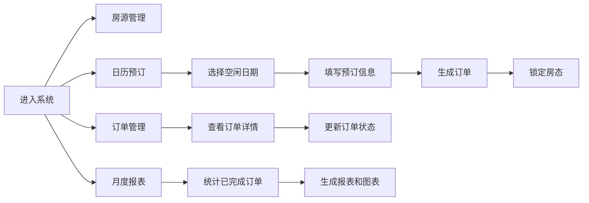

## 1. 产品概述

民宿管理系统是一款专为小型民宿业主设计的一站式管理应用，解决传统电话/微信订房容易造成超卖或空房损失的痛点。通过数字化房态管理、在线预订和月度经营报表，帮助业主高效运营、减少损失、提升收益。

## 2. 核心功能

### 2.1 用户角色

| 角色 | 登录方式 | 核心权限 |
|------|----------|----------|
| 民宿业主 | 直接访问（单用户系统） | 房源管理、预订处理、订单管理、报表查看 |

### 2.2 功能模块

1. **房源管理页面**：房源卡片展示、状态切换、房型颜色区分
2. **日历预订页面**：月视图日历、房态展示、预订表单、订单生成
3. **订单管理页面**：订单表格、行展开详情、状态管理
4. **月度经营报表**：统计数据展示、柱状图趋势分析

### 2.3 页面详情

| 页面名称 | 模块名称 | 功能描述 |
|----------|----------|----------|
| 房源管理 | 房源卡片 | 展示房型、价格、入住人数、描述，卡片背景按房型配色 |
| 房源管理 | 状态标签 | 空闲（绿色）、已预订（橙色）、打扫中（灰色），点击可切换状态 |
| 房源管理 | 卡片交互 | 悬停上浮6px、加深阴影、0.25s过渡动画 |
| 日历预订 | 月视图日历 | 按月展示，空闲日期浅绿色、已预订浅橙色 |
| 日历预订 | 预订表单 | 客户姓名、电话、入住天数（1-7）、入住人数，点击空闲日期弹出 |
| 日历预订 | 订单生成 | 自动生成订单号（YYYYMMDD-XXX），锁定对应日期房态 |
| 订单管理 | 订单表格 | 展示订单号、客户信息、房型、日期、天数、总价、状态 |
| 订单管理 | 行展开详情 | 点击行展开完整信息，0.3s高度动画 |
| 月度报表 | 统计卡片 | 总收入、订单总数、平均房价、入住率 |
| 月度报表 | 柱状图 | 每日收入趋势，渐变颜色，0.5s入场动画 |

## 3. 核心流程

业主登录系统后，通过顶部导航在三个页面间切换：
1. 在房源管理页添加/编辑房源信息，查看实时房态
2. 在日历预订页查看当月房态，点击空闲日期为客户创建预订
3. 在订单管理页查看所有订单，处理入住/退房状态变更
4. 在报表页查看月度经营数据，分析运营情况

## 4. 用户界面设计

### 4.1 设计风格

- **主色调**：柔和蓝色（#4A90D9 到 #357ABD 渐变）和白色
- **配色方案**：大床房蓝色、双床房绿色、套房紫色；状态色：空闲绿、预订橙、打扫灰
- **按钮风格**：圆角8px，点击缩放0.95，0.1s过渡
- **字体**：现代无衬线字体，标题清晰，正文易读
- **布局**：卡片式布局，统一阴影（0 2px 8px rgba(0,0,0,0.08)）
- **图标风格**：简洁线性图标，与文字搭配使用

### 4.2 页面设计概述

| 页面名称 | 模块名称 | UI元素 |
|----------|----------|--------|
| 全局布局 | 顶部导航 | 固定顶部，渐变蓝背景，三个导航项（图标+文字），下划线指示器0.3s滑动动画 |
| 全局布局 | 页脚 | 民宿名称和年份 |
| 房源管理 | 卡片网格 | 响应式网格，卡片悬停上浮动画 |
| 房源管理 | 状态标签 | 卡片右上角圆角标签 |
| 日历预订 | 日历网格 | 7列网格，日期格子颜色区分房态 |
| 日历预订 | 弹窗表单 | 模态框，表单验证，提交按钮 |
| 订单管理 | 数据表格 | 斑马纹可选，行悬停浅蓝高亮，点击展开动画 |
| 月度报表 | 统计卡片 | 四个数据卡片，大数字展示 |
| 月度报表 | 柱状图 | Recharts渐变柱形，从左到右依次绘制动画 |

### 4.3 响应式设计

- **桌面端**：多列网格布局，完整导航
- **移动端（375px）**：单列布局，汉堡菜单导航
- **触摸优化**：增大点击区域，适配手指操作

### 4.4 动效规范

- **卡片悬停**：translateY(-6px)，box-shadow加深，0.25s ease
- **导航切换**：下划线位置transition，0.3s ease
- **按钮点击**：scale(0.95)，0.1s ease
- **表格行展开**：height从0到auto，0.3s ease
- **图表入场**：柱子从左到右依次绘制，0.5s stagger
- **所有交互**：微过渡0.2s-0.3s，确保流畅体验

## 5. 性能要求

- 日历视图切换月份：DOM重绘 < 100ms
- 订单表格首次加载50条数据：呈现 < 200ms
- 页面过渡动画：60fps流畅体验
