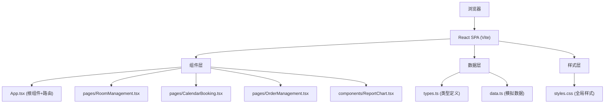
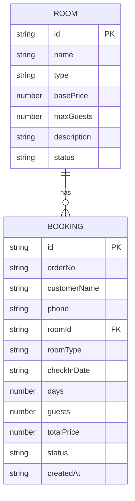

## 1. 架构设计



## 2. 技术描述

- **前端框架**：React 18 + TypeScript 5
- **构建工具**：Vite 5 + @vitejs/plugin-react 4
- **图表库**：Recharts 2（柱状图展示）
- **样式方案**：原生CSS + CSS变量，无CSS-in-JS
- **路由方案**：React状态管理（单页应用，无react-router依赖）
- **数据方案**：内存模拟数据 + React useState/useEffect

## 3. 文件结构定义

| 文件路径 | 用途 |
|----------|------|
| `package.json` | 项目依赖：react、react-dom、vite、@vitejs/plugin-react、typescript、@types/react、@types/react-dom、recharts；启动脚本：npm run dev |
| `vite.config.ts` | Vite React构建配置 |
| `tsconfig.json` | TypeScript严格模式配置 |
| `index.html` | 入口HTML页面 |
| `src/main.tsx` | 应用入口，渲染App组件 |
| `src/types.ts` | 所有数据接口定义：Room、Booking、MonthlyReport等 |
| `src/data.ts` | 模拟数据生成：10个房源、30个预订订单 |
| `src/App.tsx` | 根组件：导航路由、三个页面布局框架 |
| `src/pages/RoomManagement.tsx` | 房源管理页面：卡片展示、状态切换 |
| `src/pages/CalendarBooking.tsx` | 日历预订页面：月视图、预订表单 |
| `src/pages/OrderManagement.tsx` | 订单管理页面：表格展示、行展开详情 |
| `src/components/ReportChart.tsx` | 月度报表图表：柱状图、统计数据 |
| `src/styles.css` | 全局样式：主题色、布局、卡片、动画、响应式 |

## 4. 数据模型

### 4.1 TypeScript 类型定义

```typescript
// 房型枚举
type RoomType = '大床' | '双床' | '套房';

// 房间状态枚举
type RoomStatus = '空闲' | '已预订' | '打扫中';

// 订单状态枚举
type OrderStatus = '待入住' | '已入住' | '已退房';

// 房源接口
interface Room {
  id: string;
  name: string;
  type: RoomType;
  basePrice: number;
  maxGuests: number;
  description: string;
  status: RoomStatus;
}

// 预订接口
interface Booking {
  id: string;
  orderNo: string;
  customerName: string;
  phone: string;
  roomId: string;
  roomType: RoomType;
  checkInDate: string;
  days: number;
  guests: number;
  totalPrice: number;
  status: OrderStatus;
  createdAt: string;
}

// 月度报表接口
interface MonthlyReport {
  year: number;
  month: number;
  totalRevenue: number;
  totalOrders: number;
  avgPrice: number;
  occupancyRate: number;
  dailyRevenue: Array<{ date: string; revenue: number }>;
}
```

### 4.2 数据关系



## 5. 组件状态管理

### 5.1 全局状态（App.tsx）

- `rooms: Room[]` - 房源列表
- `bookings: Booking[]` - 订单列表
- `currentPage: 'rooms' | 'calendar' | 'orders' | 'report'` - 当前页面

### 5.2 页面级状态

- **RoomManagement**: `selectedRoomId` - 选中的房源ID
- **CalendarBooking**: `currentMonth`, `selectedDate`, `showBookingModal`, `bookingForm`
- **OrderManagement**: `expandedOrderId`, `filterStatus`
- **ReportChart**: `currentMonth` - 报表月份

## 6. 性能优化策略

1. **日历渲染优化**：使用useMemo缓存日历网格数据，避免重复计算
2. **表格虚拟化**：50条数据直接渲染（200ms内），超出时考虑虚拟滚动
3. **React.memo**：对纯展示组件使用memo避免不必要重渲染
4. **CSS动画**：使用transform和opacity属性，触发GPU加速
5. **状态提升合理**：仅将必要状态提升至App，其余保持在组件内部

## 7. 关键交互实现

### 7.1 导航下划线动画
- 使用CSS `::after` 伪元素 + `transform: translateX()`
- 根据当前激活项计算偏移量，0.3s transition

### 7.2 表格行展开动画
- 使用CSS Grid `grid-template-rows: 0fr` → `1fr` 技术
- 0.3s ease 过渡，避免height: auto动画问题

### 7.3 图表入场动画
- 使用Recharts `animationBegin` 和 `animationDuration`
- 配合CSS `@keyframes` 实现从左到右依次绘制效果

### 7.4 响应式汉堡菜单
- 使用CSS `@media (max-width: 375px)` 断点
- 移动端显示汉堡按钮，点击展开/收起导航
