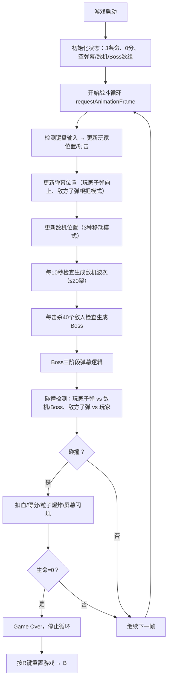

## 1. 产品概述

复古街机风格的无尽星域飞行射击游戏，玩家操控战机迎战敌机与Boss，体验流畅的弹幕系统与实时伤害反馈。

- 核心目标：打造一款手感优秀、视觉表现精美的微型弹幕飞行射击游戏
- 目标用户：喜欢复古街机风格、弹幕射击类游戏的玩家

## 2. 核心功能

### 2.1 功能模块

1. **战机控制模块**：WASD移动、空格射击、被击中无敌闪烁
2. **敌人波次系统**：每10秒生成一波敌人、3种移动模式（垂直下落、正弦波动、斜线冲撞）
3. **Boss战系统**：击杀40个敌人触发Boss、三阶段弹幕攻击模式、Boss血条显示
4. **碰撞与生命系统**：子弹与敌机/Boss碰撞检测、玩家生命值管理、无敌帧机制
5. **得分与连击系统**：击杀得分、5秒内连续击杀触发连击奖励、HUD实时显示
6. **视觉表现模块**：星域背景、粒子爆炸、辉光效果、屏幕震动/闪烁反馈

### 2.2 页面详情

| 页面名称 | 模块名称 | 功能描述 |
|-----------|-------------|---------------------|
| 游戏主界面 | 游戏画布 | 600x800 Canvas区域，渲染战机、敌机、Boss、弹幕、粒子 |
| 游戏主界面 | 顶部HUD | 显示得分（白色）、连击数（黄色呼吸动画）、Boss血条 |
| 游戏主界面 | 底部HUD | 显示生命心形图标（红色） |
| 游戏主界面 | 游戏结束层 | 显示"Game Over"文字，按R键重置 |

## 3. 核心流程

## 4. 用户界面设计

### 4.1 设计风格
- **主色调**：深蓝渐变背景（#0B0B2B → #1A1A3E）
- **玩家战机**：青色（#00FFFF）三角形，边缘辉光
- **子弹**：白色发光圆点
- **普通敌人**：红色（#FF3333）20x20矩形，红色辉光
- **Boss**：深紫色（#660099）八边形，半径35，紫色脉冲光晕
- **Boss弹幕**：Phase1橙色、Phase2粉色、Phase3蓝色
- **连击文字**：黄色（#FFD700），带呼吸动画
- **字体**：monospace风格

### 4.2 页面设计概述

| 页面名称 | 模块名称 | UI元素 |
|-----------|-------------|-------------|
| 游戏主界面 | 游戏画布 | 深蓝渐变、随机闪烁星星、Canvas 600x800居中、响应式缩放 |
| 游戏主界面 | 顶部HUD | 白色得分文字20px、黄色连击文字带呼吸动画、Boss血条 |
| 游戏主界面 | 底部HUD | 红色心形图标（20x20），monospace字体 |
| 游戏主界面 | 反馈效果 | 碰撞时屏幕白色闪烁0.1秒、敌机爆炸碎片粒子0.5秒 |

### 4.3 响应式设计
- 画布固定600x800像素居中显示
- 视口小于画布时自动等比缩放适应
- 桌面优先设计，移动设备通过缩放适配

### 4.4 性能约束
- 稳定60FPS
- 弹幕数量上限：120颗/帧
- 敌机数量上限：20架/波次 + 1个Boss
- 超出上限时暂停新生成，直至数量下降
