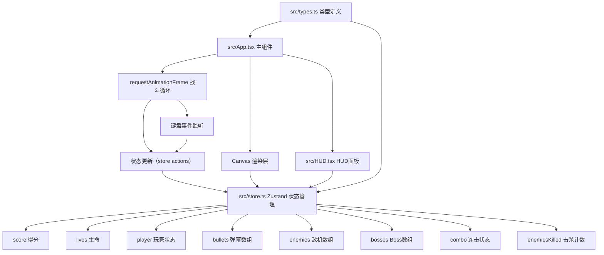

## 1. 架构设计



## 2. 技术描述
- **前端框架**：React 18 + TypeScript
- **构建工具**：Vite 5
- **状态管理**：Zustand
- **渲染方式**：HTML5 Canvas 2D
- **样式**：内联样式 + CSS变量

## 3. 文件结构与调用关系

```
d:\Pro\tasks\auto300\
├── package.json              # 项目依赖与启动脚本
├── vite.config.js            # Vite 默认配置
├── tsconfig.json             # TypeScript 严格模式配置
├── index.html                # 入口 HTML，无额外脚本
└── src/
    ├── types.ts              # 类型定义：GameState, Bullet, Enemy, Boss 等
    ├── store.ts              # Zustand store：状态与 actions
    ├── App.tsx               # 主组件：Canvas + 战斗循环 + 渲染
    └── HUD.tsx               # 纯展示组件：得分、生命、连击、Boss血条
```

**调用关系与数据流向**：
1. `src/types.ts` → 定义所有类型，被 `store.ts` 和 `App.tsx` 引用
2. `src/store.ts` → 依赖 `types.ts`，管理全局状态，被 `App.tsx` 和 `HUD.tsx` 消费
3. `src/HUD.tsx` → 纯展示组件，从 `store.ts` 读取状态，被 `App.tsx` 渲染
4. `src/App.tsx` → 主组件，整合所有模块：
   - 读取 store 状态 → Canvas 渲染
   - 键盘输入 → 调用 store actions（movePlayer / shoot / spawnWave / spawnBoss / onCollision）
   - requestAnimationFrame 驱动战斗循环 → 每帧更新状态 → 重渲染

## 4. 核心数据模型

### 4.1 类型定义（src/types.ts）

```typescript
// 画布常量
const CANVAS_WIDTH = 600;
const CANVAS_HEIGHT = 800;

// 玩家状态
interface Player {
  x: number;           // 中心X坐标
  y: number;           // 中心Y坐标
  isInvincible: boolean; // 无敌状态
  blinkUntil: number;  // 闪烁结束时间戳
  invincibleUntil: number; // 无敌结束时间戳
}

// 弹幕
interface Bullet {
  id: string;
  x: number;
  y: number;
  vx: number;          // X方向速度
  vy: number;          // Y方向速度
  radius: number;
  color: string;
  isPlayerBullet: boolean; // true=玩家子弹，false=敌人/Boss子弹
}

// 敌人移动模式
type EnemyPattern = 'vertical' | 'sine' | 'diagonal';

// 敌机
interface Enemy {
  id: string;
  x: number;
  y: number;
  pattern: EnemyPattern;
  phase: number;       // 正弦相位
  speed: number;
  hp: number;
  size: number;        // 20
}

// Boss攻击阶段
type BossPhase = 'phase1' | 'phase2' | 'phase3';

// Boss
interface Boss {
  id: string;
  x: number;
  y: number;
  radius: number;      // 35
  hp: number;
  maxHp: number;       // 50
  phase: BossPhase;
  lastShotTime: number;
}

// 爆炸粒子
interface Particle {
  id: string;
  x: number;
  y: number;
  vx: number;
  vy: number;
  size: number;
  color: string;
  life: number;        // 剩余寿命（ms）
}

// 连击状态
interface ComboState {
  count: number;        // 当前连击数
  lastKillTime: number; // 上次击杀时间戳
}

// 游戏全局状态
interface GameState {
  score: number;
  lives: number;
  player: Player;
  bullets: Bullet[];
  enemies: Enemy[];
  bosses: Boss[];
  particles: Particle[];
  combo: ComboState;
  enemiesKilled: number;  // 击杀计数（用于触发Boss）
  flashUntil: number;     // 屏幕闪烁结束时间
  isGameOver: boolean;
  lastWaveTime: number;   // 上次生成波次时间
}
```

### 4.2 Store Actions（src/store.ts）

| Action | 描述 |
|--------|------|
| `movePlayer(dx: number, dy: number)` | 移动玩家，限制在画布范围内 |
| `shoot()` | 玩家射击，每帧最多2发，创建玩家子弹 |
| `spawnWave()` | 生成一波6个敌人，随机模式，敌机≤20 |
| `spawnBoss()` | 生成Boss，重置击杀计数 |
| `update(deltaTime: number)` | 每帧更新：移动子弹/敌机、更新粒子、检查连击超时、检查波次生成 |
| `onCollision(type: 'enemy' | 'boss' | 'player', targetId: string)` | 碰撞处理：击杀得分/扣血/生成粒子/屏幕闪烁 |
| `resetGame()` | 重置所有状态为初始值 |
| `bossShoot(boss: Boss)` | Boss根据阶段发射弹幕 |

## 5. 性能优化策略
- Canvas 批量绘制：同色元素一次性绘制
- 对象池模式：弹幕和粒子复用对象引用
- 数量硬限制：弹幕≤120，敌机≤20+1Boss
- requestAnimationFrame 节流：固定60FPS逻辑步长
- 离屏过滤：超出画布的子弹立即删除
