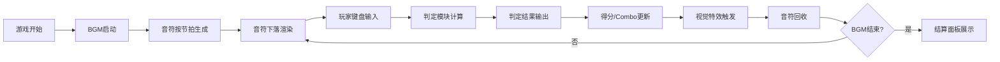

## 1. 产品概述
微型节奏音游音符生成与判定表现应用，玩家在动态下落的三条音符轨道上通过键盘输入进行精准操作，体验点击、长按、滑动三种音符类型的实时判定反馈和连击得分累积。
- 面向喜欢节奏游戏的休闲玩家，提供约30秒的沉浸式音乐体验
- 核心价值：低门槛高反馈的节奏游戏体验，精致的视觉特效与打击感

## 2. 核心功能

### 2.1 功能模块
1. **游戏主界面**：三轨道下落式音符区、判定线、实时得分与连击显示、音符预览小地图、Combo特效层
2. **判定系统**：Perfect/Good/Miss三档判定、判定波纹特效、Miss红色边框闪烁
3. **连击系统**：Combo计数、里程碑Combo粒子爆炸特效、Combo数字抖动放大
4. **音频系统**：Tone.js生成的4小节120BPM电子BGM、音符节拍同步生成
5. **结算面板**：总分、最高Combo、各判定次数占比、S/A/B/C评级

### 2.2 页面详情
| 页面名称 | 模块名称 | 功能描述 |
|-----------|-------------|---------------------|
| 游戏主界面 | 轨道渲染区 | 三条垂直轨道，音符从顶部向下匀速滚动，带垂直拖尾渐变 |
| 游戏主界面 | 判定线 | 白色半透明线条位于屏幕下方1/3处 |
| 游戏主界面 | 顶部状态栏 | 显示当前得分与最高Combo |
| 游戏主界面 | 音符预览小地图 | 左侧显示即将到达的3个音符缩略位置 |
| 游戏主界面 | 判定特效层 | Perfect金色波纹、Good银色波纹、Miss红色X动画 |
| 游戏主界面 | Combo特效层 | 10/25/50/100 Combo里程碑粒子爆炸，数字抖动放大 |
| 结算面板 | 成绩展示 | 总分、最高Combo、判定占比、评级 |

## 3. 核心流程
游戏开始 → BGM启动并同步生成音符 → 音符沿轨道下落 → 玩家按键操作 → 判定系统计算偏差 → 返回判定结果 → 更新得分与Combo → 触发对应特效 → 音符生命周期结束 → 游戏结束 → 显示结算面板

## 4. 用户界面设计

### 4.1 设计风格
- **主色调**：深空渐变背景 #0B0B2B → #1A1A4A
- **轨道色**：轨道1蓝色 #4A90D9、轨道2红色 #E74C3C、轨道3绿色 #2ECC71
- **特效色**：Perfect金色 #F1C40F、Good银色 #BDC3C7、Miss红色 #E74C3C
- **判定线**：白色半透明 #FFFFFF40
- **Combo粒子渐变**：#F1C40F → #E67E22
- **字体**：现代无衬线字体，数字使用等宽字体增强节奏感
- **布局**：CSS Grid 三轨道居中排列，轨道间距40px，左右各留80px边距

### 4.2 页面设计概述
| 页面名称 | 模块名称 | UI元素 |
|-----------|-------------|-------------|
| 游戏主界面 | 轨道区 | 三条轨道带垂直拖尾渐变，音符形状：圆形(点击)、菱形(长按)、三角形(滑动) |
| 游戏主界面 | 判定区 | 2px白色半透明判定线，下方1/3处 |
| 游戏主界面 | 状态栏 | 顶部得分(大号加粗)、最高Combo(次级显示) |
| 游戏主界面 | 预览小地图 | 左侧竖条，3个即将到达音符的轨道位置缩略 |
| 游戏主界面 | 特效层 | 环形波纹扩散、粒子爆炸、数字抖动、红色边框闪烁 |
| 结算面板 | 成绩卡片 | 居中半透明卡片，带毛玻璃效果，评级字母放大展示 |

### 4.3 响应式
- 桌面优先设计，基准分辨率 1280x720
- 轨道区域最小宽度保证3轨道+间距正常显示
