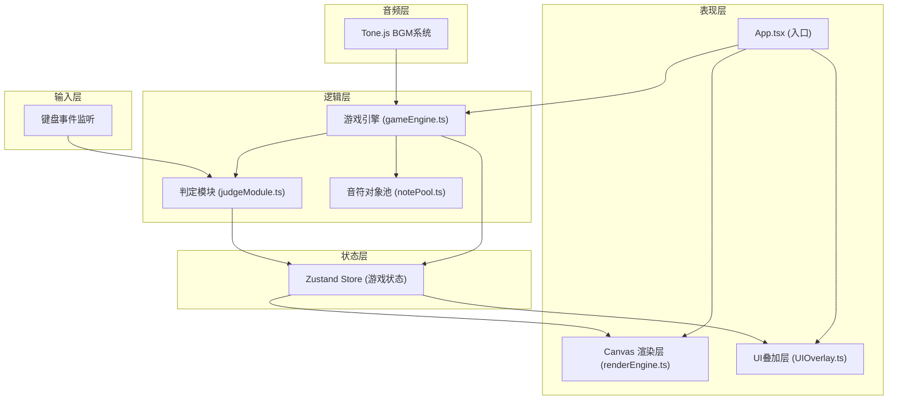

## 1. 架构设计


## 2. 技术描述
- **前端框架**：React@18 + TypeScript@5
- **构建工具**：Vite@5 + @vitejs/plugin-react
- **状态管理**：Zustand@4（管理得分、Combo、判定结果、音符状态）
- **音频引擎**：Tone.js（120BPM 4小节电子旋律，低音鼓+军鼓+Arpeggio合成器）
- **渲染方案**：HTML5 Canvas 2D（音符、判定线、特效绘制）
- **游戏循环**：requestAnimationFrame 驱动，目标60FPS

## 3. 文件结构定义
| 文件路径 | 职责 |
|----------|------|
| `package.json` | 项目依赖与脚本配置 |
| `vite.config.ts` | Vite + React插件配置 |
| `tsconfig.json` | TypeScript严格模式配置(target ES2020) |
| `index.html` | 入口HTML页面 |
| `src/App.tsx` | 应用入口，整合模块，初始化全局监听 |
| `src/modules/game/gameEngine.ts` | 游戏循环、音符生成调度、主循环逻辑 |
| `src/modules/game/notePool.ts` | 音符对象池管理，创建与复用音符节点 |
| `src/modules/game/judgeModule.ts` | 判定模块：键盘事件×音符位置→判定等级 |
| `src/modules/render/renderEngine.ts` | Canvas渲染引擎：音符、判定线、波纹特效 |
| `src/modules/render/UIOverlay.tsx` | UI叠加层：得分、Combo、特效、结算面板 |

## 4. 核心数据结构定义
```typescript
// 音符类型
type NoteType = 'tap' | 'hold' | 'slide';
// 判定等级
type JudgeGrade = 'perfect' | 'good' | 'miss' | null;
// 轨道索引 0/1/2
type TrackIndex = 0 | 1 | 2;

interface Note {
  id: number;
  type: NoteType;
  track: TrackIndex;
  spawnTime: number;      // 生成时间(ms)
  hitTime: number;        // 预期到达判定线时间(ms)
  holdEndTime?: number;   // 长按结束时间(ms)
  slideDirection?: 'up' | 'down'; // 滑动方向
  y: number;              // 当前Y坐标
  judged: boolean;        // 是否已判定
  judgeGrade?: JudgeGrade;
  holdProgress?: number;  // 长按进度 0-1
  isHolding?: boolean;    // 是否正在被按住
}

interface GameState {
  score: number;
  combo: number;
  maxCombo: number;
  perfectCount: number;
  goodCount: number;
  missCount: number;
  notes: Note[];
  startTime: number;
  isPlaying: boolean;
  isEnded: boolean;
  currentTime: number;
}

interface JudgeResult {
  noteId: number;
  grade: JudgeGrade;
  timestamp: number;
  track: TrackIndex;
}
```

## 5. 性能指标约束
- 单帧更新+碰撞检测 ≤ 2ms
- 判定计算 ≤ 1ms
- requestAnimationFrame 稳定60FPS
- 音符对象池复用，避免频繁GC
- Canvas单次绘制操作批量化，减少状态切换开销

## 6. 常量配置
```typescript
// 时间窗口(ms)
const PERFECT_WINDOW = 30;
const GOOD_WINDOW = 80;

// 视觉
const JUDGE_LINE_Y_RATIO = 2 / 3;  // 屏幕下方1/3处
const NOTE_FALL_DURATION = 2000;   // 音符下落总时长(ms)
const TRACK_COLORS = ['#4A90D9', '#E74C3C', '#2ECC71'];

// 按键映射
const KEY_MAP: Record<string, TrackIndex> = {
  'KeyD': 0, 'KeyF': 0,  // 左手 - 轨道1
  'KeyJ': 2, 'KeyK': 2   // 右手 - 轨道3
};
// 注意：三轨道方案，轨道2用KeyF或双轨合并，按用户需求D/F对应轨道1和2，J/K对应轨道3
```
