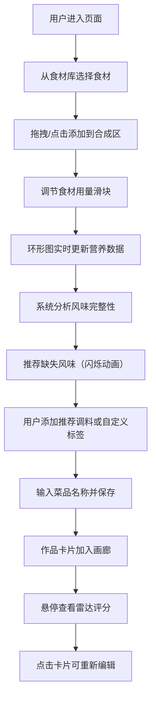

## 1. 产品概述

微型在线菜谱实验室是一款面向烹饪爱好者的创意工具，让用户以科学家做实验的方式，在虚拟厨房中自由组合食材与调料，实时获取风味平衡分析与营养数据，最终生成可分享的创意菜单卡片。

- 目标用户：烹饪爱好者、美食创作者、注重饮食健康的人群
- 核心价值：将烹饪过程游戏化、数据化，激发创意，提供科学的搭配建议
- 市场定位：轻量级Web创意工具，主打互动性与视觉表现力

## 2. 核心 Features

### 2.1 用户角色

| 角色 | 注册方式 | 核心权限 |
|------|----------|----------|
| 访客用户 | 无需注册 | 完整使用所有功能，本地存储作品 |

### 2.2 Feature 模块

1. **食材库面板**：食材分类展示、拖拽/点击添加、营养数据预览
2. **合成区工作台**：食材用量调节、风味标签管理、智能风味推荐、实时营养计算
3. **营养可视化**：动态环形图展示三大营养素占比、总热量实时更新
4. **作品卡片画廊**：3列网格展示、像素风主食材图标、悬停雷达图、点击编辑
5. **作品管理**：保存作品、编辑修改、本地持久化存储

### 2.3 页面详情

| 页面名称 | 模块名称 | Feature 描述 |
|---------|----------|-------------|
| 主工作台 | 食材库面板 | 左侧固定区域，磨砂玻璃背景，食材分类展示，支持拖拽和点击两种添加方式，每个食材卡片显示名称、emoji图标、热量/蛋白/碳水基础数据 |
| 主工作台 | 合成区工作台 | 中央核心区域，圆角卡片设计，弹簧动画效果，已添加食材列表，每个食材配有克数滑块，风味标签添加按钮，智能推荐缺失风味 |
| 主工作台 | 营养环形图 | 右侧实时更新区域，纯SVG实现的环形图，动态展示蛋白质、脂肪、碳水占比，中心显示总热量数值 |
| 主工作台 | 作品画廊 | 页面底部3列网格布局，卡片展示所有保存作品，顶角像素风主食材图标，鼠标悬停浮现半透明雷达评分图（口感、营养、创意、难度、颜值），点击展开编辑 |
| 主工作台 | 顶部操作栏 | 保存按钮、清空合成区按钮，当前菜品名称输入框 |

## 3. 核心流程

用户进入页面 → 从左侧食材库选择食材（拖拽/点击）→ 食材进入中央合成区 → 调节各食材用量滑块 → 添加风味标签（或由系统推荐）→ 实时观察右侧环形图变化 → 查看风味推荐提示 → 输入菜品名称并保存 → 作品出现在下方画廊 → 悬停查看雷达评分 → 点击可重新编辑

## 4. 界面设计

### 4.1 设计风格

- **主色调**：#E8B4B8（柔和暖粉色）
- **辅助色**：#F5E6CC（米黄色）
- **强调色**：#7C4A3A（深棕色）
- **背景渐变**：从#FDF6F0到#F5E6CC的柔和暖色系渐变
- **按钮风格**：圆角16px，轻微阴影，悬停有上浮动画
- **字体方案**：标题使用"Noto Serif SC"（中文衬线，增加温度感），正文使用"Noto Sans SC"（中文无衬线，保证可读性）
- **卡片风格**：圆角24px，多层阴影，磨砂玻璃效果（backdrop-filter: blur(12px)）
- **图标风格**：混合使用emoji表情符号（食材图标）+ 像素风图标（卡片角标）

### 4.2 页面设计概览

| 页面/模块 | 模块名称 | UI 元素与动效 |
|-----------|----------|-------------|
| 主工作台 | 食材库面板 | 左侧280px固定宽度，backdrop-filter磨砂玻璃，食材卡片网格布局，拖拽时半透明，释放时有弹簧动画归位 |
| 主工作台 | 合成区工作台 | 中央弹性宽度，白色卡片+柔和阴影，食材项滑入动画，滑块拖动时数值实时跳动，推荐调料淡黄色脉冲闪烁动画（1.5s循环） |
| 主工作台 | 营养环形图 | 右侧240px固定宽度，SVG环形图分段着色，数值变化时有平滑过渡动画（transition: 0.3s ease-out） |
| 主工作台 | 作品画廊 | 底部3列网格（640px以下单列），卡片悬停上浮8px+阴影加深，雷达图fade-in动画 |
| 全局 | 弹簧动画 | 食材添加/删除时卡片scale(1.03→1.0)弹性动画，用时300ms，cubic-bezier(0.34, 1.56, 0.64, 1) |

### 4.3 响应式设计

- **桌面端（>1024px）**：三栏布局（食材库 | 合成区 | 环形图），底部画廊3列
- **平板端（641px-1024px）**：两栏布局（食材库 | 合成区+环形图上下堆叠），底部画廊2列
- **移动端（≤640px）**：单列布局，食材库→合成区→环形图→画廊依次垂直排列，画廊单列

### 4.4 性能指标

- 拖拽操作帧率 ≥ 50fps
- 环形图更新帧率 ≥ 50fps
- 滑块拖动无明显卡顿
- 首次加载时间 ≤ 2s
