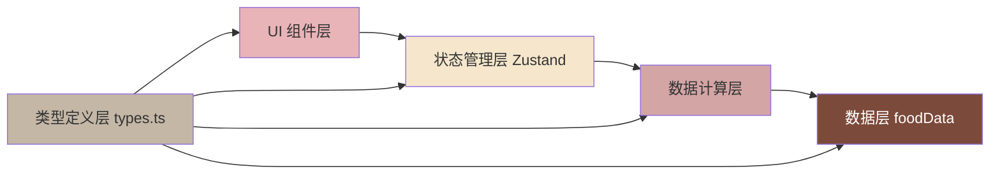

## 1. 架构设计



## 2. 技术选型说明

| 技术 | 版本 | 用途说明 |
|------|------|----------|
| React | ^18.3.1 | UI 框架，组件化开发 |
| React DOM | ^18.3.1 | React DOM 渲染层 |
| TypeScript | ^5.4.0 | 类型安全，严格模式 |
| Vite | ^5.2.0 | 构建工具，快速开发与打包 |
| @vitejs/plugin-react | ^4.2.1 | Vite React 插件支持 |
| Zustand | ^4.5.0 | 轻量级状态管理，管理食材库存与合成状态 |
| CSS Modules | 内置 | 组件级样式隔离，处理动画 |

**关键决策理由：**
- 选择 Zustand 而非 Redux：状态逻辑相对集中但不复杂，Zustand 更轻量，API 更简洁，性能更好
- 选择 CSS Modules 而非 Tailwind：需要大量自定义动画和磨砂玻璃效果，CSS Modules 更灵活，避免原子类堆砌
- 纯 SVG 实现环形图：无需引入图表库，减少包体积，帧率更可控
- 原生 HTML5 Drag API：无需拖拽库，保证 50fps+ 性能要求

## 3. 目录结构

```
auto303/
├── package.json
├── vite.config.ts
├── tsconfig.json
├── index.html
└── src/
    ├── main.tsx              # 入口渲染
    ├── App.tsx               # 主布局与组件组装
    ├── types.ts              # 全局类型定义
    ├── store/
    │   └── useRecipeStore.ts # Zustand 状态管理
    ├── components/
    │   ├── IngredientShelf.tsx    # 左侧食材库
    │   ├── SynthesisZone.tsx      # 中央合成区
    │   ├── NutritionChart.tsx     # 右侧环形图
    │   └── CardGallery.tsx        # 作品卡片画廊
    └── utils/
        └── foodData.ts       # 食材数据库
```

## 4. 类型定义（types.ts）

```typescript
export interface Nutrition {
  calories: number;      // 每100克热量 (kcal)
  protein: number;       // 每100克蛋白质 (g)
  carbs: number;         // 每100克碳水 (g)
  fat: number;           // 每100克脂肪 (g)
}

export interface Ingredient {
  id: string;
  name: string;
  emoji: string;         // 食材图标
  category: 'protein' | 'vegetable' | 'seasoning' | 'grain' | 'other';
  nutrition: Nutrition;
  flavors: Flavor[];     // 自带风味标签
  pixelIcon: string;     // 像素风图标emoji
}

export type Flavor = 'sour' | 'sweet' | 'bitter' | 'spicy' | 'salty' | 'umami';

export interface SynthesisItem {
  ingredient: Ingredient;
  quantity: number;      // 克数
}

export interface RecipeScore {
  taste: number;         // 口感 0-100
  nutrition: number;     // 营养 0-100
  creativity: number;    // 创意 0-100
  difficulty: number;    // 难度 0-100
  appearance: number;    // 颜值 0-100
}

export interface SavedCard {
  id: string;
  name: string;
  items: SynthesisItem[];
  flavors: Flavor[];
  totalNutrition: Nutrition;
  score: RecipeScore;
  mainIngredient: Ingredient;
  createdAt: number;
}

export interface RecipeState {
  ingredients: Ingredient[];
  synthesisItems: SynthesisItem[];
  selectedFlavors: Flavor[];
  savedCards: SavedCard[];
  currentRecipeName: string;
  editingCardId: string | null;
}
```

## 5. 状态管理设计（useRecipeStore.ts）

### 5.1 State 结构

```typescript
interface RecipeStore extends RecipeState {
  // Actions
  addIngredient: (ingredient: Ingredient) => void;
  removeIngredient: (ingredientId: string) => void;
  updateQuantity: (ingredientId: string, quantity: number) => void;
  toggleFlavor: (flavor: Flavor) => void;
  setRecipeName: (name: string) => void;
  saveCard: () => void;
  loadCardForEdit: (cardId: string) => void;
  clearSynthesis: () => void;
  deleteCard: (cardId: string) => void;
  
  // Computed
  getTotalNutrition: () => Nutrition;
  getNutrientPercentages: () => { protein: number; carbs: number; fat: number };
  getMissingFlavors: () => Flavor[];
  getRecommendedSeasonings: () => Ingredient[];
  calculateScore: () => RecipeScore;
  getMainIngredient: () => Ingredient | null;
}
```

### 5.2 核心计算逻辑

1. **总营养计算**：遍历合成区食材，按重量加权求和
2. **营养素占比**：蛋白质、碳水、脂肪分别按热量系数（4/4/9 kcal/g）计算占比
3. **风味分析**：对比现有风味与理想风味模型，识别缺失
4. **调料推荐**：基于缺失风味匹配食材库中的调料
5. **评分算法**：
   - 营养：营养素均衡度 + 热量合理度
   - 口感：风味覆盖度 + 食材搭配和谐度
   - 创意：食材组合独特性
   - 难度：食材数量 + 调料复杂度
   - 颜值：色彩丰富度（基于食材emoji推断）

## 6. 组件设计

### 6.1 IngredientShelf.tsx
- Props: 无（直接消费 store）
- 功能：食材分类展示、拖拽发起、点击添加
- 动画：拖拽时 opacity 0.5，推荐食材 pulse 闪烁
- 性能：使用 React.memo，按分类虚拟化渲染

### 6.2 SynthesisZone.tsx
- Props: 无（直接消费 store）
- 功能：食材列表、用量滑块、风味标签、推荐提示
- 动画：食材项添加时 spring 弹性动画，删除时 fade-out
- 性能：滑块使用 requestAnimationFrame 节流

### 6.3 NutritionChart.tsx
- Props: `percentages: { protein: number; carbs: number; fat: number }; totalCalories: number`
- 功能：纯 SVG 环形图，三段着色
- 动画：stroke-dasharray 平滑过渡
- 性能：SVG path 本地缓存，仅在百分比变化时重绘

### 6.4 CardGallery.tsx
- Props: 无（直接消费 store）
- 功能：3列网格、卡片悬停雷达图、点击编辑
- 动画：卡片 hover 上浮，雷达图 fade-in

## 7. 数据模型（foodData.ts）

硬编码约20种食材，覆盖：
- 蛋白质类：鸡胸肉🐔、牛肉🐄、虾仁🦐、豆腐🧈、鸡蛋🥚
- 蔬菜类：西兰花🥦、胡萝卜🥕、番茄🍅、青椒🫑、蘑菇🍄、菠菜🥬
- 调料类：酱油🫗、盐🧂、糖🍬、醋🍶、姜🫚、蒜🧄、辣椒🌶️、蜂蜜🍯
- 主食类：米饭🍚、面条🍜

## 8. 性能优化策略

1. **拖拽性能**：使用原生 Drag API，避免库的额外开销
2. **动画性能**：
   - CSS transform + opacity 动画，触发 GPU 加速
   - 环形图更新使用 SVG stroke-dasharray 过渡，避免重排
   - 弹簧动画使用 CSS cubic-bezier 模拟，避免 JS 动画库
3. **渲染性能**：
   - Zustand 选择器细粒度订阅，避免不必要重渲染
   - React.memo 包裹纯展示组件
   - useMemo 缓存计算结果（总营养、百分比、评分）
4. **帧率保证**：
   - 滑块值更新使用 rAF 节流，每帧最多更新一次
   - 环形图数据变化使用 CSS transition 平滑过渡

## 9. 本地存储

使用 localStorage 持久化 savedCards：
- 初始化时从 localStorage 读取
- 每次 saveCard/deleteCard 后自动写入
- 最大存储 50 张卡片，超出时自动删除最旧的

## 10. 构建配置

### vite.config.ts
- React 插件启用 JSX 运行时
- CSS Modules 启用 camelCase 命名
- 开发服务器端口 5173

### tsconfig.json
- strict: true
- jsx: "preserve"
- moduleResolution: "bundler"
- skipLibCheck: true
