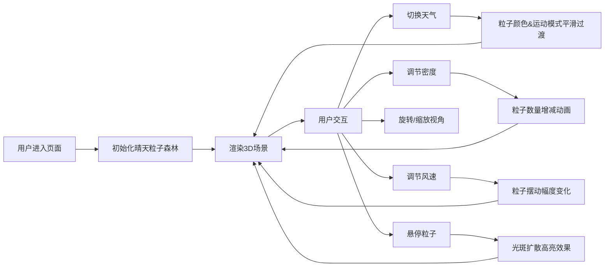

## 1. 产品概述

天气数据驱动的3D粒子森林交互可视化应用，将抽象的天气数据转化为沉浸式的数字森林雕塑，用于科技艺术展览和环境设计展示。

- 核心价值：将气象数据转化为可感知的视觉艺术，让用户直观感受天气变化对自然形态的影响
- 目标用户：环境设计师、艺术展览观众、科技爱好者
- 应用场景：科技艺术展、互动装置、数据可视化教学演示

## 2. 核心功能

### 2.1 功能模块

1. **3D粒子森林场景**：2000个立方体粒子组成的数字森林，支持实时天气驱动的形态变化
2. **天气控制面板**：四种天气模式切换（晴/多云/雨/雪），粒子密度调节，风速调节
3. **交互控制系统**：鼠标拖拽旋转视角、滚轮缩放、粒子悬停高亮效果

### 2.2 页面详情

| 页面名称 | 模块名称 | 功能描述 |
|---------|---------|---------|
| 主页面 | 3D粒子森林场景 | 实时渲染粒子系统，根据天气参数动态变化粒子颜色、运动轨迹和形态 |
| 主页面 | 天气控制面板 | 天气切换按钮、密度滑块、风速滑块，带动画过渡效果 |
| 主页面 | 视角控制器 | OrbitControls 支持旋转、缩放，鼠标悬停粒子交互 |

## 3. 核心流程

用户进入页面后，默认展示晴天状态的绿色粒子森林。用户可以通过右侧控制面板切换天气类型、调节粒子密度和风速，观察粒子森林的实时变化。支持鼠标拖拽旋转场景和滚轮缩放，悬停粒子时产生光斑扩散效果。

## 4. 用户界面设计

### 4.1 设计风格

- **主题风格**：深色科幻风格，背景色 #0A0A0A
- **主色调**：
  - 晴天：#FFD700（金色）
  - 多云：#A9A9A9（暗灰色）
  - 雨天：#4A90D9（蓝色）
  - 雪天：#FFFFFF（白色）
  - 文字：#E0E0E0（浅白色）
- **按钮风格**：圆形天气按钮（直径48px），点击时外圈发光脉冲效果
- **控制面板**：半透明磨砂玻璃背景 rgba(255,255,255,0.05)，白色半透明边框，10px圆角
- **滑块设计**：自定义渐变轨道（从#333到对应天气颜色），白色圆形拖拽柄（直径20px）
- **动效风格**：framer-motion 驱动，0.2秒缩放和透明度变化的悬停效果，天气切换时脉冲光效

### 4.2 页面设计概述

| 页面名称 | 模块名称 | UI元素 |
|---------|---------|-------|
| 主页面 | 3D场景区域 | 占70%宽度，深色背景，可旋转缩放的粒子森林 |
| 主页面 | 控制面板区域 | 占30%宽度，磨砂玻璃效果，天气按钮组、密度滑块、风速滑块 |
| 主页面 | 天气按钮组 | 四个圆形彩色按钮，横向排列，点击脉冲动画 |
| 主页面 | 滑块控件 | 带数值标签的自定义渐变滑块，悬停放大效果 |

### 4.3 响应式

- 桌面端（>768px）：左侧3D场景占70%，右侧控制面板占30%，flex横向布局
- 移动端（≤768px）：控制面板变为底部固定横条（高度120px），3D场景占剩余高度，按钮和滑块重新排列为两行
- 触摸优化：滑块支持触摸拖拽，场景支持双指缩放

### 4.4 3D场景设计

- **环境与氛围**：深色背景 #0A0A0A，营造深邃太空感，粒子自发光形成霓虹效果
- **光照设置**：环境光 + 点光源，突出粒子立体感和颜色渐变
- **相机设置**：PerspectiveCamera，初始距离场景中心8单位，可缩放范围5-15单位
- **构图与焦点**：粒子分布在以原点为中心的球形区域内，形成森林整体形态
- **交互与动画**：
  - 晴天：粒子静止，绿色渐变
  - 多云：灰绿色粒子，左右摇摆
  - 雨天：蓝色粒子，上下抖动，半透明拖尾
  - 雪天：白色粒子，缓慢下落并旋转
  - 密度变化：从中心向外扩散或向内收拢的过渡动画（1秒）
  - 悬停效果：粒子放大1.5倍高亮白色，周围0.5单位粒子亮度提升10%
- **后处理效果**：轻微辉光效果增强科技感
- **性能预算**：粒子数500-3000，FPS稳定30以上，过渡响应时间≤300ms
