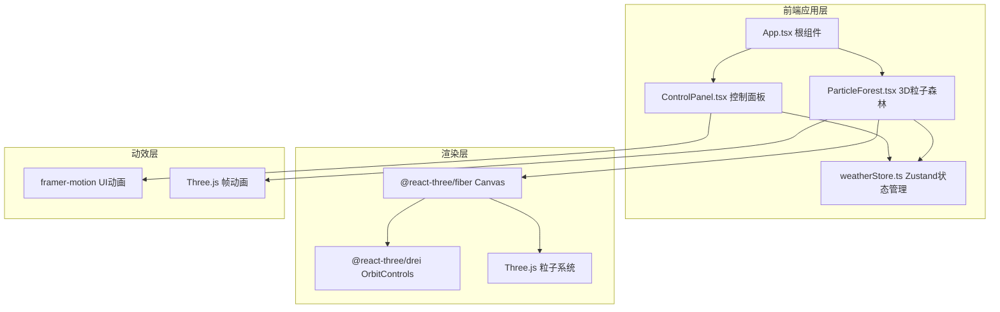

## 1. 架构设计



**数据流向说明：**
1. 用户操作 ControlPanel → 调用 weatherStore 的 setWeather/setDensity/setWindSpeed
2. weatherStore 更新状态 → ParticleForest 和 ControlPanel 同时响应
3. ParticleForest 监听 store 变化 → 通过 useFrame 驱动 Three.js 粒子动画
4. ControlPanel 监听 store 变化 → framer-motion 驱动 UI 动画反馈

## 2. 技术栈说明

- **前端框架**：React@18 + TypeScript
- **构建工具**：Vite + @vitejs/plugin-react
- **3D渲染**：Three.js + @react-three/fiber + @react-three/drei
- **状态管理**：Zustand
- **动画库**：framer-motion
- **包管理器**：npm

## 3. 目录结构

```
src/
├── components/
│   ├── App.tsx              # 根组件，布局容器
│   ├── ParticleForest.tsx   # 3D粒子森林核心组件
│   └── ControlPanel.tsx     # UI控制面板组件
├── store/
│   └── weatherStore.ts      # Zustand天气状态管理
└── main.tsx                 # React入口文件
```

## 4. 核心数据模型

### 4.1 天气状态定义

```typescript
type WeatherType = 'sunny' | 'cloudy' | 'rainy' | 'snowy';

interface WeatherState {
  currentWeather: WeatherType;
  particleDensity: number;    // 范围 500-3000
  windSpeed: number;          // 范围 0-10
  setWeather: (weather: WeatherType) => void;
  setDensity: (density: number) => void;
  setWindSpeed: (speed: number) => void;
}
```

### 4.2 粒子数据结构

```typescript
interface ParticleData {
  id: number;
  basePosition: [number, number, number];  // 基准位置
  size: number;                            // 立方体边长 0.05-0.15
  baseColor: string;                       // 基准颜色
  phase: number;                           // 动画相位偏移
}
```

## 5. 核心技术方案

### 5.1 粒子系统性能优化

- 使用 InstancedMesh 批量渲染所有立方体粒子，减少 Draw Call
- 粒子位置/旋转/颜色通过 instanceMatrix 和统一更新
- useFrame 中使用增量时间计算，确保动画速度一致
- 密度变化时使用 Lerp 插值实现平滑过渡

### 5.2 天气状态驱动动画

- 每种天气对应一组粒子行为参数（颜色、运动模式、速度）
- 天气切换时使用 2 秒 Lerp 平滑过渡所有粒子属性
- 运动模式：
  - 晴天：静止 + 微呼吸
  - 多云：水平正弦摇摆
  - 雨天：垂直快速抖动 + 拖尾
  - 雪天：缓慢下落 + 自旋

### 5.3 悬停交互实现

- 使用 Raycaster 进行鼠标拾取检测
- 检测到悬停粒子后，计算周围 0.5 单位内的邻近粒子
- 悬停粒子放大 1.5 倍并高亮白色
- 邻近粒子亮度提升 10%，形成光斑扩散

### 5.4 响应式布局

- 使用 CSS Flexbox 实现桌面端左右布局
- 使用 @media 查询实现移动端底部横条布局
- 控制面板使用 backdrop-filter 实现磨砂玻璃效果
