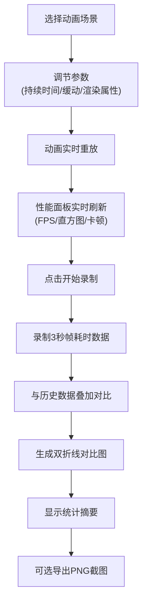

## 1. 产品概述

CSS动画性能微基准测试应用，帮助前端开发者快速对比不同CSS动画实现方式的性能表现。解决调试复杂动画时手动测试繁琐、难以量化流畅度的痛点，目标用户为前端开发工程师、UI动效设计师。

通过可视化的性能指标和对比报告，帮助开发者选择最优的动画实现方案，提升页面流畅度和用户体验。

## 2. 核心功能

### 2.1 用户角色
| 角色 | 注册方式 | 核心权限 |
|------|----------|----------|
| 前端开发者 | 无需注册 | 使用所有动画测试、性能监控、对比分析功能 |

### 2.2 功能模块
1. **动画场景库**：8种预设动画场景，支持参数调节和实时预览
2. **性能仪表盘**：实时FPS、帧耗时直方图、卡顿次数统计
3. **录制对比系统**：3秒性能数据录制，历史对比双折线图，报告导出
4. **参数控制面板**：持续时间、缓动函数、渲染属性等参数调节

### 2.3 页面详情
| 页面名称 | 模块名称 | 功能描述 |
|---------|----------|----------|
| 主页面 | 动画预览区 | 居中显示当前选中动画场景，支持交互和重放 |
| 主页面 | 左侧控制面板 | 场景选择、参数滑块、缓动函数下拉、渲染属性选择 |
| 主页面 | 性能面板 | 左上角固定显示FPS、帧耗时直方图、卡顿统计 |
| 主页面 | 对比报告弹窗 | 录制结束后显示双折线对比图和统计摘要，支持导出PNG |

## 3. 核心流程

用户选择动画场景 → 调节动画参数 → 查看实时性能指标 → 点击录制按钮 → 系统录制3秒帧数据 → 生成对比报告 → 查看统计摘要 → 可选导出PNG截图

## 4. 用户界面设计

### 4.1 设计风格
- **主色调**：#4A90D9（科技蓝）
- **背景色**：#F5F7FA（浅灰）+ 白色主区域
- **按钮风格**：圆角8px，统一主题色边框和背景
- **字体**：Inter 或系统无衬线字体，清晰的层级对比
- **布局风格**：三栏布局，左右固定面板，中间流体预览区
- **视觉细节**：柔和发光边框、滑块阻尼回弹动画、平滑过渡

### 4.2 页面设计概述
| 页面名称 | 模块名称 | UI元素 |
|---------|----------|--------|
| 主页面 | 动画预览区 | 70%宽度居中，选中时box-shadow发光，白色卡片背景 |
| 主页面 | 左侧控制面板 | 场景选择下拉、滑块（带阻尼动画）、下拉菜单、圆角按钮 |
| 主页面 | 性能面板 | 半透明背景，FPS三色指示，柱状直方图，数字跳动动画 |
| 主页面 | 对比报告 | 双折线图（#4A90D9当前 / #E74C3C历史），统计摘要卡片 |

### 4.3 响应式
- **桌面优先**：适配1280px以上宽屏
- **平板适配**：宽度<1024px时，参数面板折叠为顶部抽屉式展开
- **触摸优化**：滑块和按钮尺寸适配触摸操作，最小点击区域44px

### 4.4 性能优化
- 使用 `will-change` 和 `transform` 启用硬件加速
- 性能仪表盘自身开销控制在0.5ms每帧以内
- 合理使用 `requestAnimationFrame` 进行帧调度
- 避免频繁的重排重绘，参数变化时批量更新
