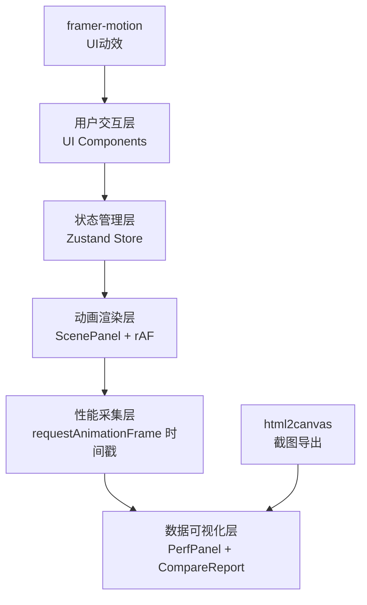

## 1. 架构设计



## 2. 技术描述

- **前端框架**：React@18 + TypeScript@5
- **构建工具**：Vite@5 + @vitejs/plugin-react@4
- **状态管理**：Zustand@4（轻量级，避免重渲染）
- **UI动效**：framer-motion@11（面板展开/数字跳动/悬浮效果）
- **截图导出**：html2canvas@1（导出对比报告PNG）
- **渲染方式**：纯前端，无后端依赖
- **性能采集**：基于requestAnimationFrame时间戳分析

## 3. 目录结构

```
auto305/
├── .trae/documents/        # 文档目录
├── src/
│   ├── components/
│   │   ├── ScenePanel.tsx      # 动画场景渲染组件（8种动画）
│   │   ├── PerfPanel.tsx       # 性能仪表盘组件
│   │   ├── ControlPanel.tsx    # 参数控制面板组件
│   │   └── CompareReport.tsx   # 对比报告组件
│   ├── types.ts            # TypeScript类型定义
│   ├── store.ts            # Zustand状态管理
│   ├── App.tsx             # 主应用组件
│   └── main.tsx            # 应用入口
├── index.html              # HTML入口
├── vite.config.ts          # Vite配置
├── tsconfig.json           # TypeScript配置
└── package.json            # 项目依赖
```

## 4. 数据模型定义

### 4.1 核心类型定义

```typescript
// 动画场景定义
interface AnimationScene {
  id: string;
  name: string;
  thumbnail: string;
  description: string;
}

// 动画参数
interface AnimationParams {
  duration: number;       // 持续时间 ms
  easing: string;         // 缓动函数
  renderProperty: string; // 渲染属性
  loop: boolean;          // 是否循环
}

// 性能快照
interface PerformanceSnapshot {
  timestamp: number;
  frameTime: number;      // 单帧耗时 ms
  fps: number;            // 瞬时FPS
}

// 录制结果
interface RecordingResult {
  id: string;
  startTime: number;
  endTime: number;
  frames: PerformanceSnapshot[];
  stats: {
    avgFrameTime: number;
    minFps: number;
    maxFps: number;
    jankCount: number;
    overallRating: string;
  };
}

// 应用状态
interface AppState {
  currentSceneIndex: number;
  animationParams: AnimationParams;
  performanceHistory: PerformanceSnapshot[];
  recordingHistory: RecordingResult[];
  isRecording: boolean;
  currentRecording: PerformanceSnapshot[];
  realtimeFps: number;
  jankCount: number;
}
```

### 4.2 状态管理设计

**Zustand Store** 分为三个关注点：
1. **动画参数**：场景索引、持续时间、缓动函数、渲染属性
2. **性能数据**：最近60帧历史队列、实时FPS、卡顿计数
3. **录制数据**：FIFO队列存储历史录制结果，最多保存10次

## 5. 关键组件设计

### 5.1 ScenePanel.tsx
- 使用 `useRef` 存储动画状态和DOM引用
- `requestAnimationFrame` 驱动动画循环
- 通过回调函数上报每帧耗时给store
- 支持8种动画场景的条件渲染
- 使用 `will-change` 启用硬件加速

### 5.2 PerfPanel.tsx
- 从store读取最近60帧数据
- Canvas绘制帧耗时直方图
- framer-motion实现数字跳动动画
- 每200ms刷新一次UI（避免过度渲染）
- FPS显示使用绿/黄/红三色指示

### 5.3 ControlPanel.tsx
- 场景选择：下拉菜单 + 缩略图预览网格
- 参数滑块：CSS transition实现阻尼回弹
- 缓动函数：10+预设值 + cubic-bezier自定义输入
- 渲染属性：单选按钮组
- framer-motion实现抽屉式展开收起

### 5.4 CompareReport.tsx
- 双折线图：Canvas或SVG绘制
- 统计摘要：均值、最小值、卡顿计数、总体评价
- 导出PNG：html2canvas捕获DOM节点
- 支持关闭/重新打开

## 6. 性能优化策略

1. **动画层**：优先使用transform和opacity，避免触发布局
2. **硬件加速**：关键动画元素添加`will-change`和`transform: translateZ(0)`
3. **状态更新**：Zustand selectors避免不必要重渲染
4. **UI节流**：性能面板每200ms刷新，而非每帧刷新
5. **内存管理**：性能队列限制60帧，录制队列限制10条
6. **事件清理**：组件卸载时取消rAF循环和事件监听
