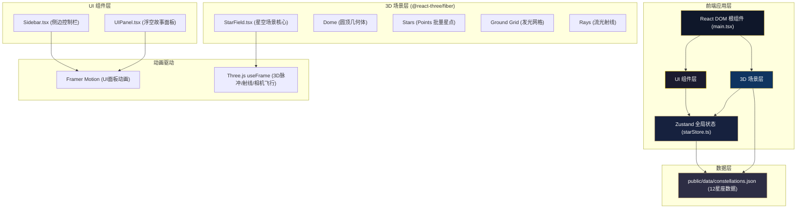

## 1. 架构设计



---

## 2. 技术栈说明

| 分类 | 技术选择 | 版本/说明 |
|------|---------|----------|
| 前端框架 | React 18 + TypeScript | 严格模式（strict: true），函数组件 + Hooks |
| 构建工具 | Vite 5 + @vitejs/plugin-react | 快速热更新，开发服务器端口 5173 |
| 3D渲染引擎 | Three.js 0.160 + @react-three/fiber 8 + @react-three/drei 9 | R3F声明式Three.js封装，drei提供OrbitControls等助手 |
| 状态管理 | Zustand 4 | 轻量无Provider，管理selectedStar、面板可见性、搜索状态 |
| UI动画 | Framer Motion 11 | 侧边栏收放、面板淡入淡出、滑块交互 |
| 性能监控 | stats.js | HUD显示FPS，确保≥30fps |
| 样式方案 | 原生CSS + CSS Modules（内联style结合className） | 磨砂玻璃使用backdrop-filter: blur(10px) |

**初始化命令**：`npm init vite-init@latest -y . -- --template react-ts --force` （Windows PowerShell）

---

## 3. 路由定义

| 路由 | 用途 |
|------|------|
| / (默认单页) | 星空投影仪主界面，包含所有功能模块 |

（单页应用无多路由，全部逻辑在主页面）

---

## 4. 核心数据模型

### 4.1 星座数据结构 (constellations.json)

```typescript
interface StarInfo {
  name: string;          // 恒星名称，如 "Betelgeuse"
  commonName?: string;   // 中文名，如 "参宿四"
  position: [number, number, number]; // 球面坐标 [theta, phi, radius]，theta经度0-2π，phi纬度0-π/2（上半球）
  spectralType: 'O' | 'B' | 'A' | 'F' | 'G' | 'K' | 'M';
  brightness: number;    // 0.2 - 1.0
  distance: string;      // 距离描述，如 "约640光年"
}

interface Constellation {
  id: string;            // 唯一标识，如 "orion"
  name: string;          // 中文名，如 "猎户座"
  latinName: string;     // 拉丁名，如 "Orion"
  symbol: string;        // 简笔画SVG path data（2D矢量图标）
  stars: StarInfo[];     // 该星座的代表恒星数组
  myth: string;          // 中文神话故事，约150字
}

// 根数据结构
type ConstellationData = Constellation[];
// 包含12个黄道星座：白羊座、金牛座、双子座、巨蟹座、狮子座、处女座、
// 天秤座、天蝎座、射手座、摩羯座、水瓶座、双鱼座
```

### 4.2 光谱颜色映射

| 光谱型 | 颜色HEX | 视觉效果 |
|--------|---------|---------|
| O | #9BB0FF | 蓝白色 |
| B | #AAD4FF | 淡蓝色 |
| A | #FFFFFF | 纯白色 |
| F | #FFF9E6 | 淡黄色 |
| G | #FFE899 | 黄色（太阳型） |
| K | #FFB366 | 橙色 |
| M | #FF6644 | 红色 |

### 4.3 Zustand Store 状态定义

```typescript
interface StarStore {
  // 选中状态
  selectedStarId: string | null;          // 当前选中恒星ID（格式：constellationIdx_starIdx）
  selectedConstellationId: string | null; // 当前选中星座ID

  // UI面板状态
  isPanelVisible: boolean;                // 浮空故事面板可见性
  isSidebarOpen: boolean;                 // 侧边栏展开状态
  scrollSpeed: number;                    // 文本滚动速度 1.0 - 3.0，默认1.5

  // 搜索状态
  searchTerm: string;                     // 搜索框输入内容

  // 相机飞行目标
  flyToTarget: [number, number, number] | null; // 相机飞行目标世界坐标

  // 动画触发标记（递增版本号触发useEffect）
  pulseTrigger: number;                   // 脉冲动画触发器
  blinkStarId: string | null;             // 闪烁恒星ID（搜索定位用）

  // Actions
  selectStar: (constellationId: string, starIndex: number, position: [number, number, number]) => void;
  setPanelVisible: (visible: boolean) => void;
  toggleSidebar: () => void;
  setScrollSpeed: (speed: number) => void;
  setSearchTerm: (term: string) => void;
  searchAndFlyToStar: (starName: string) => boolean; // 返回是否找到
  flyToConstellation: (constellationId: string) => void;
  closePanel: () => void;
  clearBlink: () => void;
}
```

---

## 5. 项目文件结构

```
auto307/
├── package.json                      # 依赖配置
├── vite.config.ts                    # Vite配置（React插件）
├── tsconfig.json                     # TypeScript严格模式配置
├── index.html                        # 入口HTML（全屏）
├── public/
│   └── data/
│       └── constellations.json       # 12星座数据（恒星坐标+神话故事）
└── src/
    ├── main.tsx                      # ReactDOM渲染入口
    ├── store/
    │   └── starStore.ts              # Zustand状态管理
    ├── components/
    │   ├── StarField.tsx             # Three.js 3D场景核心
    │   ├── UIPanel.tsx               # 浮空磨砂玻璃故事面板
    │   └── Sidebar.tsx               # 左侧搜索+星座图标控制栏
    └── styles/
        └── global.css                # 全局样式（磨砂玻璃、字体等）
```

---

## 6. 关键实现要点

### 6.1 恒星坐标生成

- 600颗恒星中，约24颗为12星座的代表星（每星座2颗），使用constellations.json中定义的球面坐标
- 剩余576颗为随机分布的背景星，在半球面（y ≥ 0）均匀采样：
  ```
  theta = 2π * random()
  phi = arcsin(sqrt(random()))   // 球面均匀采样修正
  radius = 9.5 (略小于圆顶半径10)
  x = radius * sin(phi) * cos(theta)
  y = radius * cos(phi)
  z = radius * sin(phi) * sin(theta)
  ```
- 光谱型按真实天文比例随机分配：O(0.00003%)→简化为1%、B(3%)、A(10%)、F(15%)、G(20%)、K(30%)、M(21%)

### 6.2 星点拾取与脉冲动画

- 使用THREE.Points + BufferGeometry存储600颗星的position、color、size
- @react-three/drei的useCursorRaycaster或自定义Raycaster检测点击
- 脉冲动画：在useFrame中对选中星的pointSize乘以`1.0 + 0.5 * abs(sin(time * 4))`实现缩放0.5Hz脉动
- 高亮：emissiveIntensity从1.0提升到2.0

### 6.3 流光射线动画

- 射线使用THREE.Line，顶点从恒星世界坐标到面板屏幕坐标映射到3D空间（固定在圆顶左上方，y=3, x=-3, z=-4附近）
- 使用LineBasicMaterial + vertexColors实现#FFD700→rgba(0,0,0,0)渐变
- 动画：1.5秒内通过dashOffset + lineDash实现流光从恒星流向面板，然后淡出

### 6.4 相机平滑飞行

- 禁用OrbitControls，在useFrame中使用线性插值（lerp）+ easeOutCubic缓动函数：
  ```
  t = elapsed / duration; eased = 1 - Math.pow(1-t, 3);
  camera.position.lerpVectors(startPos, targetPos, eased);
  controls.target.lerpVectors(startTarget, starPosition, eased);
  ```

### 6.5 磨砂玻璃效果

```css
.frosted-glass {
  background: rgba(26, 26, 46, 0.15);
  backdrop-filter: blur(10px) saturate(150%);
  -webkit-backdrop-filter: blur(10px) saturate(150%);
  border: 1px solid #C9A96E;
  border-radius: 12px;
}
```

### 6.6 滚动文本动画

- 使用CSS `@keyframes scroll-up` + `animation-duration: calc(30s / var(--speed))` 实现
- JS根据scrollSpeed state动态设置CSS变量 --speed

### 6.7 FPS性能监控

- 在main.tsx中实例化Stats，挂载到DOM，并在useFrame的自定义循环中调用`stats.update()`
- 开发模式下通过console.log每5秒输出平均FPS作为备份
