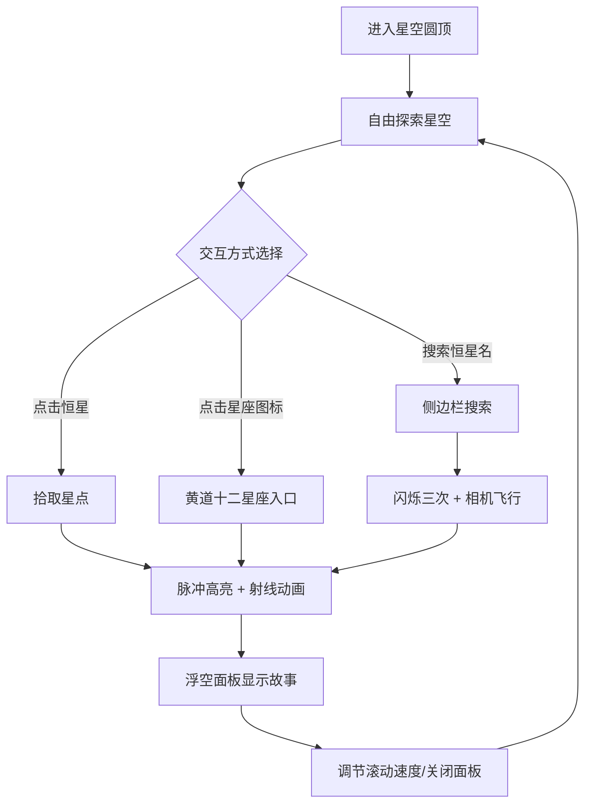

## 1. 产品概述

微型3D星座故事投影仪是一款面向天文爱好者的沉浸式虚拟星空体验应用。用户可在交互式3D圆顶星空中探索恒星，通过点击、搜索等方式了解恒星信息，并聆听富有文化底蕴的星座神话故事。

- 核心价值：将枯燥的天文知识与浪漫的神话故事相结合，打造寓教于乐的沉浸式星空漫游体验
- 目标用户：天文爱好者、学生、文化爱好者

---

## 2. 核心功能

### 2.1 用户角色

| 角色 | 注册方式 | 核心权限 |
|------|---------|---------|
| 访客用户 | 无需注册 | 自由浏览星空、搜索恒星、阅读星座故事 |

### 2.2 功能模块

1. **3D星空场景**：圆顶空间、600颗光谱着色恒星、相机控制（旋转/平移/缩放）
2. **恒星交互系统**：点击拾取、脉冲高亮、流光射线动画、相机飞行
3. **神话故事面板**：浮空磨砂玻璃面板、滚动文本展示、速度调节滑块
4. **侧边控制栏**：恒星搜索、黄道十二星座快捷入口、侧边栏动画收起

### 2.3 页面详情

| 页面名称 | 模块名称 | 功能描述 |
|---------|---------|---------|
| 主场景页 | 3D圆顶星空 | 直径20单位、高6单位浅灰半透明圆顶，地面发光网格 |
| 主场景页 | 恒星系统 | 600颗随机分布恒星，按O/B/A/F/G/K/M光谱着色，亮度随机0.2-1.0 |
| 主场景页 | 相机控制 | 左键拖拽旋转、右键平移、滚轮缩放 |
| 主场景页 | 恒星交互 | 点击恒星脉冲放大1.5倍、保持高亮、金色流光射线连接面板 |
| 主场景页 | 故事面板 | 磨砂玻璃效果、显示星座名称、滚动神话故事、速度滑块、关闭按钮 |
| 主场景页 | 侧边控制栏 | 搜索框输入恒星名、闪烁定位、自动飞行动画、12黄道星座图标入口 |

---

## 3. 核心流程

用户进入虚拟星空圆顶 → 自由探索（鼠标旋转/平移/缩放）→ 通过以下任一方式触发恒星展示：
  1. 直接点击任意可见恒星
  2. 侧边栏搜索恒星名称（如Betelgeuse）
  3. 点击黄道十二星座快捷图标
→ 恒星闪烁/脉冲高亮 → 相机平滑飞向目标恒星 → 金色流光射线从恒星射向浮空面板 → 面板显示星座名称和滚动神话故事 → 用户可调节滚动速度或关闭面板 → 继续探索

---

## 4. 用户界面设计

### 4.1 设计风格

- **主色调**：深蓝 #0F172A，金色点缀 #D4AF37 / #C9A96E / #FFD700
- **面板效果**：磨砂玻璃（backdrop-filter: blur），半透明深色背景 + 金色细边框
- **字体**：标题衬线字体营造古典神话氛围，正文等宽字体用于滚动故事文本
- **动效风格**：优雅缓动动画（easeOut），Three.js 3D动画 + framer-motion UI动画
- **图标风格**：简笔画线条风格星座图标

### 4.2 页面设计概览

| 页面名称 | 模块名称 | UI元素 |
|---------|---------|--------|
| 主场景 | 3D圆顶星空 | 深浅蓝色渐变背景、浅灰半透明穹顶、发光网格地面、彩色星点 |
| 主场景 | 恒星动画 | 脉冲缩放、金色渐变流光射线（1.5秒）、闪烁（周期0.5秒×3次） |
| 主场景 | 浮空故事面板 | 磨砂玻璃 #1A1A2E(15%透明度)、#C9A96E边框、居中偏左上、距地3单位 |
| 主场景 | 故事面板控件 | 白色圆形关闭按钮（悬停变金）、右下角速度滑块（1X-3X，默认1.5X） |
| 主场景 | 侧边控制栏 | 宽200px、#16213E背景、圆角8px、半透明、framer-motion 0.3s缓动收放 |
| 主场景 | 侧边栏内容 | 搜索框（金色边框聚焦）、12星座简笔画图标网格（居中排列） |

### 4.3 响应式设计

- 桌面端优先设计，1920×1080为基准分辨率
- 侧边栏在小屏幕下可默认收起，通过汉堡按钮展开
- 浮空面板采用相对屏幕定位，确保在各种分辨率下位置合理

### 4.4 3D场景指引

- **环境**：深蓝渐变背景模拟夜空，无外部HDRI，圆顶内自发光星点作为主要光源
- **光照**：AmbientLight(0.3) + 微弱PointLight模拟环境光，星点自身emissive发光
- **相机**：PerspectiveCamera，fov 60，近裁剪0.1，远裁剪100，初始位置圆顶内部中央
- **相机运动**：OrbitControls支持左键旋转/右键平移/滚轮缩放，阻尼开启；搜索定位时自定义tween动画（2秒平滑飞行）
- **交互**：Raycaster射线拾取星点，点击检测三维空间坐标
- **后处理**：星点使用Additive Blending模拟发光，必要时使用UnrealBloomPass增强辉光
- **性能**：使用Points/BatchedMesh合并600颗星为单个Draw Call，目标帧率≥30fps（stats.js监测）
