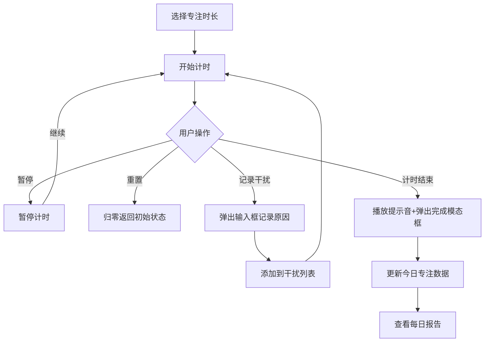

## 1. 产品概述

专注实验室是一款微型虚拟自习室专注计时与干扰记录应用，帮助用户通过番茄工作法进行专注学习，记录分心事件并生成每日专注报告，提升个人效率和专注力。

- 主要功能：专注计时、干扰事件记录、每日专注报告
- 目标用户：需要提升专注力的学生、职场人士、自由职业者
- 产品价值：通过可视化的专注数据和干扰分析，帮助用户建立良好的专注习惯

## 2. 核心功能

### 2.1 功能模块

1. **计时面板**：预设/自定义专注时长、开始/暂停/重置计时、计时状态可视化
2. **干扰日志**：快速记录干扰事件、查看历史干扰记录、删除单条记录
3. **每日报告**：查看每日专注数据、近7天专注趋势图表、详细记录表格

### 2.2 页面详情

| 页面名称 | 模块名称 | 功能描述 |
|---------|---------|---------|
| 主页面 | 计时面板 | 选择25/45/60分钟预设或自定义1-120分钟时长，开始/暂停/重置计时，倒计时显示带颜色渐变，计时结束播放提示音并弹出完成模态框 |
| 主页面 | 干扰日志 | 点击"记录干扰"按钮弹出输入框，记录时间戳和干扰原因，列表按时间倒序显示，支持单条删除，最多50条记录 |
| 主页面 | 每日报告 | 日期选择器查看近7天数据，显示专注总时长、完成次数、干扰次数，柱状图展示近7天趋势，表格展示每日详细记录 |

## 3. 核心流程

用户选择专注时长 → 开始计时 → 期间可暂停/重置/记录干扰 → 计时结束播放提示音并弹出完成提示 → 查看每日报告分析专注数据

## 4. 用户界面设计

### 4.1 设计风格

- **主色调**：深色主题，背景 #1E1E2E，卡片 #2D2D44，文字 #E0E0E0
- **交互色**：紫色 #6C63FF（hover #5A52D5），计时状态色：绿色 #2ECC71 / 黄色 #F39C12 / 红色 #E74C3C
- **强调色**：金色 #F1C40F（应用名称）
- **字体**：等宽字体 monospace（计时器），系统默认字体（正文）
- **按钮风格**：圆角按钮，带脉冲动画（计时中），毛玻璃卡片效果
- **布局风格**：三栏式桌面布局，响应式适配平板和移动端

### 4.2 页面设计概览

| 页面名称 | 模块名称 | UI元素 |
|---------|---------|---------|
| 主页面 | 计时面板 | 时长选择（预设+自定义）、大号等宽字体倒计时、开始/暂停/重置按钮、计时进度颜色渐变、毛玻璃卡片 |
| 主页面 | 干扰日志 | "记录干扰"按钮、干扰记录列表（时间+原因+删除按钮）、浅红背景+红色左边框、滚动容器 |
| 主页面 | 每日报告 | 日期选择器、统计卡片（时长/次数/干扰）、柱状图（SVG）、详细数据表格 |

### 4.3 响应式设计

- **桌面端（≥900px）**：三栏并排布局，每栏占1/3宽度
- **平板端（600px-900px）**：计时面板满宽，干扰日志和每日报告上下排列
- **移动端（<600px）**：单栏垂直排列，计时面板吸顶

### 4.4 动画效果

- 卡片进入视口：透明度 0→1 渐入，持续0.4s
- 计时中按钮：红色脉冲动画
- 模态框：淡入淡出动画，持续0.3s
- 列表项hover：背景色过渡
