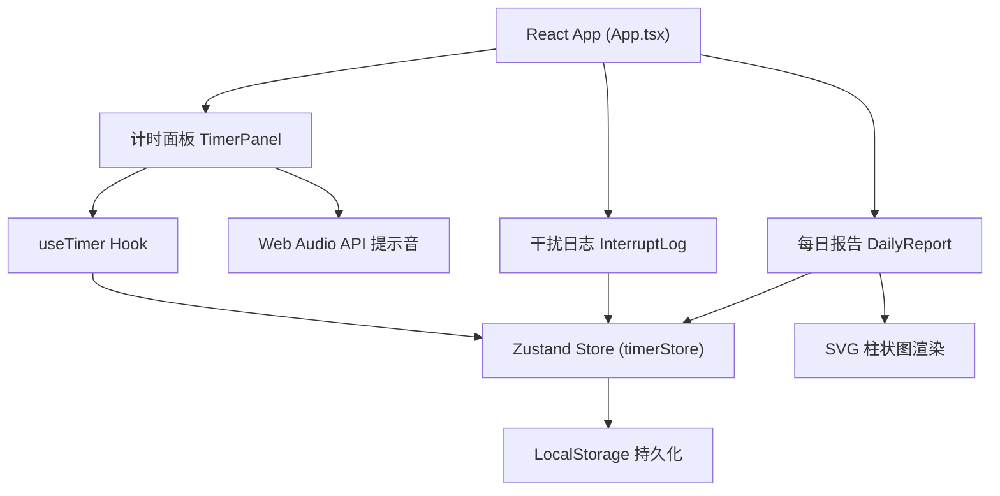

## 1. 架构设计



## 2. 技术说明

- **前端框架**：React 18 + TypeScript
- **构建工具**：Vite
- **状态管理**：Zustand
- **日期处理**：date-fns
- **样式方案**：原生CSS（无UI库），使用CSS变量管理主题
- **图表渲染**：原生SVG实现柱状图
- **音频**：Web Audio API生成提示音

## 3. 文件结构

```
d:\Pro\tasks\auto309\
├── package.json
├── vite.config.ts
├── tsconfig.json
├── index.html
└── src/
    ├── App.tsx
    ├── hooks/
    │   └── useTimer.ts
    ├── store/
    │   └── timerStore.ts
    └── components/
        ├── TimerPanel.tsx
        ├── InterruptLog.tsx
        └── DailyReport.tsx
```

## 4. 数据模型

### 4.1 状态定义（timerStore）

```typescript
interface InterruptEvent {
  id: string;
  timestamp: number;
  reason: string;
}

interface TimerState {
  isRunning: boolean;
  isPaused: boolean;
  targetDuration: number;      // 目标时长（秒）
  elapsedSeconds: number;      // 已用秒数
  interrupts: InterruptEvent[];
  dailyFocusMinutes: Record<string, number>;   // 日期(YYYY-MM-DD) -> 专注分钟数
  dailySessions: Record<string, number>;       // 日期 -> 完成次数
  dailyInterrupts: Record<string, number>;     // 日期 -> 干扰次数
  setTargetDuration: (minutes: number) => void;
  startTimer: () => void;
  pauseTimer: () => void;
  resetTimer: () => void;
  completeSession: (minutes: number) => void;
  addInterrupt: (reason: string) => void;
  removeInterrupt: (id: string) => void;
  resetTodayData: () => void;
}
```

## 5. 性能优化方案

- **useTimer Hook**：使用 setInterval 每秒更新一次状态，仅在秒数变化时触发重渲染
- **组件优化**：使用 useMemo 和 useCallback 包装子组件和回调函数，避免不必要的重绘
- **状态选择**：Zustand 使用 selector 精确订阅所需状态切片
- **图表**：SVG 渲染柱状图，切换日期时复用 DOM 节点避免闪烁
- **持久化**：数据变更时防抖写入 localStorage
