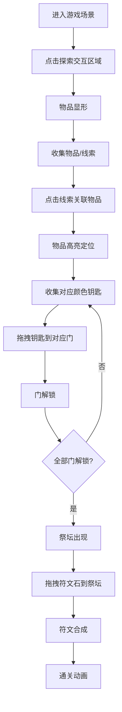

## 1. 产品概述

Hidden Quest 是一款微型解谜寻物游戏，玩家在古老图书馆场景中通过线索提示和交互操作找出隐藏的钥匙与符文石，逐步解锁门禁并最终完成通关。

- 核心玩法：在固定场景内探索、收集物品与线索、解开谜题、解锁门禁、合成符文通关
- 目标用户：休闲解谜游戏爱好者，适合短时间内体验完整游戏循环

## 2. 核心功能

### 2.1 Feature Module

1. **游戏主场景**：古老图书馆场景画布、可交互隐藏物品、门禁系统、通关祭坛
2. **线索面板**：线索收集展示、线索关联物品高亮定位
3. **物品栏系统**：背包物品展示、拖拽使用、物品组合
4. **动画反馈系统**：物品发现动画、门禁解锁动画、通关动画、拖拽交互反馈

### 2.3 Page Details

| 页面名称 | 模块名称 | 功能描述 |
|-----------|-------------|---------------------|
| 游戏主界面 | 场景画布 | 800x600(桌面)/400x300(移动) 固定场景，随机分布5个隐藏物品和4条线索 |
| 游戏主界面 | 交互区域 | 点击书架边缘、地毯角落等特定区域使物品显形并收集 |
| 游戏主界面 | 门禁系统 | 3扇颜色门(红/蓝/绿)，需对应钥匙解锁，全部解锁后出现祭坛 |
| 游戏主界面 | 合成祭坛 | 拖拽2块符文石碎片到祭坛合成完整符文触发通关 |
| 线索面板 | 线索列表 | 右侧垂直面板，展示已收集线索，带图标和文字描述 |
| 线索面板 | 线索高亮 | 点击线索条目使场景中对应物品播放脉冲高亮动画并显示指向箭头 |
| 物品栏 | 物品展示 | 底部横向物品栏，展示钥匙和符文石，悬停显示名称和用途 |
| 物品栏 | 拖拽交互 | 拖拽钥匙到对应门解锁，拖拽符文石到祭坛合成 |

## 3. 核心流程

玩家进入游戏后，在古老图书馆场景中通过点击探索发现隐藏物品和线索，收集线索后可关联定位隐藏物品，收集对应钥匙解锁3扇颜色门，全部门解锁后出现祭坛，将符文石碎片拖拽到祭坛合成通关。

## 4. 用户界面设计

### 4.1 Design Style

- **设计基调**：深色奇幻神秘风格，营造古老图书馆的魔法氛围
- **主色调**：深蓝紫渐变背景 #1a1a2e → #16213e
- **强调色**：青色发光 #00d2ff，金色脉冲 #FFD700，红色警示 #FF6347
- **门颜色**：红色 #e74c3c、蓝色 #3498db、绿色 #2ecc71
- **面板效果**：半透明磨砂玻璃，backdrop-filter: blur(8px)，background: rgba(15, 52, 96, 0.7)
- **字体**：使用 Cinzel Decorative 作为标题字体（奇幻风格），Noto Sans SC 作为正文字体
- **动画风格**：细腻的发光、脉冲、滑动、淡入淡出效果，所有过渡使用 ease-out 缓动

### 4.2 Page Design Overview

| 页面名称 | 模块名称 | UI Elements |
|-----------|-------------|-------------|
| 游戏主界面 | 场景画布 | 800x600 图书馆背景，交互区域半透明伪装，发现时淡入实体，点击涟漪效果 |
| 游戏主界面 | 可交互物品 | 半透明伪装色，hover时发光边框，收集时0.3s缩放+发光动画 |
| 游戏主界面 | 门禁系统 | 3扇带颜色的门，未解锁时显示锁图标，解锁时0.5s向两侧滑开动画，错误时0.2s震动 |
| 游戏主界面 | 合成祭坛 | 3门解锁后出现，位于场景中央，接收符文石拖拽，合成时粒子上升 |
| 线索面板 | 线索条目 | 右侧垂直固定，每个线索带卷轴图标和文字，点击高亮关联物品 |
| 物品栏 | 物品图标 | 底部横向排列，悬停时上浮3px并放大1.1倍，拖拽时跟随鼠标，目标区域高亮边框 |
| 通关界面 | 通关效果 | 场景渐变亮起，粒子上升动画，"Quest Complete" 文字渐显 |

### 4.3 Responsiveness

- **桌面端**（≥768px）：场景画布 800x600 居中显示，线索面板固定右侧200px宽，物品栏固定底部全宽
- **移动端**（<768px）：场景画布缩小至 400x300 并自动居中，线索面板改为底部横向可滑动布局，物品栏压缩高度适配
- **触摸优化**：增大可点击区域至最小44x44px，长按触发线索高亮，触摸拖拽与鼠标拖拽行为一致

### 4.4 视觉动效规范

- **物品发现**：从opacity:0.3 scale:0.8 过渡到 opacity:1 scale:1，0.5s ease-out，伴随 box-shadow 发光增强
- **线索高亮**：物品颜色从 #FFD700 到 #FF6347 脉冲动画，1.5s 循环，伴随指向箭头悬浮
- **门解锁**：门扇向两侧滑开，transform: translateX(±100%)，0.5s cubic-bezier(0.34, 1.56, 0.64, 1)
- **拖拽反馈**：目标区域高亮边框 box-shadow: 0 0 20px #00d2ff，物品跟随鼠标时带轻微旋转
- **涟漪效果**：点击交互区域时使用 radial-gradient 创建扩散波纹，0.6s 淡出
