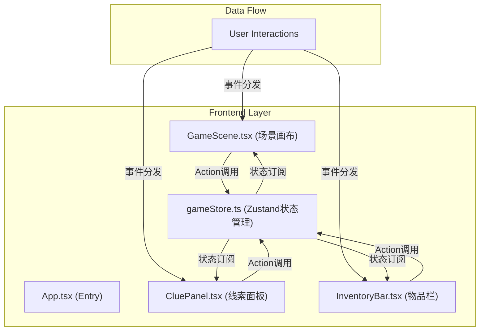

## 1. Architecture Design



**文件调用关系与数据流：**

1. `App.tsx` → 组装 `GameScene.tsx`、`CluePanel.tsx`、`InventoryBar.tsx`
2. `GameScene.tsx` → 订阅 `gameStore.ts` 中的 `currentScene`、`items`、`unlockedDoors`、`highlightItem`、`inventory`
3. `CluePanel.tsx` → 订阅 `gameStore.ts` 中的 `clues`、`highlightItem`，调用 `setHighlightItem`
4. `InventoryBar.tsx` → 订阅 `gameStore.ts` 中的 `inventory`，调用 `useItem`、`unlockDoor`
5. 所有状态变更通过 `gameStore.ts` 的 action 统一处理，组件通过 selector 获取所需状态

## 2. Technology Description

- **Frontend Framework**: React@18 + TypeScript@5
- **Build Tool**: Vite@5
- **State Management**: Zustand@4
- **Dev Server**: @vitejs/plugin-react@4
- **Type Definitions**: @types/react@18, @types/react-dom@18
- **Styling**: 原生 CSS（CSS Variables + CSS Animations）
- **Audio**: Web Audio API（生成简单音效）
- **No Backend**: 纯前端应用，所有数据为 mock 数据

### 项目文件结构

```
auto311/
├── index.html                    # 入口HTML
├── package.json                  # 依赖配置
├── vite.config.ts                # Vite配置
├── tsconfig.json                 # TypeScript配置
└── src/
    ├── main.tsx                  # React入口
    ├── App.tsx                   # 根组件
    ├── gameStore.ts              # Zustand状态管理
    ├── GameScene.tsx             # 游戏场景组件
    ├── CluePanel.tsx             # 线索面板组件
    ├── InventoryBar.tsx          # 物品栏组件
    ├── types.ts                  # TypeScript类型定义
    ├── utils/
    │   ├── audio.ts              # Web Audio API音效工具
    │   └── gameData.ts           # 游戏初始数据
    └── styles.css                # 全局样式
```

## 3. Route Definitions

| Route | Purpose |
|-------|---------|
| / | 游戏主界面（单页面应用，无路由切换） |

## 4. Data Model

### 4.1 TypeScript 类型定义

```typescript
// 物品类型
type ItemType = 'key-red' | 'key-blue' | 'key-green' | 'rune-1' | 'rune-2';
type DoorColor = 'red' | 'blue' | 'green';

interface Item {
  id: string;
  type: ItemType;
  name: string;
  description: string;
  x: number;      // 场景x坐标 (%)
  y: number;      // 场景y坐标 (%)
  discovered: boolean;
  collected: boolean;
  relatedClueId?: string;
}

interface Clue {
  id: string;
  title: string;
  description: string;
  icon: string;
  collected: boolean;
  relatedItemId: string;
}

interface Door {
  id: string;
  color: DoorColor;
  x: number;
  y: number;
  unlocked: boolean;
  requiredKey: ItemType;
}

interface Ripple {
  id: string;
  x: number;
  y: number;
}

interface GameState {
  // 状态
  items: Item[];
  clues: Clue[];
  doors: Door[];
  inventory: ItemType[];
  unlockedDoors: DoorColor[];
  highlightItem: string | null;
  altarVisible: boolean;
  runeSynthesis: boolean;
  gameComplete: boolean;
  ripples: Ripple[];
  draggingItem: ItemType | null;
  dragPosition: { x: number; y: number } | null;
  
  // Actions
  discoverItem: (itemId: string) => void;
  collectItem: (itemId: string) => void;
  collectClue: (clueId: string) => void;
  setHighlightItem: (itemId: string | null) => void;
  unlockDoor: (doorColor: DoorColor, keyType: ItemType) => boolean;
  useItem: (itemType: ItemType, target: { type: 'door' | 'altar'; id?: string }) => boolean;
  synthesizeRune: () => void;
  addRipple: (x: number, y: number) => void;
  removeRipple: (rippleId: string) => void;
  setDraggingItem: (item: ItemType | null, pos?: { x: number; y: number }) => void;
  setDragPosition: (pos: { x: number; y: number }) => void;
  resetGame: () => void;
}
```

### 4.2 游戏初始数据

```typescript
// 5个隐藏物品初始位置（随机分布在场景中）
const initialItems: Item[] = [
  { id: 'key-red', type: 'key-red', name: '红色符文钥匙', description: '用于打开红色之门', x: 15, y: 30, discovered: false, collected: false, relatedClueId: 'clue-1' },
  { id: 'key-blue', type: 'key-blue', name: '蓝色符文钥匙', description: '用于打开蓝色之门', x: 75, y: 45, discovered: false, collected: false, relatedClueId: 'clue-2' },
  { id: 'key-green', type: 'key-green', name: '绿色符文钥匙', description: '用于打开绿色之门', x: 45, y: 70, discovered: false, collected: false, relatedClueId: 'clue-3' },
  { id: 'rune-1', type: 'rune-1', name: '符文石碎片·上', description: '古老符文的上半部分', x: 25, y: 55, discovered: false, collected: false, relatedClueId: 'clue-4' },
  { id: 'rune-2', type: 'rune-2', name: '符文石碎片·下', description: '古老符文的下半部分', x: 65, y: 25, discovered: false, collected: false, relatedClueId: 'clue-4' },
];

// 4条线索
const initialClues: Clue[] = [
  { id: 'clue-1', title: '书页之间', description: '红门之钥藏于书页之间', icon: '📜', collected: false, relatedItemId: 'key-red' },
  { id: 'clue-2', title: '水晶之光', description: '蓝门之钥在水晶吊灯的反光之处', icon: '📜', collected: false, relatedItemId: 'key-blue' },
  { id: 'clue-3', title: '地毯角落', description: '绿门之钥藏于古老地毯的角落', icon: '📜', collected: false, relatedItemId: 'key-green' },
  { id: 'clue-4', title: '符文传说', description: '两块符文石碎片，一明一暗，合则通关', icon: '📜', collected: false, relatedItemId: 'rune-1' },
];

// 3扇门
const initialDoors: Door[] = [
  { id: 'door-red', color: 'red', x: 10, y: 15, unlocked: false, requiredKey: 'key-red' },
  { id: 'door-blue', color: 'blue', x: 45, y: 15, unlocked: false, requiredKey: 'key-blue' },
  { id: 'door-green', color: 'green', x: 80, y: 15, unlocked: false, requiredKey: 'key-green' },
];
```

## 5. 核心实现要点

### 5.1 性能优化

- **状态选择器**：使用 Zustand 的 selector 精确订阅，避免不必要的重渲染
- **CSS 动画**：所有动画使用 transform 和 opacity，避免触发 layout
- **will-change**：对拖拽元素和动画元素设置 will-change 提升性能
- **requestAnimationFrame**：拖拽位置更新使用 rAF 确保 60FPS
- **事件委托**：场景点击事件使用事件委托减少监听器数量

### 5.2 拖拽实现

- 使用原生 pointer events 统一处理鼠标和触摸拖拽
- 拖拽开始时记录起始位置，拖拽过程中更新位置
- 目标区域使用 `elementFromPoint` 检测碰撞
- 松手时判断目标类型并执行对应逻辑

### 5.3 动画实现

- 物品发现：CSS transition + keyframes 实现缩放发光
- 线索高亮：CSS animation 实现脉冲效果
- 门解锁：CSS transform 实现滑开动画
- 涟漪效果：动态创建元素 + CSS radial-gradient 动画
- 通关粒子：Canvas 或 CSS 粒子系统实现上升效果

### 5.4 音频实现

- Web Audio API 创建 OscillatorNode 生成简单音效
- 收集物品：高音调短促叮当声
- 解锁成功：上升音阶
- 错误操作：低音调短促音效
- 通关：和弦音效
