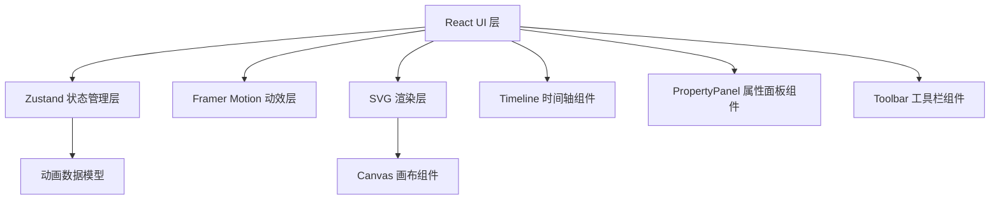

## 1. 架构设计



## 2. 技术描述

- **前端框架**：React 18 + TypeScript
- **构建工具**：Vite 5
- **状态管理**：Zustand 4
- **UI动效**：Framer Motion 11
- **样式方案**：CSS Modules + CSS Variables
- **类型检查**：TypeScript strict模式
- **目标版本**：ES2020

## 3. 项目结构

```
.
├── package.json
├── vite.config.ts
├── tsconfig.json
├── index.html
└── src/
    ├── store/
    │   └── useAnimationStore.ts    # Zustand状态管理
    ├── components/
    │   ├── Canvas.tsx              # SVG画布组件
    │   ├── Timeline.tsx            # 时间轴组件
    │   ├── PropertyPanel.tsx       # 属性编辑面板
    │   ├── Toolbar.tsx             # 工具栏组件
    │   ├── EasingPreview.tsx       # 缓动曲线预览
    │   └── CodePreview.tsx         # 导出代码预览
    ├── utils/
    │   ├── easing.ts               # 缓动函数计算
    │   └── interpolation.ts        # 关键帧插值计算
    ├── types/
    │   └── animation.ts            # 类型定义
    ├── App.tsx
    ├── main.tsx
    └── index.css
```

## 4. 类型定义

```typescript
// src/types/animation.ts
export interface Keyframe {
  id: string;
  time: number;          // 0-5秒
  x: number;             // -200到200像素
  y: number;             // -200到200像素
  rotate: number;        // -180到180度
  scale: number;         // 0.5到2.0
  opacity: number;       // 0到1
  easing: EasingType;
  bezierParams?: BezierParams;
}

export type EasingType = 'linear' | 'ease-in' | 'ease-out' | 'ease-in-out' | 'bezier';

export interface BezierParams {
  p1x: number;  // 0-1
  p1y: number;  // 0-1
  p2x: number;  // 0-1
  p2y: number;  // 0-1
}

export interface AnimationState {
  duration: number;           // 总时长5秒
  keyframes: Keyframe[];
  currentTime: number;
  isPlaying: boolean;
  playbackSpeed: 0.5 | 1 | 2;
  selectedKeyframeId: string | null;
  zoom: number;               // 0.5-3
  startRange: number;
  endRange: number;
}

export interface ExportedAnimation {
  duration: number;
  keyframes: Array<{
    time: number;
    x: number;
    y: number;
    rotate: number;
    scale: number;
    opacity: number;
    easing: string;
  }>;
}
```

## 5. Zustand Store 接口

```typescript
// src/store/useAnimationStore.ts
interface AnimationStore extends AnimationState {
  // 关键帧操作
  addKeyframe: (time: number) => void;
  updateKeyframe: (id: string, updates: Partial<Keyframe>) => void;
  removeKeyframe: (id: string) => void;
  selectKeyframe: (id: string | null) => void;
  
  // 播放控制
  play: () => void;
  pause: () => void;
  setCurrentTime: (time: number) => void;
  setPlaybackSpeed: (speed: 0.5 | 1 | 2) => void;
  
  // 范围控制
  setRange: (start: number, end: number) => void;
  
  // 缩放
  setZoom: (zoom: number) => void;
  
  // 缓动函数
  setEasing: (keyframeId: string, easing: EasingType, bezierParams?: BezierParams) => void;
  
  // 导出
  exportAnimation: () => ExportedAnimation;
  
  // 计算当前帧状态
  getInterpolatedState: (time: number) => { x: number; y: number; rotate: number; scale: number; opacity: number };
}
```

## 6. 性能优化策略

1. **requestAnimationFrame驱动**：使用rAF确保动画帧率稳定在60FPS
2. **Zustand选择器优化**：使用细粒度selector避免不必要的重渲染
3. **SVG transform优化**：使用transform属性而非直接修改x/y，触发GPU加速
4. **Memoization**：关键帧插值计算结果缓存，避免重复计算
5. **Framer Motion优化**：使用will-change提示浏览器提前优化
6. **时间轴虚拟化**：只渲染可视区域的关键帧（虽然最多20个，预留优化空间）
