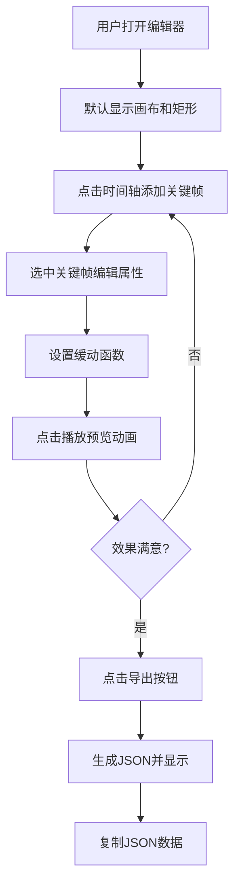

## 1. 产品概述

SVG动画序列编辑器是一款面向前端开发者的交互式Web应用，帮助开发者在浏览器中快速构建和调试SVG动画序列，解决手动编写SVG动画代码时无法实时预览时间轴、调整关键帧和缓动函数以及对比不同动画曲线效果的问题。

- **目标用户**：前端开发者、UI/UX设计师、动画创作者
- **核心价值**：可视化编辑、实时预览、一键导出动画序列数据

## 2. 核心功能

### 2.1 用户角色

| 角色 | 注册方式 | 核心权限 |
|------|----------|----------|
| 普通用户 | 无需注册 | 使用全部编辑功能，导出动画数据 |

### 2.2 功能模块

1. **画布区域**：SVG工作区，渲染动画元素，支持缩放预览
2. **时间轴面板**：横向时间轴条带，展示关键帧序列，支持拖拽编辑
3. **属性面板**：编辑选中关键帧的位置、旋转、缩放、不透明度属性
4. **缓动函数面板**：选择预设缓动函数或自定义贝塞尔曲线，实时预览曲线
5. **工具栏**：播放/暂停控制、速度调节、数据导出
6. **代码预览区**：展示导出的JSON动画数据，支持一键复制

### 2.3 页面详情

| 页面名称 | 模块名称 | 功能描述 |
|----------|----------|----------|
| 主编辑器 | 画布区域 | 400x400浅灰色工作区，中央显示蓝色矩形，支持滚轮缩放（0.5x-3x），右下角显示缩放比例 |
| 主编辑器 | 时间轴面板 | 5秒时长横向条带，0.5秒刻度间隔，可拖拽设置动画范围，竖线光标指示播放位置 |
| 主编辑器 | 关键帧编辑 | 点击时间轴添加菱形关键帧（#FF6F61），选中后可编辑属性，画布实时更新带0.2s淡入淡出过渡 |
| 主编辑器 | 缓动函数面板 | 下拉选择linear/ease-in/ease-out/ease-in-out/自定义贝塞尔，四滑块调节控制点，100x60曲线预览图 |
| 主编辑器 | 工具栏 | 播放/暂停按钮、0.5x/1x/2x速度选择、导出按钮 |
| 主编辑器 | 代码预览区 | 语法高亮显示导出JSON，提供复制按钮 |

## 3. 核心流程

用户打开应用 → 在时间轴上点击添加关键帧 → 选中关键帧编辑属性（位置/旋转/缩放/不透明度） → 选择或自定义关键帧间的缓动函数 → 使用播放按钮预览动画效果 → 调整参数直至满意 → 点击导出按钮生成JSON数据 → 复制JSON用于项目开发

## 4. 用户界面设计

### 4.1 设计风格

- **主色调**：深色主题
  - 主背景：#1E1E1E
  - 面板底色：#2D2D2D
  - 文字颜色：#E0E0E0
  - 时间轴底色：#3C3C3C
  - 刻度线颜色：#555555
  - 主题高亮色：#4A90D9
  - 关键帧颜色：#FF6F61
  - 曲线预览色：#2ECC71
  - 错误状态色：#E74C3C
  - 画布底色：#F0F0F0
- **按钮风格**：圆角8px，悬停时背景色变亮10%，点击时有0.95倍缩放动效（0.1s）
- **字体**：使用系统无衬线字体，保持清晰可读
- **布局风格**：左右分栏布局（画布左，时间轴+属性面板右），可拖拽分割线调节宽度
- **视觉动效**：输入框滑块高亮主题色，无效输入抖动0.3s并显示红色边框

### 4.2 页面设计概览

| 页面名称 | 模块名称 | UI元素 |
|----------|----------|--------|
| 主编辑器 | 画布区域 | SVG容器、矩形元素、缩放比例指示器 |
| 主编辑器 | 时间轴面板 | 横向条带、刻度线、可拖拽范围条、播放光标、菱形关键帧 |
| 主编辑器 | 属性面板 | 数字输入框（x/y/rotate/scale/opacity）、滑块控件、标签 |
| 主编辑器 | 缓动函数面板 | 下拉选择器、贝塞尔滑块组、SVG曲线预览图 |
| 主编辑器 | 工具栏 | 图标按钮（播放/暂停）、速度切换按钮组、导出按钮 |
| 主编辑器 | 代码预览区 | 代码块容器、语法高亮、复制按钮 |

### 4.3 响应式设计

- **桌面端（>=768px）**：左右分栏布局，画布在左，时间轴和属性面板在右，可拖拽分割线调节宽度
- **移动端（<768px）**：上下排列布局，画布在上，时间轴和属性面板在下，垂直堆叠
- **触摸优化**：移动端关键帧和按钮区域增大，便于触摸操作

## 5. 性能要求

- 动画播放帧率稳定在55FPS以上
- 关键帧数量不超过20个时，编辑响应延迟低于50ms
- 画布缩放流畅，无明显卡顿
