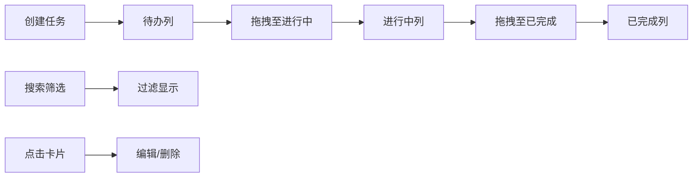

## 1. 产品概述

团队任务看板与协作应用，专为小微企业主设计，用于替代零散的表格和聊天记录，实现员工任务分配、进度跟踪和团队协作的在线化管理。

- 核心目标：提供直观、高效的任务可视化管理工具，提升团队协作效率
- 目标用户：小微企业主、团队管理者、基层员工
- 市场价值：低成本、轻量化的团队任务管理解决方案，无需复杂培训即可上手

## 2. 核心功能

### 2.1 用户角色

| 角色 | 注册方式 | 核心权限 |
|------|----------|----------|
| 团队成员 | 预设员工列表 | 创建任务、编辑任务、拖拽任务、删除任务、搜索筛选 |

### 2.2 功能模块

1. **看板主页**：三列任务看板（待办/进行中/已完成）、任务卡片展示、拖拽交互
2. **任务管理**：新建任务表单、任务详情抽屉、编辑功能、删除确认
3. **搜索筛选**：实时搜索框、优先级筛选下拉框
4. **顶部导航**：应用名称、搜索区域、筛选区域

### 2.3 页面详情

| 页面名称 | 模块名称 | 功能描述 |
|----------|----------|----------|
| 看板主页 | 三列看板 | 按状态展示任务列表，支持拖拽移动任务 |
| 看板主页 | 任务卡片 | 显示标题、负责人头像、优先级标签，悬停效果 |
| 看板主页 | 新建任务按钮 | 打开新建任务表单，填写任务信息 |
| 任务详情 | 右侧抽屉 | 展示完整任务信息，支持编辑和删除 |
| 顶部导航 | 搜索筛选 | 按标题实时搜索，按优先级筛选任务 |

## 3. 核心流程

### 3.1 新建任务流程
用户点击新建任务按钮 → 弹出表单 → 填写标题（必填）、描述、负责人、优先级 → 提交 → 任务卡片出现在待办列最上方（滑入动画）

### 3.2 任务状态流转
用户拖拽任务卡片 → 卡片跟随鼠标 → 半透明占位指示 → 放置到目标列 → 卡片弹入新列（弹簧动画）

### 3.3 任务编辑删除
点击任务卡片 → 右侧抽屉展开 → 编辑信息或点击删除 → 确认删除 → 卡片缩小消失

### 3.4 搜索筛选流程
输入搜索关键词 → 300ms延迟后过滤 → 非匹配卡片淡出 → 匹配卡片依次淡入

## 4. 用户界面设计

### 4.1 设计风格
- 主色调：深蓝色背景 (#1a2332)
- 列标题渐变：待办列蓝色 (#3b82f6)、进行中列橙色 (#f59e0b)、已完成列绿色 (#10b981)
- 卡片背景：白色 (#ffffff)
- 优先级标签：高(红)、中(黄)、低(绿)
- 字体：现代无衬线字体，标题加粗，正文清晰
- 卡片样式：8px圆角，轻微阴影，悬停时阴影增大并上移2px
- 毛玻璃效果：列标题栏使用 backdrop-filter: blur(4px)

### 4.2 页面设计概述

| 页面名称 | 模块名称 | UI元素 |
|----------|----------|--------|
| 看板主页 | 顶部导航栏 | 固定高度56px，带下阴影，左侧应用名，右侧搜索框和筛选下拉 |
| 看板主页 | 三列布局 | 最小320px，大于960px时等分，间距20px |
| 看板主页 | 任务卡片 | 标题、负责人头像、优先级标签，8px间距 |
| 任务详情 | 右侧抽屉 | 从右向左展开动画0.3s，包含编辑表单和删除按钮 |
| 交互反馈 | 动画效果 | 新建滑入、拖拽占位、放置弹簧、删除缩小、筛选淡入淡出 |

### 4.3 响应式
- Desktop-first设计
- 屏幕宽度 < 768px：三列变为垂直堆叠单列，每列高度不超过视口70%，可独立滚动
- 列间显示向下箭头指示方向
- 触摸交互优化

### 4.4 动画设计
- 新建任务：从上方滑入 0.3s ease-out
- 放置动画：弹簧效果 0.2s
- 抽屉展开：从右向左 0.3s ease-out
- 删除确认：卡片缩小消失 0.2s
- 筛选过渡：非匹配淡出 0.25s，匹配淡入 0.3s 间隔50ms
- 卡片悬停：阴影增大+上移2px 0.2s
