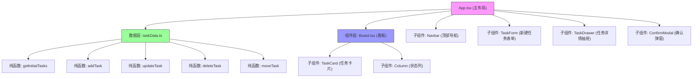

## 1. 架构设计



**数据流向说明：**
1. `App.tsx` 从 `taskData.ts` 获取初始任务数据
2. `App.tsx` 将状态传递给 `Board.tsx`、`TaskForm.tsx`、`TaskDrawer.tsx`
3. 用户操作（拖拽、新建、编辑、删除）触发回调到 `App.tsx`
4. `App.tsx` 调用 `taskData.ts` 的纯函数更新数据
5. 更新后的状态重新下发到各组件

## 2. 技术描述

- **前端框架**: React 18 + TypeScript
- **构建工具**: Vite 5 + @vitejs/plugin-react
- **拖拽库**: react-beautiful-dnd
- **HTTP客户端**: axios (预留)
- **类型定义**: @types/react, @types/react-dom
- **CSS方案**: 原生CSS + CSS Modules
- **初始化方式**: npm create vite@latest

## 3. 目录结构

```
auto32/
├── package.json
├── vite.config.ts
├── tsconfig.json
├── index.html
└── src/
    ├── main.tsx                 # 应用入口
    ├── App.tsx                  # 主布局组件
    ├── index.css                # 全局样式
    ├── types/
    │   └── index.ts             # TypeScript类型定义
    ├── data/
    │   └── taskData.ts          # 模拟数据和纯函数
    └── components/
        ├── Board.tsx            # 看板组件
        ├── Column.tsx           # 状态列组件
        ├── TaskCard.tsx         # 任务卡片组件
        ├── Navbar.tsx           # 顶部导航栏
        ├── TaskForm.tsx         # 新建任务表单
        ├── TaskDrawer.tsx       # 任务详情抽屉
        └── ConfirmModal.tsx     # 确认弹窗
```

## 4. 核心文件调用关系

| 调用方 | 被调用方 | 调用目的 |
|--------|----------|----------|
| main.tsx | App.tsx | 渲染根组件，初始化模拟数据 |
| App.tsx | taskData.ts | 获取初始数据，调用增删改查函数 |
| App.tsx | Board.tsx | 传递任务数据和拖拽回调 |
| App.tsx | Navbar.tsx | 传递搜索和筛选状态及回调 |
| App.tsx | TaskForm.tsx | 控制表单显示，接收新建任务数据 |
| App.tsx | TaskDrawer.tsx | 控制抽屉显示，传递选中任务，接收编辑数据 |
| App.tsx | ConfirmModal.tsx | 控制弹窗显示，接收删除确认 |
| Board.tsx | Column.tsx | 渲染三列，传递列数据和拖拽配置 |
| Board.tsx | TaskCard.tsx | 渲染任务卡片，传递点击回调 |
| Column.tsx | TaskCard.tsx | 渲染列内任务卡片 |

## 5. 数据模型

### 5.1 TypeScript 类型定义

```typescript
// 任务状态
type TaskStatus = 'todo' | 'in-progress' | 'done';

// 优先级
type Priority = 'high' | 'medium' | 'low';

// 员工信息
interface Employee {
  id: string;
  name: string;
  avatar: string;
}

// 任务信息
interface Task {
  id: string;
  title: string;
  description: string;
  assigneeId: string;
  priority: Priority;
  status: TaskStatus;
  createdAt: number;
}

// 看板列数据
interface ColumnData {
  id: TaskStatus;
  title: string;
  color: string;
  taskIds: string[];
}

// 看板数据
interface BoardData {
  tasks: Record<string, Task>;
  columns: Record<TaskStatus, ColumnData>;
  columnOrder: TaskStatus[];
}
```

### 5.2 数据操作纯函数

| 函数名 | 参数 | 返回值 | 功能 |
|--------|------|--------|------|
| getInitialTasks | 无 | BoardData | 获取初始模拟数据 |
| addTask | board: BoardData, task: Omit<Task, 'id' \| 'createdAt' \| 'status'> | BoardData | 添加新任务到待办列顶部 |
| updateTask | board: BoardData, taskId: string, updates: Partial<Task> | BoardData | 更新任务信息 |
| deleteTask | board: BoardData, taskId: string | BoardData | 删除任务 |
| moveTask | board: BoardData, source: { droppableId: string; index: number }, destination: { droppableId: string; index: number } | BoardData | 拖拽移动任务 |
| filterTasks | board: BoardData, searchTerm: string, priorityFilter: Priority \| 'all' | string[] | 过滤任务ID列表 |

### 5.3 预设员工列表

```typescript
const employees: Employee[] = [
  { id: 'emp1', name: '张三', avatar: '👨‍💼' },
  { id: 'emp2', name: '李四', avatar: '👩‍💼' },
  { id: 'emp3', name: '王五', avatar: '👨‍🔧' },
  { id: 'emp4', name: '赵六', avatar: '👩‍🔬' },
  { id: 'emp5', name: '钱七', avatar: '👨‍🎨' },
];
```

## 6. 性能优化策略

1. **React.memo**：对 TaskCard、Column 等频繁渲染的组件使用 memo 包裹
2. **useCallback**：对拖拽回调、搜索回调等使用 useCallback 缓存
3. **useMemo**：对过滤后的任务列表使用 useMemo 缓存
4. **防抖搜索**：搜索输入使用 300ms 防抖，减少不必要的渲染
5. **react-beautiful-dnd**：使用官方推荐的性能最佳实践，避免拖拽时重渲染
6. **CSS动画**：优先使用 transform 和 opacity 属性实现动画，触发 GPU 加速
7. **虚拟列表**：如任务量过大，可考虑引入 react-window 实现虚拟滚动
