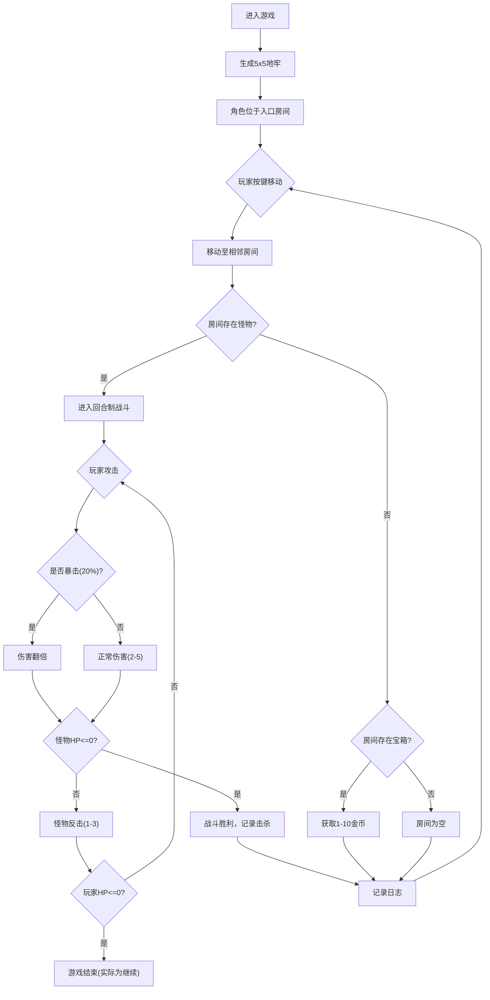

## 1. 产品概述

Roguelike地牢模拟器是一个用于快速迭代和可视化测试程序化地牢生成与回合制战斗逻辑的迷你游戏工具。面向游戏开发者和设计师，提供即时反馈的地牢生成参数调试环境。

### 2. 核心功能

#### 2.1 功能模块
1. **地牢画布区域**: 5x5网格地图渲染、房间/走廊、怪物、宝箱、角色
2. **状态面板**: 玩家HP/ATK/GOLD/KILLS数值显示与动画过渡
3. **战斗日志**: 滚动记录战斗事件，带时间戳
4. **小地图**: 全览已探索房间布局
5. **重置功能**: 重新生成地牢

#### 2.2 页面详情
| 页面名称 | 模块名称 | 功能描述 |
|-----------|-------------|---------------------|
| 主页面 | 地牢画布 | 5x5网格房间，CSS Grid布局，房间高亮/暗色/纯黑状态 |
| 主页面 | 角色移动 | WASD/方向键控制，0.15s线性动画，每个房间一格 |
| 主页面 | 战斗系统 | 回合制攻击，20%暴击率，0.2s闪烁动画，进入战斗红色光晕 |
| 主页面 | 状态面板 | HP/ATK/GOLD/KILLS数值，0.3s平滑过渡动画 |
| 主页面 | 战斗日志 | 50条滚动记录，时间戳格式[2.3s]，自动清除最早记录 |
| 主页面 | 小地图 | 200x200px，浅灰房间+金色出口圆点 |
| 主页面 | 重置按钮 | 圆形40px，悬停放大1.1倍 |

## 3. 核心流程

玩家进入游戏后自动生成地牢，使用WASD或方向键控制角色移动。每次移动进入新房间触发事件：存在怪物则进入回合制战斗，存在宝箱则自动开启获取金币，清除房间内容后可继续探索。战斗中玩家与怪物轮流攻击，直到一方血量归零。玩家可随时点击右下角重置按钮重新生成地牢。

## 4. 用户界面设计

### 4.1 设计风格
- **主色调**: 深渐变背景 (#0A0A0A → #1A1A2E)，墙壁深灰 (#2A2A2A)，地面稍亮灰 (#3A3A3A)
- **强调色**: 金色 (#FFD700 / #DAA520)、深红 (#8B0000)、蓝色 (#4A90D9)、红色按钮 (#E94560)
- **字体**: 使用 'Cinzel' 或 'Segoe UI' 等衬线/无衬线组合，营造黑暗奇幻氛围
- **布局**: 主画布居中，右侧固定面板，左上角小地图，右下角重置按钮
- **动效**: 怪物呼吸(1.5s循环透明度0.8-1.0)、宝箱闪烁(每3s闪0.1s)、角色移动0.15s线性、战斗闪烁0.2s、数值过渡0.3s

### 4.2 页面设计概览
| 页面名称 | 模块名称 | UI元素 |
|-----------|-------------|-------------|
| 主页面 | 地牢画布 | CSS Grid 5x5，房间边框高亮#FFD700 2px半透明，已探索#4A4A4A，未探索纯黑 |
| 主页面 | 角色 | 🟦蓝色圆点16px直径，血条绿色渐变在上方 |
| 主页面 | 怪物 | 🟥深红方块，呼吸动画，红色血条 |
| 主页面 | 宝箱 | 🟨金色方块，间断闪光动画 |
| 主页面 | 战斗日志 | #1E1E1E深色半透明，圆角8px，滚动区域 |
| 主页面 | 状态面板 | HP/ATK/GOLD/KILLS四行显示，数值变化平滑过渡 |
| 主页面 | 小地图 | 200x200px，#1E1E1E半透明，圆角4px |
| 主页面 | 重置按钮 | 圆形直径40px，#E94560，悬停1.1倍缩放+变亮 |

### 4.3 响应式
桌面端优先，采用固定布局保证地牢网格显示比例正确。战斗日志区域使用内部滚动适应内容。
