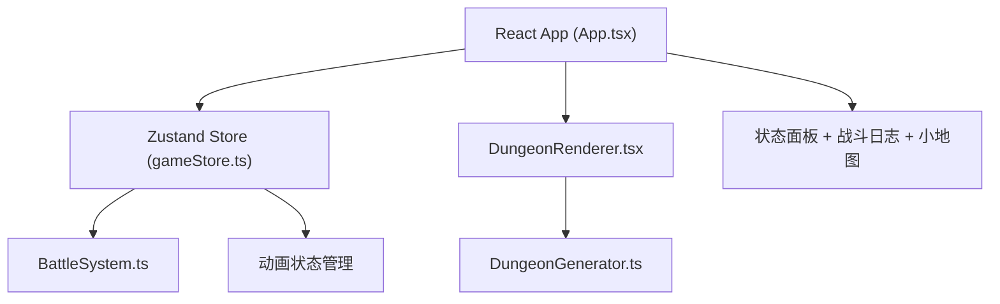

## 1. 架构设计



## 2. 技术描述
- **前端框架**: React@18 + TypeScript
- **构建工具**: Vite@5 + @vitejs/plugin-react
- **状态管理**: Zustand
- **工具库**: uuid (唯一ID生成)
- **样式方案**: 原生CSS + CSS Grid + CSS Animations
- **初始化方式**: vite-init react-ts模板

## 3. 文件结构
```
src/
├── main.tsx              # React入口
├── App.tsx               # 主应用组件
├── game/
│   ├── DungeonGenerator.ts   # 地牢生成算法
│   ├── DungeonRenderer.tsx   # 地牢渲染组件
│   └── BattleSystem.ts       # 战斗系统逻辑
└── store/
    └── gameStore.ts      # Zustand状态管理
```

## 4. 数据模型

### 4.1 类型定义

```typescript
interface Position {
  x: number;
  y: number;
}

interface Monster {
  id: string;
  hp: number;
  maxHp: number;
  atk: number;
  position: Position;
  isFlashing: boolean;
}

interface Chest {
  id: string;
  gold: number;
  position: Position;
  opened: boolean;
}

interface Room {
  id: string;
  position: Position;
  size: { width: number; height: number };
  monsters: Monster[];
  chests: Chest[];
  explored: boolean;
  isEntrance: boolean;
  isExit: boolean;
}

interface Player {
  position: Position;
  hp: number;
  maxHp: number;
  atk: number;
  gold: number;
  kills: number;
  isFlashing: boolean;
}

interface LogEntry {
  id: string;
  timestamp: string;
  message: string;
  type: 'attack' | 'crit' | 'gold' | 'kill' | 'info';
}

interface GameState {
  dungeon: Room[][];
  rooms: Room[];
  connections: boolean[][];
  player: Player;
  logs: LogEntry[];
  isInBattle: boolean;
  currentBattleMonster: Monster | null;
  battleScreenFlash: boolean;
  seed: number;
}
```

### 4.2 Store Actions
- `generateNewDungeon(seed?: number)`: 生成新地牢
- `movePlayer(direction: 'up'|'down'|'left'|'right')`: 移动玩家
- `processRoomEvent()`: 处理房间事件
- `playerAttack()`: 玩家攻击
- `monsterAttack()`: 怪物反击
- `openChest(chestId: string)`: 开启宝箱
- `addLog(message: string, type: LogType)`: 添加日志
- `resetGame()`: 重置游戏

## 5. 核心算法

### 5.1 地牢生成 (DungeonGenerator.ts)
1. 输入随机种子，创建5x5网格
2. 随机选择8-12个格子作为房间，固定左上角(0,0)为入口，右下角(4,4)为出口
3. 每个房间随机大小2x2-4x4，内部放置1-3只怪物和0-2个宝箱
4. 使用BFS生成走廊连接所有房间，确保连通性
5. 返回房间列表和5x5连接矩阵

### 5.2 战斗系统 (BattleSystem.ts)
- `startBattle(player, monster)`: 执行一回合战斗
- 计算玩家伤害: Math.floor(2 + Math.random() * 4)，20%概率翻倍
- 计算怪物伤害: Math.floor(1 + Math.random() * 3)
- 返回结果对象 { playerDamage, monsterDamage, isCrit, playerHp, monsterHp, monsterDefeated }

## 6. 性能优化
- 所有计算逻辑纯函数化，避免不必要的重渲染
- CSS动画优先使用transform和opacity，保证GPU加速
- 战斗日志使用虚拟滚动或限制50条自动截断
- 状态更新使用Zustand批量更新
