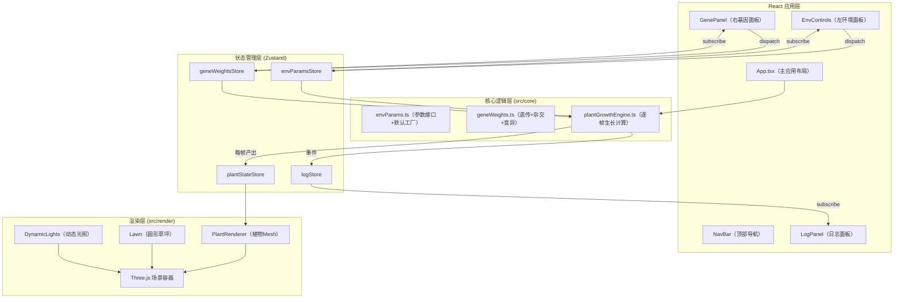
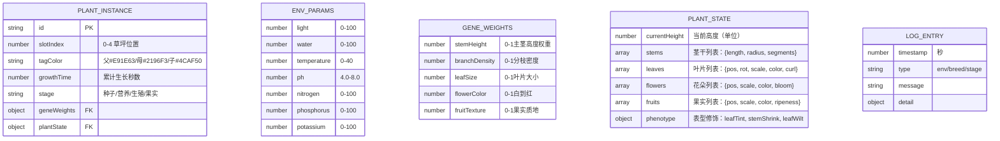

## 1. 架构设计



## 2. 技术描述

- **前端框架**：React@18 + TypeScript@5（严格模式）
- **构建工具**：Vite@5 + @vitejs/plugin-react@4
- **3D引擎**：three@0.160 + @react-three/fiber@8 + @react-three/drei@9
- **状态管理**：zustand@4（扁平化，分模块store）
- **动画**：framer-motion@11（UI面板/弹簧过渡）、@react-three/drei/spring、three 原生lerp
- **工具库**：lodash@4（深拷贝/对象合并）
- **后端**：无（纯前端单页应用）
- **数据**：内存态Zustand stores，日志localStorage持久化（可选）

## 3. 文件结构

```
d:\Pro\tasks\auto322\
├── index.html
├── package.json
├── vite.config.ts
├── tsconfig.json
└── src/
    ├── main.tsx（入口）
    ├── App.tsx（主布局）
    ├── core/
    │   ├── envParams.ts（环境参数接口+默认值）
    │   ├── geneWeights.ts（基因权重+杂交变异算法）
    │   ├── plantGrowthEngine.ts（生长阶段+表型计算）
    │   └── types.ts（共享类型定义）
    ├── render/
    │   ├── PlantRenderer.tsx（单株植物Mesh渲染）
    │   ├── EnvControls.tsx（左控制面板）
    │   ├── GenePanel.tsx（右基因雷达图面板）
    │   ├── LogPanel.tsx（右下日志+导出）
    │   ├── NavBar.tsx（顶部导航）
    │   ├── SceneContainer.tsx（R3F Canvas+草坪+光照）
    │   └── icons/（Material Design风格SVG图标）
    └── store/
        ├── envParamsStore.ts
        ├── geneWeightsStore.ts
        ├── plantStateStore.ts
        └── logStore.ts
```

## 4. 数据模型

### 4.1 数据模型定义



### 4.2 核心数据结构（TypeScript）

```typescript
// 环境参数
interface EnvParams {
  light: number; water: number; temperature: number; ph: number;
  nitrogen: number; phosphorus: number; potassium: number;
}

// 基因权重
interface GeneWeights {
  stemHeight: number; branchDensity: number; leafSize: number;
  flowerColor: number; fruitTexture: number;
}

// 生长阶段
type GrowthStage = 'seed' | 'vegetative' | 'reproductive' | 'fruiting';

// 植物实例
interface PlantInstance {
  id: string;
  slotIndex: number;
  tagColor: string;
  parentIds: [string?, string?];
  geneWeights: GeneWeights;
  growthTime: number;
  stage: GrowthStage;
  phenotype: PhenotypeModifier;
}

// 表型修饰（环境联动的渐变参数）
interface PhenotypeModifier {
  leafColorTint: string;
  leafCurlAmount: number;
  stemShrinkFactor: number;
  stemWrinkling: number;
  leafTranslucency: number;
  leafEdgeColor: string;
}

// 日志
type LogType = 'env' | 'breed' | 'stage';
interface LogEntry { id: string; time: number; type: LogType; message: string; detail?: any; }
```

## 5. 关键算法说明

### 5.1 环境-表型联动（15秒渐变）
- 光照：`<20%` → 叶色 #2E7D32 → #FDD835（黄化），`>80%` → 茎干矮化+叶焦边 #BF360C，`20-80%` → 光合效率线性
- 水分：`<30%` → 叶片卷曲+茎干皱缩，`>80%` → 水渍半透明
- pH：`<5.0` → 叶缘紫边 #6A1B9A，`>7.5` → 叶缘黄 #FFB300
- 所有表型参数通过 `current + (target - current) * (dt / 15)` 每帧趋近

### 5.2 遗传算法
- 每个基因位点独立：50% 父 / 50% 母
- 5% 概率变异：`(父或母值) * (1 ± random(0, 0.2))`
- clamp 到 [0, 1]

### 5.3 生长阶段时序
| 阶段 | 时长 | 关键事件 |
|-----|------|---------|
| seed | 0-5s | 高度 0→3，绿芽点→茎 |
| vegetative | 5-20s | 高度 3→12，分枝+叶片展开 |
| reproductive | 20-35s | 花芽出现→开放，花色 gene→#FFF→#F44336 |
| fruiting | 35-50s | 花落→果实，绿→#F44336 |
- 阶段切换时，顶部 `PointLight` 强度 0→3→0，0.5秒脉冲

### 5.4 性能优化
- 植物 Mesh 数量控制：茎 CylinderGeometry 段数 6，叶 PlaneGeometry 2x2 分段，花/果低多边形
- InstancedMesh（叶片/果实批量）若 > 10个
- 离屏植物（非选中）简化 LOD
- R3F frameloop='demand' 配合手动 invalidate（参数变化/阶段切换时）
- 表型渐变 useFrame 内统一 lerp，避免独立动画实例
