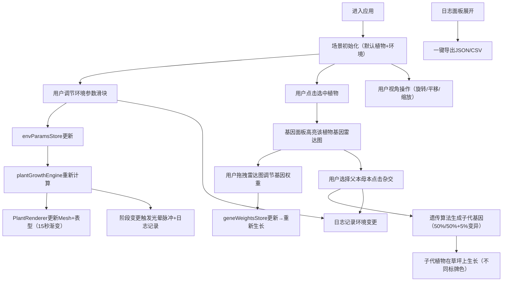

## 1. 产品概述
微型3D植物生长模拟与遗传参数编辑应用，让用户以园艺师身份在三维场景中实时调节环境参数，观察植物从种子到开花结果的动态生长，并通过杂交育种生成具有不同形态的后代植株。
- 面向植物学爱好者、教育用户、游戏设计师的交互式植物生长模拟器
- 提供沉浸式的3D生长可视化与科学遗传育种体验，兼具教育与娱乐价值

## 2. 核心功能

### 2.1 功能模块
1. **3D场景主视图**：圆形草坪、最多5株植物、可交互视角控制、选中高亮
2. **环境控制面板**：光照/水分/温度/pH/氮磷钾浓度滑块，实时联动植物表型
3. **基因编辑面板**：SVG雷达图展示基因轮廓、拖拽调权、杂交与变异功能
4. **生长日志面板**：环境变更/杂交事件/阶段变更记录、JSON/CSV导出
5. **顶部导航栏**：应用标题、重置场景、截图、帮助按钮

### 2.2 页面详情

| 页面名称 | 模块名称 | 功能描述 |
|---------|---------|---------|
| 主应用页 | 3D场景渲染 | 动态生成植物Mesh，茎干/叶片/花朵/果实按阶段生长，弹簧过渡动画 |
| 主应用页 | 环境控制面板 | 折叠式侧边栏，6个滑块实时更新环境参数并联动场景光照渐变 |
| 主应用页 | 基因编辑面板 | 雷达图+拖拽调节+杂交/变异按钮，父本母本子代标牌区分 |
| 主应用页 | 生长日志面板 | 右下角可展开浮动面板，时间倒序最多200条，JSON/CSV导出 |
| 主应用页 | 顶部导航栏 | 40px高导航，重置/截图/帮助图标按钮，悬停变色+水波纹 |

## 3. 核心流程

用户进入应用后，场景中默认存在1株处于营养生长阶段的植物。用户可调节左侧环境滑块观察表型变化，点击植物选中后在右侧雷达图调整基因权重，或选择两株植物进行杂交生成子代。所有操作被自动记录到日志中，可随时导出。

## 4. 用户界面设计

### 4.1 设计风格
- **主色调**：深灰背景#212121，面板#333333/#2C2C2C，植物主题绿#7CB342，警示/按钮采用Material Design色板
- **按钮风格**：圆形图标按钮，悬停#555555，点击水波纹扩散动画
- **字体**：衬线字体（标题）+ 无衬线字体（数值/正文），白色系文字
- **布局**：三栏式（左控制面板 | 中央3D全屏 | 右基因面板），顶部40px导航，右下角浮动日志
- **图标**：Material Design风格线性图标，半透明浮层

### 4.2 页面设计概述

| 模块名称 | UI元素 | 风格描述 |
|---------|-------|---------|
| 顶部导航栏 | 应用名+3图标 | 高度40px，衬线白色标题，圆形图标按钮悬停变色+水波纹 |
| 环境控制面板 | 6个带数值滑块组 | #333333背景、圆角8px、半透明，折叠动画，framer-motion侧边滑入 |
| 3D场景 | 草坪+植物+光照 | 背景渐变#0D47A1→#616161，OrbitControls控制，5-30单位缩放范围 |
| 基因编辑面板 | 雷达图+按钮 | #2C2C2C背景、圆角8px，0.2秒滑入，SVG半透明雷达图浮层 |
| 日志面板 | 列表+导出按钮 | 右下角浮动，可展开收起，时间戳+彩色标签分类 |

### 4.3 响应式设计
- Desktop-first，断点768px
- <768px时，环境面板/基因面板折叠为浮动图标按钮，点击后展开为全屏覆盖层（半透明遮罩），3D场景始终在底层可见

### 4.4 3D场景指南
- **环境/氛围**：渐变天空背景（深蓝→浅灰），圆形草绿草坪（#7CB342）带轻微波动动画，柔和环境光+方向光
- **光照设置**：AmbientLight基础光+DirectionalLight主光，随光照滑块（20%-80%）线性调整强度与色温
- **相机设置**：PerspectiveCamera，OrbitControls，minDistance=5，maxDistance=30，enableDamping=true
- **焦点构成**：草坪中央为视觉中心，植物间隔4单位环形分布，选中植物出现发光光环高亮
- **交互/动画**：OrbitControls鼠标交互，Mesh变化使用0.3s弹簧过渡，阶段转换0.5s光晕脉冲，叶片颜色15s渐变过渡
- **后期处理**：柔和阴影+轻微Bloom效果（光晕脉冲时加强）
- **性能预算**：单植物≤200 Mesh，5株同时渲染FPS≥50，每帧≤16ms

