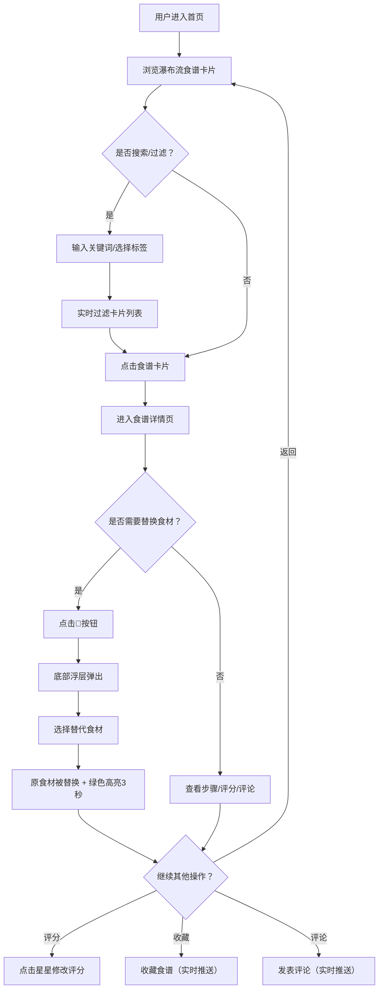

# 共享食光 - 产品需求文档 (PRD)

## 1. 产品概述

共享食光是一款面向微型团队的内部特色食谱分享与智能替换平台。团队成员可分享拿手菜谱、收藏评分、评论互动，核心亮点是智能食材替换系统——根据用户已有食材自动推荐可替代品，解决做饭缺材料的痛点。

- 目标用户：微型团队成员、烹饪爱好者
- 核心价值：知识共享 + 智能替代，降低烹饪门槛

---

## 2. 核心功能

### 2.1 用户角色

| 角色 | 注册方式 | 核心权限 |
|------|----------|----------|
| 普通用户 | 默认内置账户登录 | 浏览食谱、收藏、评分、评论、使用食材替换 |

### 2.2 功能模块

1. **首页瀑布流**：食谱卡片展示、悬停动效、点击进入详情
2. **搜索与过滤**：实时搜索（防抖500ms）、多标签组合过滤
3. **食谱详情页**：完整步骤、用料列表、5星评分、评论区
4. **智能食材替换**：替换按钮🔁、底部浮层、3种替代选项、3秒绿色高亮
5. **收藏系统**：收藏按钮、个人中心收藏列表
6. **评分排行榜**：TOP5排行、🥇🥈🥉图标、10分钟自动刷新
7. **实时通信**：WebSocket推送评论和收藏更新

### 2.3 页面详情

| 页面名称 | 模块名称 | 功能描述 |
|----------|----------|----------|
| 首页 | 顶部导航栏 | 深橙色页眉#E65100、搜索框、用户头像下拉菜单 |
| 首页 | 瀑布流卡片 | 随机背景色（#FFD54F/#81C784/#64B5F6/#E57373）、菜名、作者头像、悬停上浮5px |
| 首页 | 标签过滤条 | 5个标签（家常菜#FF8A65、烘焙#AB47BC、甜品#FFD54F、汤羹#4DB6AC、快手菜#7986CB）、多组合过滤、2px白色描边动画 |
| 首页 | 评分TOP5排行榜 | 纵向列表、排名/菜名/均分、前3名奖牌图标、10分钟自动刷新 |
| 详情页 | 步骤展示 | 完整烹饪步骤列表 |
| 详情页 | 用料列表 | 食材名称+用量、🔁替换按钮 |
| 详情页 | 5星评分 | 可点击修改1-5星评分 |
| 详情页 | 评论区 | 评论列表（时间戳+删除按钮）、评论输入框、WebSocket实时更新 |
| 详情页 | 替换浮层 | 从底部上滑（0.3s ease-out）、最多3种替代食材、替换后绿色高亮3秒 |
| 个人中心 | 收藏列表 | 头像下拉进入、展示收藏的食谱 |

---

## 3. 核心流程

### 3.1 主流程描述
用户登录 → 浏览瀑布流首页 → 搜索/标签过滤 → 点击卡片进入详情 → 查看食谱步骤/用料 → 点击🔁替换食材 → 选择替代项 → 食材高亮 → 评分/收藏/评论 → 返回首页

### 3.2 流程图

---

## 4. 用户界面设计

### 4.1 设计风格

| 项目 | 规格 |
|------|------|
| 主色调 | 深橙色 #E65100（页眉） |
| 内容背景 | 米白色 #FFF8E1 |
| 卡片背景 | 白色 + 2px圆角 |
| 卡片背景色 | 4色循环：#FFD54F / #81C784 / #64B5F6 / #E57373 |
| 标签色 | 家常菜#FF8A65 / 烘焙#AB47BC / 甜品#FFD54F / 汤羹#4DB6AC / 快手菜#7986CB |
| 高亮色 | 绿色 #4CAF50 |
| 骨架屏脉冲 | #E0E0E0 ↔ #F5F5F5，1.5s循环 |
| 按钮/交互过渡 | 0.2s - 0.3s ease-out |
| 卡片悬停 | 上浮5px + box-shadow过渡0.25s |
| 字体 | 系统默认字体栈，清晰易读 |
| 图标风格 | Emoji图标（🥇🥈🥉🔁⭐等） |

### 4.2 页面设计概览

| 页面名称 | 模块名称 | UI 元素与动效 |
|----------|----------|---------------|
| 首页 | 顶部导航 | 固定定位、深橙背景、logo+搜索框+头像 |
| 首页 | 搜索框 | placeholder:"搜索菜名或食材"、聚焦时边框变主色、防抖500ms |
| 首页 | 标签按钮条 | 横向滚动、选中态背景变色+2px白色描边动画、支持多选 |
| 首页 | 瀑布流 | 多列（移动端单列）、卡片加载骨架屏、悬停上浮动效 |
| 首页 | 排行榜 | 右侧固定、排名列表、奖牌图标高亮 |
| 详情页 | 内容区 | 标题、作者信息、步骤卡片、用料列表、评分组件、评论区 |
| 详情页 | 替换浮层 | 底部抽屉式、上滑动画0.3s ease-out、遮罩层半透明 |
| 详情页 | 食材高亮 | 替换后文字绿色#4CAF50，持续3秒后恢复 |

### 4.3 响应式设计

- **设计优先**：桌面端优先设计
- **断点**：768px
- **移动端适配**：
  - 瀑布流→单列布局
  - 搜索框+排行榜→折叠为汉堡菜单
  - 标签按钮条→横向滚动
  - 触摸优化：增大点击热区≥44px

### 4.4 性能要求

- 搜索过滤响应 ≤ 200ms
- 瀑布流滚动加载（每屏≥6张）无卡顿
- 骨架屏优先渲染，避免白屏
- WebSocket连接复用，减少重连

