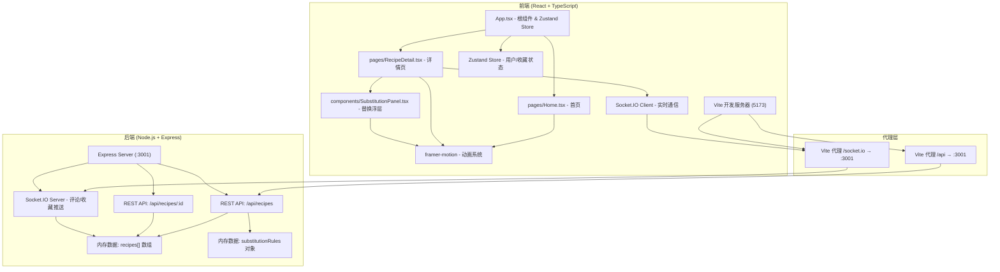
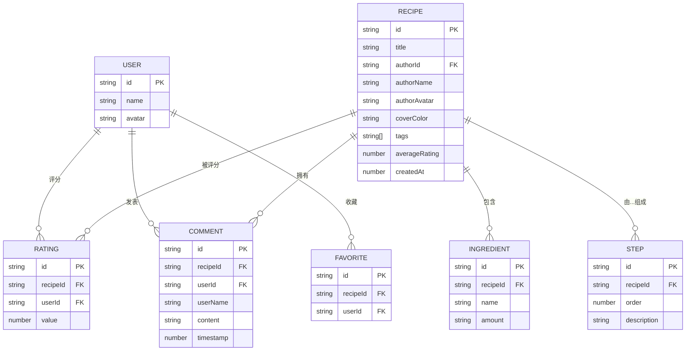

# 共享食光 - 技术架构文档

## 1. 架构设计



---

## 2. 技术栈说明

| 层级 | 技术 | 版本说明 |
|------|------|----------|
| 前端框架 | React 18 + React DOM | 函数组件 + Hooks |
| 语言 | TypeScript | strict 模式，target ES2020 |
| 构建工具 | Vite + @vitejs/plugin-react | 热更新 + 代理配置 |
| 状态管理 | Zustand | 轻量级 store，管理用户/收藏 |
| 动画库 | framer-motion | 动效、过渡、浮层动画 |
| 后端框架 | Express 4 | REST API 服务 |
| 实时通信 | Socket.IO + socket.io-client | 评论/收藏双向推送 |
| 跨域 | cors | Express 中间件 |
| ID 生成 | uuid | 评论/数据唯一标识 |
| 数据存储 | 内存存储 | recipes 数组 + substitutionRules 对象 |

---

## 3. 路由定义

### 3.1 前端路由 (React Router - 简化版 hash/state 路由)

| 路由 | 页面组件 | 说明 |
|------|----------|------|
| `/` (首页) | `Home.tsx` | 瀑布流 + 搜索过滤 + 排行榜 |
| `/recipe/:id` | `RecipeDetail.tsx` | 食谱详情 + 替换 + 评分 + 评论 |

> 注：实现采用 Zustand store 管理当前页面状态（轻量路由，无需 react-router-dom）

### 3.2 后端 API 路由

| 方法 | 路径 | 说明 |
|------|------|------|
| GET | `/api/recipes` | 获取全部食谱列表（含评分均值计算） |
| GET | `/api/recipes/:id` | 获取单条食谱详情（含完整评论列表） |
| POST | `/api/recipes/:id/rating` | 提交/更新评分（Body: {userId, rating}） |
| POST | `/api/recipes/:id/comments` | 新增评论（Body: {userId, userName, content}） |
| DELETE | `/api/recipes/:id/comments/:commentId` | 删除评论 |
| POST | `/api/recipes/:id/favorite` | 切换收藏状态（Body: {userId}） |

---

## 4. API 类型定义 (TypeScript)

```typescript
// ============ 数据模型 ============

interface User {
  id: string;
  name: string;
  avatar: string; // emoji 头像
}

interface Ingredient {
  id: string;
  name: string;
  amount: string; // 如 "2勺"、"300克"
}

interface RecipeStep {
  order: number;
  description: string;
}

interface Comment {
  id: string;
  recipeId: string;
  userId: string;
  userName: string;
  userAvatar: string;
  content: string;
  timestamp: number; // Date.now()
}

interface Rating {
  userId: string;
  value: 1 | 2 | 3 | 4 | 5;
}

interface Recipe {
  id: string;
  title: string;
  authorId: string;
  authorName: string;
  authorAvatar: string;
  coverColor: string; // 卡片背景色
  tags: string[]; // 标签数组
  ingredients: Ingredient[];
  steps: RecipeStep[];
  ratings: Rating[];
  averageRating: number; // 计算字段
  comments: Comment[];
  createdAt: number;
}

// 食材替换规则：key=原始食材名（小写），value=替代食材数组
type SubstitutionRules = Record<string, string[]>;

// ============ 请求/响应 ============

interface ApiResponse<T> {
  code: number;
  data: T;
  message?: string;
}

interface RatingRequest {
  userId: string;
  rating: 1 | 2 | 3 | 4 | 5;
}

interface CommentRequest {
  userId: string;
  userName: string;
  userAvatar: string;
  content: string;
}

interface FavoriteRequest {
  userId: string;
}
```

---

## 5. Socket.IO 事件定义

| 事件名 | 方向 | 数据 | 说明 |
|--------|------|------|------|
| `comment:new` | Server → All Clients | `{ recipeId, comment }` | 新评论广播 |
| `comment:delete` | Server → All Clients | `{ recipeId, commentId }` | 评论删除广播 |
| `favorite:toggle` | Server → All Clients | `{ recipeId, userId, isFavorited }` | 收藏状态变更广播 |
| `rating:update` | Server → All Clients | `{ recipeId, averageRating, ratingCount }` | 评分更新广播 |
| `connect` | Client → Server | - | 连接建立 |

---

## 6. 数据模型 ER 图



---

## 7. 项目目录结构

```
auto324/
├── package.json
├── vite.config.ts
├── tsconfig.json
├── index.html
└── src/
    ├── App.tsx                       # 根组件 + Zustand Store
    ├── pages/
    │   ├── Home.tsx                  # 首页：瀑布流+搜索+标签+排行榜
    │   └── RecipeDetail.tsx          # 详情页：步骤+用料+评分+评论
    ├── components/
    │   └── SubstitutionPanel.tsx     # 食材替换底部浮层
    ├── server/
    │   ├── server.ts                 # Express+Socket.IO服务
    │   └── substitutionRules.ts      # 食材替换规则表
    └── types/                        # (可选) 类型定义
```

---

## 8. 关键实现要点

### 8.1 性能优化
- **搜索防抖**：`lodash-es/debounce` 或手写 `setTimeout` 500ms
- **瀑布流**：CSS columns 布局实现，避免复杂 JS 计算
- **骨架屏**：framer-motion `animate={{ opacity: [0.4, 1, 0.4] }}` 实现脉冲
- **Memo优化**：`React.memo` 包裹卡片组件，避免不必要重渲染

### 8.2 状态管理 (Zustand Store)
```typescript
interface AppStore {
  currentUser: User;
  favorites: string[];         // recipeId 数组
  currentPage: 'home' | 'detail';
  selectedRecipeId: string | null;
  // actions
  toggleFavorite: (recipeId: string) => void;
  navigateToDetail: (recipeId: string) => void;
  navigateToHome: () => void;
}
```

### 8.3 启动脚本
使用 `concurrently` 或自定义脚本同时启动 Vite(5173) + Node Server(3001)：
```json
"scripts": {
  "dev:client": "vite",
  "dev:server": "tsx src/server/server.ts",
  "dev": "concurrently \"npm:dev:client\" \"npm:dev:server\""
}
```

> 注：`tsx` 用于直接运行 TypeScript，无需编译
