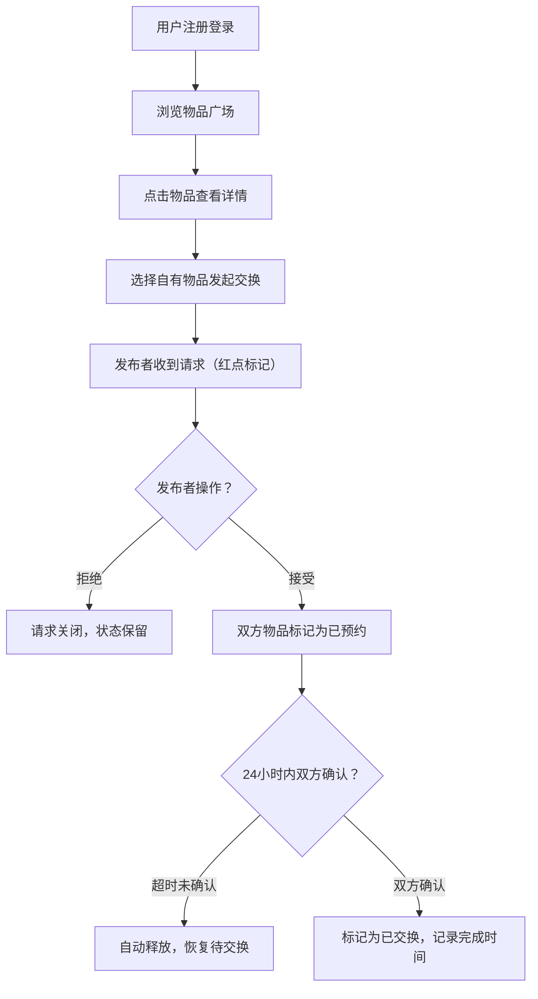

## 1. 产品概述
面向小型团队或社区组织的旧物交换平台，解决线下跳蚤市场信息分散、物品流动缺乏管理、交易进展无法实时查看的痛点。
- 核心用途：让用户便捷发布闲置物品、发起/确认交换请求、实时沟通交流
- 目标用户：小型团队成员、社区邻居、学生组织等有闲置物品交换需求的群体
- 产品价值：降低物品浪费，促进社区互动，实现资源循环利用

## 2. 核心功能

### 2.1 用户角色
| 角色 | 注册方式 | 核心权限 |
|------|----------|----------|
| 普通用户 | 表单注册（昵称、头像、区域） | 浏览广场、发布物品、发起/处理交换请求、发送消息 |

### 2.2 功能模块
1. **主页（Home）**：顶部搜索筛选栏、物品瀑布流网格、右侧消息与待办面板
2. **物品详情（Detail）**：模态弹窗展示物品信息、发起交换请求表单、提案物品选择
3. **个人中心（集成于Sidebar）**：用户信息展示、待办看板、历史记录

### 2.3 页面详情
| 页面名称 | 模块名称 | 功能描述 |
|----------|----------|----------|
| 主页 | 搜索筛选栏 | 支持物品标题模糊搜索，类别/新旧程度/区域下拉筛选 |
| 主页 | 物品瀑布流 | 每行3列响应式布局，卡片展示缩略图、标题、期望类别、状态标签 |
| 主页 | 物品卡片 | 悬停上浮4px + box-shadow过渡，点击打开详情模态框 |
| 主页 | Sidebar面板 | 用户信息、我发起的请求、我收到的请求、已完成交换历史、消息面板 |
| 物品详情 | 详情展示 | 大图、标题、描述、新旧程度、期望类别、发布者信息、物品状态 |
| 物品详情 | 交换请求 | 选择自己的物品作为提案，提交交换请求给发布者 |
| Sidebar | 待办看板 | 显示待回复/待处理请求数量，最近5条已完成交换，可折叠模块 |
| Sidebar | 消息面板 | 轮询刷新（5秒），100字限制消息发送 |

## 3. 核心流程
用户注册登录 → 浏览/搜索物品广场 → 查看感兴趣物品详情 → 选择自己物品发起交换请求 → 发布者收到请求后接受/拒绝 → 接受则双方物品标记为已预约（24小时超时释放）→ 双方确认完成 → 物品状态更新为已交换并记录时间

## 4. 用户界面设计

### 4.1 设计风格
- **主导色**：#FF8A65（温暖珊瑚橙）
- **辅色**：#FFCC80（浅杏黄）
- **背景色**：#FFF8E1（米白暖黄）
- **按钮样式**：圆角8px，点击0.15s微弹动效（transform: scale(0.97)）
- **字体**：Noto Sans SC（Google Fonts）
- **布局风格**：左右分栏布局，左侧主内容区自适应，右侧固定280px面板
- **图标风格**：使用Lucide React图标库，简洁线性风格

### 4.2 页面设计概述
| 页面名称 | 模块名称 | UI元素 |
|----------|----------|--------|
| 主页 | 搜索筛选栏 | 圆角搜索框 + 三个下拉选择器，暖色系背景 |
| 主页 | 物品瀑布流 | CSS Grid 3列布局，卡片100x100圆角缩略图，#E8F5E9类别标签，状态Badge |
| 主页 | Sidebar面板 | 固定宽度280px，顶部头像+昵称，内容区可滚动 |
| 物品详情 | 模态弹窗 | backdrop-filter: blur(8px)，0.2s scale(1)进入动画 |
| Sidebar | 待办模块 | 折叠/展开动画，未读红点标记，0.3s淡入动画 |

### 4.3 响应式设计
- **桌面端**（≥1024px）：左右分栏，左侧3列瀑布流 + 右侧280px面板
- **平板端**（768-1023px）：左侧2列瀑布流 + 右侧面板
- **移动端**（<768px）：单列瀑布流，右侧面板改为底部抽屉
- 所有交互元素支持touch目标尺寸（≥44x44px）

### 4.4 动效规范
- 物品卡片：hover 0.3s transition → translateY(-4px) + box-shadow增强
- 模态弹窗：0.2s scale(0.95) → scale(1) + opacity淡入
- 请求列表项：0.3s fade-in淡入动画
- 按钮点击：0.15s微弹动效（scale(0.97) → scale(1.02) → scale(1)）
- 状态切换：颜色过渡动画
