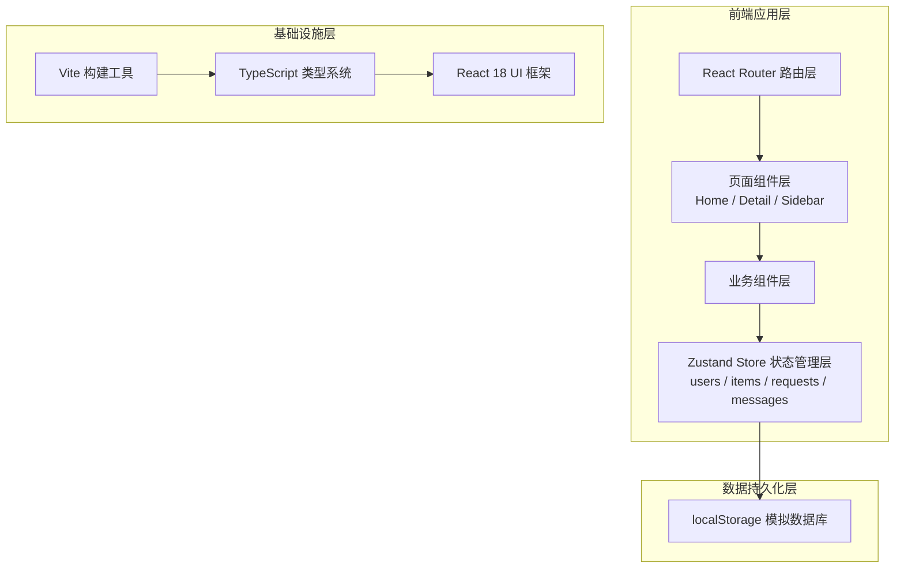
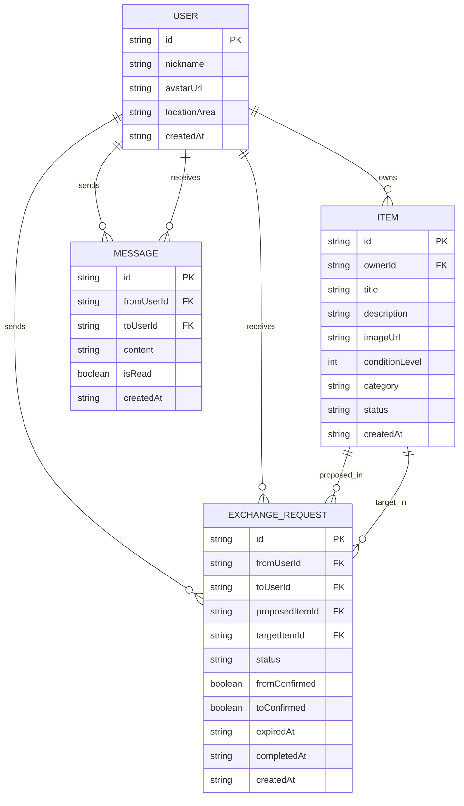

## 1. 架构设计



## 2. 技术说明
- **前端框架**：React@18 + React Router DOM@6
- **构建工具**：Vite@5 + @vitejs/plugin-react
- **语言**：TypeScript@5（严格模式，target ES2020）
- **状态管理**：Zustand@4（全局状态 + localStorage持久化）
- **唯一ID生成**：uuid@9
- **字体**：Google Fonts Noto Sans SC
- **后端模拟**：localStorage（数据结构与真实API一致，便于后续迁移）
- **初始化工具**：vite-init

## 3. 路由定义
| 路由 | 用途 |
|------|------|
| / | 主页（物品广场 + 搜索筛选 + Sidebar） |
| /item/:id | 物品详情（模态弹窗形式展示） |
| * | 404重定向至首页 |

## 4. 数据模型

### 4.1 数据模型定义



### 4.2 TypeScript 类型定义

```typescript
interface User {
  id: string;
  nickname: string;
  avatarUrl: string;
  locationArea: string;
  createdAt: string;
}

type ItemStatus = 'pending' | 'reserved' | 'exchanged';
type ItemCategory = '书籍' | '电子产品' | '家居' | '服装' | '玩具' | '其他';

interface Item {
  id: string;
  ownerId: string;
  title: string;
  description: string;
  imageUrl: string;
  conditionLevel: number; // 1-10
  category: ItemCategory;
  status: ItemStatus;
  createdAt: string;
}

type RequestStatus = 'pending' | 'accepted' | 'rejected' | 'completed' | 'expired';

interface ExchangeRequest {
  id: string;
  fromUserId: string;
  toUserId: string;
  proposedItemId: string;
  targetItemId: string;
  status: RequestStatus;
  fromConfirmed: boolean;
  toConfirmed: boolean;
  expiredAt: string | null;
  completedAt: string | null;
  createdAt: string;
}

interface Message {
  id: string;
  fromUserId: string;
  toUserId: string;
  content: string;
  isRead: boolean;
  createdAt: string;
}
```

## 5. Store 状态管理设计

### 5.1 Zustand Store 结构

```typescript
interface AppStore {
  // 用户状态
  currentUser: User | null;
  users: User[];
  
  // 物品状态
  items: Item[];
  
  // 请求状态
  requests: ExchangeRequest[];
  unreadRequestsCount: number;
  
  // 消息状态
  messages: Message[];
  unreadMessagesCount: number;
  
  // 搜索筛选状态
  searchQuery: string;
  filterCategory: ItemCategory | 'all';
  filterCondition: number | 'all';
  filterArea: string | 'all';
  
  // Actions
  registerUser: (data: Omit<User, 'id' | 'createdAt'>) => User;
  loginUser: (userId: string) => void;
  logoutUser: () => void;
  
  createItem: (data: Omit<Item, 'id' | 'status' | 'createdAt'>) => Item;
  getItem: (id: string) => Item | undefined;
  getFilteredItems: () => Item[];
  
  createRequest: (data: Omit<ExchangeRequest, 'id' | 'status' | 'fromConfirmed' | 'toConfirmed' | 'expiredAt' | 'completedAt' | 'createdAt'>) => ExchangeRequest;
  acceptRequest: (requestId: string) => void;
  rejectRequest: (requestId: string) => void;
  confirmExchange: (requestId: string, userId: string) => void;
  checkExpiredRequests: () => void;
  
  sendMessage: (data: Omit<Message, 'id' | 'isRead' | 'createdAt'>) => Message;
  markMessagesAsRead: (fromUserId: string, toUserId: string) => void;
  
  setSearchQuery: (query: string) => void;
  setFilters: (filters: Partial<{ category: ItemCategory | 'all'; condition: number | 'all'; area: string | 'all' }>) => void;
}
```

## 6. 文件结构

```
auto325/
├── package.json
├── vite.config.ts
├── tsconfig.json
├── index.html
└── src/
    ├── App.tsx              # 根组件，路由与全局布局
    ├── store.ts             # Zustand全局状态管理
    ├── pages/
    │   ├── Home.tsx         # 主页（搜索筛选 + 瀑布流 + Sidebar）
    │   └── Detail.tsx       # 物品详情模态弹窗
    └── components/
        └── Sidebar.tsx      # 右侧消息与待办面板
```

## 7. 关键技术点

### 7.1 localStorage 持久化
- Store 初始化时从 localStorage 读取数据
- 每次状态变更通过 subscribe 同步写入 localStorage
- 数据 key: `exchange_app_state`

### 7.2 24小时超时机制
- 请求被接受时设置 expiredAt = now + 24h
- 应用加载及组件挂载时调用 checkExpiredRequests()
- 超过 expiredAt 且未完成的请求自动标记为 expired，物品恢复 pending

### 7.3 消息轮询机制
- Sidebar 组件 useEffect 中设置 5000ms 定时器
- 模拟从 store 刷新消息列表（实际为重新读取store，可扩展为真实API轮询）

### 7.4 性能优化
- 物品列表使用 CSS Grid + 响应式断点
- 卡片 transform 硬件加速（will-change: transform）
- 避免不必要的重渲染（useMemo 筛选结果）
- 目标滚动帧率 ≥ 50fps

## 8. 初始化数据
首次加载若无数据，自动注入以下 mock 数据：
- 3 个示例用户（分别位于不同区域）
- 9+ 个示例物品（覆盖各分类和新旧程度）
- 部分示例请求和消息
