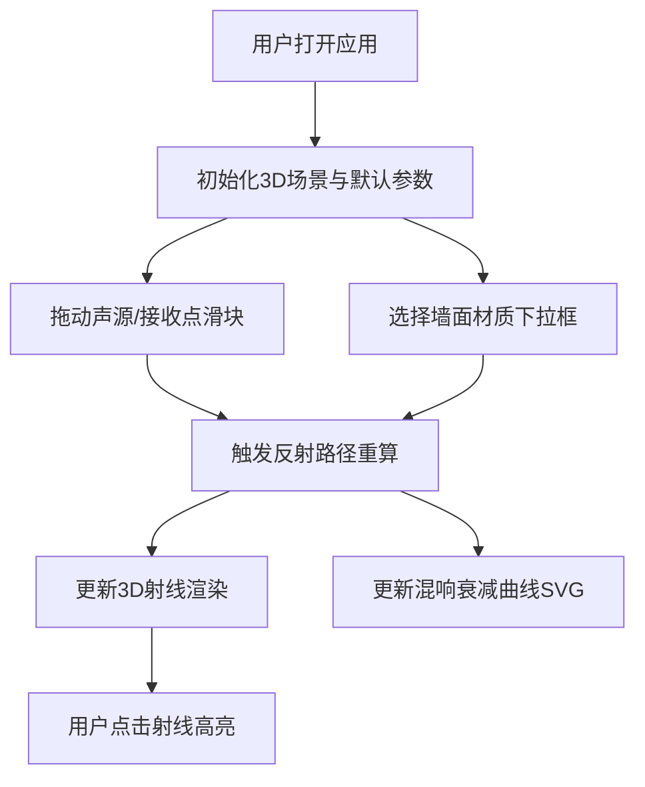

## 1. 产品概述
面向建筑师的三维空间声场反弹与混响效果动态可视化模拟工具，帮助在方案汇报中直观展示不同材质墙面对声音传播路径的反射和吸收影响。
- 核心用途：室内声学效果可视化演示，辅助建筑师与客户沟通声学设计方案
- 目标用户：建筑设计师、室内设计师、声学工程师

## 2. 核心功能

### 2.1 功能模块
1. **3D声场场景**：长方体房间内声源、接收点、墙面、反射路径的三维可视化
2. **控制面板**：声源位置调整、墙面材质选择、接收点位置指示、混响时间显示
3. **混响衰减曲线**：实时绘制时间-声压衰减曲线图

### 2.2 功能详情
| 模块名称 | 功能描述 |
|-----------|----------|
| 声源与接收点放置 | 通过滑块自由移动声源（发光红色）和接收点（发光蓝色），位置变化时反射路径实时重算（≤200ms） |
| 墙面材质配置 | 六面墙各自选择材质（玻璃0.1/石膏0.3/木板0.5/毛毯0.8），吸收系数影响射线透明度与长度 |
| 反射路径计算 | 自动计算直接路径 + 一级/二级/三级反射（最多20条），透明度从0.8→0.5→0.3递减，青色#00E5FF |
| 混响衰减曲线 | SVG绘制0-2000ms横轴、0-100dB纵轴衰减曲线，半圆点表示各路径到达时间和能量强度，曲线区域渐变填充 |
| 交互反馈动画 | 射线0.1s淡入淡出过渡；选中射线高亮为亮黄色#FFD700且加宽至3px，其他射线透明度降至0.15 |

## 3. 核心流程
用户打开应用 → 调整声源/接收点位置或墙面材质 → 系统实时计算所有反射路径 → 更新3D场景射线与混响衰减曲线图 → 可选点击射线查看高亮效果

## 4. 用户界面设计

### 4.1 设计风格
- 主色：深色背景#1A1A2E，面板背景#16213E，轨道色#0F3460
- 强调色：声源#FF5252（红）、接收点#448AFF（蓝）、射线#00E5FF（青）、高亮#FFD700（金）、滑块#E94560（洋红）
- 字体：现代无衬线字体，标题加粗
- 布局：桌面端左侧70% 3D画布 + 右侧30%控制面板；移动端控制面板移至底部
- 动画：framer-motion弹簧动画入场，按钮悬停缩放1.05倍

### 4.2 页面设计
| 页面区域 | UI元素 | 样式说明 |
|----------|--------|----------|
| 3D画布区域 | 房间网格墙、声源球、接收点球、反射射线 | 发光材质，半透明墙面，射线颜色/透明度随反射次数变化 |
| 控制面板（上） | 三轴滑块×3、材质选择器×6、混响时间标签 | 滑块轨道#0F3460，thumb圆形#E94560；下拉框带色块预览；混响时间白色加粗14px |
| 控制面板（下） | SVG混响衰减曲线图 | 背景#0F3460，网格#1A1A2E，曲线渐变填充，刻度标签带单位 |

### 4.3 响应式布局
- ≥1024px：左右分栏（70%/30%）
- <1024px：上下布局，控制面板固定底部200px，场景自适应剩余高度
- 适用宽度：768px-1920px

## 5. 性能指标
- 帧率：≥30FPS
- 射线重算时间：≤200ms（射线≤20条）
- 布局无错乱范围：768px-1920px
