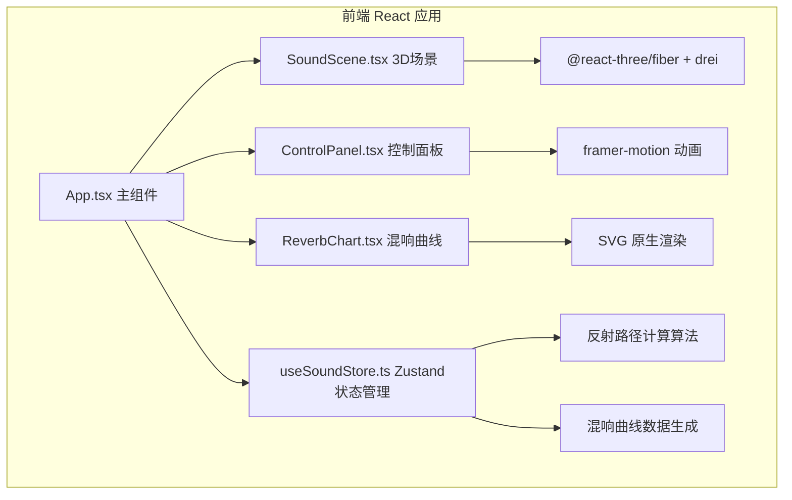

## 1. 架构设计



## 2. 技术栈说明
- **前端框架**：React 18 + TypeScript
- **构建工具**：Vite + @vitejs/plugin-react
- **3D渲染**：three.js + @react-three/fiber + @react-three/drei
- **状态管理**：Zustand
- **动画库**：framer-motion
- **图表渲染**：原生SVG

## 3. 文件结构与数据流向

### 3.1 目录结构
```
src/
├── main.tsx                 # ReactDOM入口
├── App.tsx                  # 主应用组件
├── store/
│   └── useSoundStore.ts     # Zustand全局状态与计算逻辑
└── components/
    ├── SoundScene.tsx       # Three.js 3D场景
    ├── ControlPanel.tsx     # UI控制面板
    └── ReverbChart.tsx      # SVG混响曲线图
```

### 3.2 调用关系与数据流
```
useSoundStore (状态源)
    ↓ (订阅)
App.tsx
    ├──→ SoundScene.tsx  →  读取: sourcePos, receiverPos, wallAbsorption, reflectionPaths, selectedPath
    │                      写入: setSelectedPath
    ├──→ ControlPanel.tsx → 读取: sourcePos, receiverPos, wallAbsorption, reverbTime
    │                      写入: setSourcePos, setReceiverPos, setWallAbsorption
    └──→ ReverbChart.tsx  → 读取: reverbCurveData, reflectionPaths
```

## 4. 核心数据模型

### 4.1 状态类型定义
```typescript
interface Vec3 { x: number; y: number; z: number }

interface ReflectionPath {
  id: string;
  points: Vec3[];           // 路径点序列（含声源、反射点、接收点）
  reflectionCount: number;  // 反射次数 0-3
  energy: number;           // 剩余能量 0-1
  arrivalTime: number;      // 到达时间 ms
  pathLength: number;       // 路径长度
}

interface ReverbPoint {
  time: number;    // ms
  level: number;   // dB 0-100
  energy: number;  // 0-1
}

interface SoundStore {
  // 房间尺寸 12x8x4
  roomSize: { width: number; height: number; depth: number };
  // 声源位置
  sourcePos: Vec3;
  // 接收点位置
  receiverPos: Vec3;
  // 六面墙吸收系数 [前,后,左,右,上,下]
  wallAbsorption: number[];
  // 反射路径列表
  reflectionPaths: ReflectionPath[];
  // 当前选中的路径ID
  selectedPathId: string | null;
  // 混响曲线数据
  reverbCurveData: ReverbPoint[];
  // 混响时间 RT60 (ms)
  reverbTime: number;
  // 更新方法
  setSourcePos: (pos: Vec3) => void;
  setReceiverPos: (pos: Vec3) => void;
  setWallAbsorption: (index: number, value: number) => void;
  setSelectedPathId: (id: string | null) => void;
  // 计算方法
  computeReflectionPaths: () => void;
  computeReverbCurve: () => void;
}
```

## 5. 核心算法

### 5.1 反射路径计算
采用镜像源法（Image Source Method）计算三级以内反射：
1. **直接路径（0次反射）**：声源→接收点直线
2. **一级反射**：对6面墙各生成镜像声源，镜像源→接收点与墙面求交
3. **二级反射**：对所有一级镜像源再次对各墙面镜像（去除相邻平行墙组合）
4. **三级反射**：同理生成三级镜像源
5. 按能量衰减排序取前20条路径

### 5.2 能量衰减公式
每次反射能量乘以 (1 - 吸收系数)
```
总能量 = 初始能量 × ∏(1 - α_i)  // α_i 为每次反射墙面的吸收系数
射线长度比例 = 总能量的平方根
透明度 = 0.8 - 反射次数 × 0.17  // 0次:0.8, 1次:0.63, 2次:0.46, 3次:0.29
```

### 5.3 混响时间估算（Sabine公式简化）
```
RT60 ≈ 0.161 × V / A
V = 房间体积
A = ∑(墙面面积 × 吸收系数)
```

## 6. 性能优化策略
- 反射路径计算使用 Web Worker 或 requestIdleCallback（本项目简化为同步计算，因上限20条路径复杂度可控）
- 射线几何使用 BufferGeometry 复用，避免每帧重建
- 利用 Zustand 选择器避免不必要的重渲染
- Three.js 场景启用自动丢弃不可见对象
