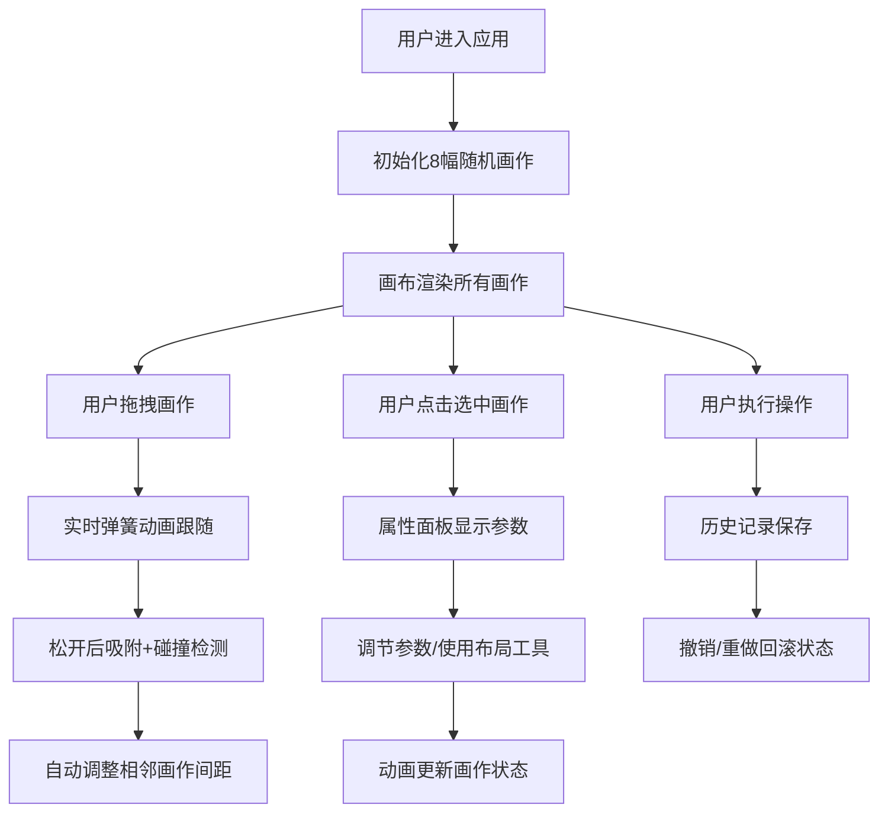

## 1. 产品概述

虚拟画廊策展空间是一个浏览器端的交互式策展工具，让用户以画廊策展人的身份自由拖拽、排列画作缩略图，实时预览不同布局下的展示效果。

- 核心价值：提供沉浸式的虚拟策展体验，让用户在虚拟墙面上自由布置艺术品
- 目标用户：艺术爱好者、画廊策展人、设计师
- 市场价值：填补虚拟策展工具的空白，让策展工作数字化、可视化

## 2. 核心功能

### 2.1 用户角色

| 角色 | 注册方式 | 核心权限 |
|------|----------|----------|
| 访客用户 | 无需注册 | 自由使用所有策展功能 |

### 2.2 功能模块

1. **画廊画布**：虚拟墙面展示、画作渲染、拖拽交互、碰撞检测
2. **属性面板**：画作参数调节、布局工具、撤销重做
3. **状态管理**：Zustand统一管理画作状态、布局参数、历史记录

### 2.3 页面详情

| 页面名称 | 模块名称 | 功能描述 |
|----------|----------|----------|
| 主页面 | 顶部标题栏 | 显示应用名称、画作总数、选中画作ID |
| 主页面 | 画廊画布 | 1200x700px虚拟墙面，支持拖拽、选中、吸附 |
| 主页面 | 底部状态栏 | 实时显示鼠标在画布中的坐标 |
| 主页面 | 右侧属性面板 | 画作参数编辑、全局布局工具、撤销重做按钮 |

## 3. 核心流程

## 4. 用户界面设计

### 4.1 设计风格

- **极简画廊主题**：干净、专业、突出艺术品本身
- **主色调**：浅米色背景 (#F5E6D3)、深色顶部栏 (#2C2C2C)、深金色选中描边 (#8B4513)
- **调色板**：#D32F2F、#1976D2、#388E3C、#FBC02D、#8E24AA、#00ACC1、#FF6F00、#7B1FA2
- **字体**：优雅的衬线字体搭配现代无衬线字体
- **动效**：0.3s ease-out为默认缓动，拖拽使用0.1s弹簧动画

### 4.2 页面设计概述

| 页面名称 | 模块名称 | UI元素 |
|----------|----------|----------|
| 主页面 | 顶部标题栏 | 深色背景、白色标题文字、画作统计信息 |
| 主页面 | 画廊画布 | 浅米色纹理背景、1200x700居中、带阴影的画作卡片 |
| 主页面 | 底部状态栏 | 浅灰背景 (#E0E0E0)、坐标显示 |
| 主页面 | 属性面板 | 300px宽度、#FAFAFA背景、圆角卡片、16px内边距、分隔线 |

### 4.3 响应式设计

- Desktop-first设计，屏幕宽度小于768px时：
  - 侧栏收起为底部抽屉
  - 画布自适应宽度
  - 触摸操作优化

### 4.4 动画设计

- 拖拽时：画作放大至1.05倍，0.1s弹簧动画
- 选中时：3px深金色描边，0.2s过渡动画
- 参数调节：0.3s过渡动画
- 布局工具：0.5s动画过渡
- 撤销重做：0.3s动画过渡
