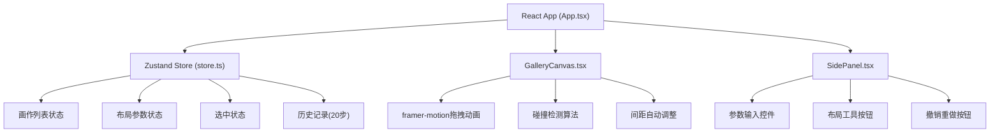

## 1. 架构设计



## 2. 技术描述

- **前端框架**：React 18 + TypeScript
- **构建工具**：Vite 5 + @vitejs/plugin-react
- **状态管理**：Zustand 4
- **动画库**：framer-motion 11
- **工具库**：uuid (生成唯一ID)
- **类型系统**：严格模式 TypeScript，target ES2020

## 3. 文件结构

| 文件路径 | 作用 |
|----------|------|
| `package.json` | 项目依赖与脚本配置 |
| `vite.config.ts` | Vite配置，React插件 |
| `tsconfig.json` | TypeScript配置，严格模式 |
| `index.html` | 入口HTML，标题"虚拟画廊策展空间" |
| `src/types.ts` | 画作类型与布局接口定义 |
| `src/store.ts` | Zustand store，状态管理核心 |
| `src/App.tsx` | 主组件，集成画布、侧栏、工具栏 |
| `src/components/GalleryCanvas.tsx` | 画廊画布，拖拽与渲染 |
| `src/components/SidePanel.tsx` | 属性面板，参数调节与布局工具 |

## 4. 数据模型

### 4.1 类型定义 (types.ts)

```typescript
interface Artwork {
  id: string;
  x: number;
  y: number;
  width: number;
  height: number;
  rotation: 0 | 15 | 30;
  color: string;
}

interface LayoutParams {
  canvasWidth: number;
  canvasHeight: number;
  minSpacing: number;
  maxSpacing: number;
}

interface HistoryState {
  artworks: Artwork[];
  timestamp: number;
}

interface GalleryState {
  artworks: Artwork[];
  selectedId: string | null;
  layout: LayoutParams;
  history: HistoryState[];
  historyIndex: number;
}
```

### 4.2 Store 操作 (store.ts)

| 方法 | 描述 |
|------|------|
| `initArtworks()` | 初始化8幅随机画作，无重叠 |
| `selectArtwork(id)` | 选中指定画作 |
| `updatePosition(id, x, y)` | 更新画作位置，带碰撞检测 |
| `updateSelected(updates)` | 更新选中画作参数 |
| `alignHorizontal()` | 一键水平对齐 |
| `alignVerticalCenter()` | 垂直居中对齐 |
| `distributeEvenly()` | 均匀分布 |
| `shuffle()` | 随机打乱 |
| `undo()` | 撤销 (Ctrl+Z) |
| `redo()` | 重做 (Ctrl+Shift+Z) |
| `saveHistory()` | 保存当前状态到历史记录 |

## 5. 核心算法

### 5.1 碰撞检测

```typescript
function checkCollision(a: Artwork, b: Artwork, spacing: number): boolean {
  return !(
    a.x + a.width + spacing <= b.x ||
    b.x + b.width + spacing <= a.x ||
    a.y + a.height + spacing <= b.y ||
    b.y + b.height + spacing <= a.y
  );
}
```

### 5.2 无重叠随机生成

1. 随机生成画作尺寸与颜色
2. 尝试随机位置，检测与已有画作的碰撞
3. 如碰撞，重新生成位置，最多尝试100次
4. 确保所有画作在画布范围内

### 5.3 拖拽吸附与间距调整

1. 拖拽结束后，计算目标位置
2. 检测与其他画作的碰撞
3. 如有碰撞，微调位置保持最小间距
4. 相邻画作自动重新计算间距，保持15-30px范围

## 6. 性能优化

- 使用 `framer-motion` 的 `drag` 功能，硬件加速
- Zustand 状态选择器按需订阅，避免不必要重渲染
- 碰撞检测优化：只检测移动画作与其他画作
- 历史记录限制为20条，避免内存泄漏
- 动画使用 transform 和 opacity，避免重排重绘
