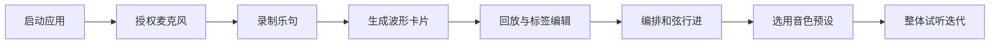

## 1. 产品概述

BandSync Studio 是一款面向小型乐队和音乐团体的在线协作创作工具，旨在解决乐队成员因地理分散而无法同步录制即兴乐句、共同编配和弦走向以及共享音色预设的协作痛点。通过浏览器端的轻量级音频录制、可视化和弦编辑与音色管理模块，音乐人可以随时随地捕捉灵感碎片并与队友协同打磨。

- 核心价值：降低远程音乐协作的技术门槛，让灵感不被距离和设备所限制
- 目标用户：独立乐队成员、校园乐队、远程合作的词曲作者与编曲人

## 2. 核心功能

### 2.1 用户角色

| 角色 | 注册方式 | 核心权限 |
|------|----------|----------|
| 创作成员 | 无需注册，本地即用 | 录制乐句、编辑和弦进行、管理音色预设、回放与导出 |

### 2.2 功能模块

1. **灵感乐句面板（左侧）**：麦克风录音、波形预览、调性/BPM 标注、乐器分类卡片、悬停预览、详情回放
2. **和弦行进编辑器（中央顶部）**：和弦块拖拽排列、根音与和弦类型选择、播放指示线、入场动画
3. **波形回放区（中央底部）**：选中乐句的波形可视化、播放进度、标签编辑
4. **音色预设面板（右侧）**：预设创建表单、乐器 emoji 图标网格、悬停放大浮层、一键应用

### 2.3 页面详情

| 页面名称 | 模块名称 | 功能描述 |
|----------|----------|----------|
| 主工作区 | 左侧乐句面板 | 点击录音按钮启动最长 60 秒录音；自动生成波形与时间戳；按乐器类型上色的卡片列表；卡片悬停自动播放 2 秒预览；点击进入详情编辑 |
| 主工作区 | 中央和弦编辑器 | 从下拉菜单选择根音（C-B）与和弦类型（Major/Minor/Dim/Aug/Sus4/Sus2/7th）；拖拽和弦块调整顺序；双击修改属性；红色竖线指示当前播放位置；每个和弦块入场带 0.2s 淡入动画 |
| 主工作区 | 中央波形回放区 | 展示当前选中乐句的完整波形；可播放/暂停、拖动进度 |
| 主工作区 | 右侧音色预设面板 | 创建预设（名称、乐器类型、描述、图片 URL）；每行 4 张卡片网格；悬停放大 1.05 倍并显示详情浮层（0.3s 过渡）；点击应用预设 |

## 3. 核心流程

用户启动应用 → 选择麦克风授权 → 在左侧面板录制即兴乐句 → 系统自动生成波形卡片 → 选择乐句后在中央底部回放并编辑标签 → 在和弦编辑器添加/拖拽和弦块构建进行 → 在右侧面板创建或选用音色预设 → 整体试听并继续迭代创作

## 4. 用户界面设计

### 4.1 设计风格

- **主背景**：#121212（纯深黑），卡片背景 #1E1E1E，主色 #64B5F6（冷蓝）
- **乐器配色**：人声 #FFCDD2、吉他 #C8E6C9、键盘 #BBDEFB、鼓组 #FFE0B2、贝斯 #D1C4E9
- **分割条**：4px 宽 #424242，支持拖拽调整面板宽度
- **按钮风格**：圆角 6px，主色填充，hover 态提升亮度 10%
- **字体**：标题使用 Orbitron（等宽未来感），正文使用 JetBrains Mono（代码/音符可读性）
- **布局风格**：三栏式专业 DAW（数字音频工作站）布局，可收起左右面板
- **图标**：使用 emoji 作为乐器图标（🎤🎸🎹🥁🎻），简洁直观

### 4.2 页面设计概览

| 页面名称 | 模块名称 | UI 元素 |
|----------|----------|---------|
| 主工作区 | 左侧乐句面板 | 可收起展开（0.4s 缓动）；录音按钮带脉冲动画；卡片列表纵向滚动；每张卡片显示波形缩略图、乐器标签、BPM、调性 |
| 主工作区 | 中央和弦编辑器 | 五线谱风格网格（背景 #F5F5F5，网格线 #E0E0E0）；彩色和弦块可拖拽；红色播放指示线；顶部和弦属性下拉菜单 |
| 主工作区 | 中央波形回放区 | Canvas 绘制实时波形；播放控制条；标签编辑输入框 |
| 主工作区 | 右侧音色预设面板 | 可收起展开；网格布局 4 列；卡片悬停放大 1.05 倍并浮现详情层（0.3s 过渡）；底部悬浮创建按钮 |

### 4.3 响应式设计

- **桌面端（≥1024px）**：三栏横向布局，左右面板可拖拽调整宽度
- **平板端（768px - 1023px）**：左右面板默认收起，点击图标展开为浮层覆盖中央编辑区
- **移动端（<768px）**：三面板自动堆叠为上下结构，乐句面板在上，编辑区居中，音色预设在下；所有面板全宽显示

### 4.4 动效与性能

- 面板收起/展开：0.4s cubic-bezier(0.4, 0, 0.2, 1) 缓动
- 和弦块入场：0.2s opacity 淡入 + translateY(8px) 滑入
- 音色卡片悬停：0.3s transform: scale(1.05) + box-shadow 增强
- 波形绘制：Canvas requestAnimationFrame，帧率稳定 30fps 以上
- 录音按钮：录制中呼吸式脉冲动画（box-shadow 扩散）
