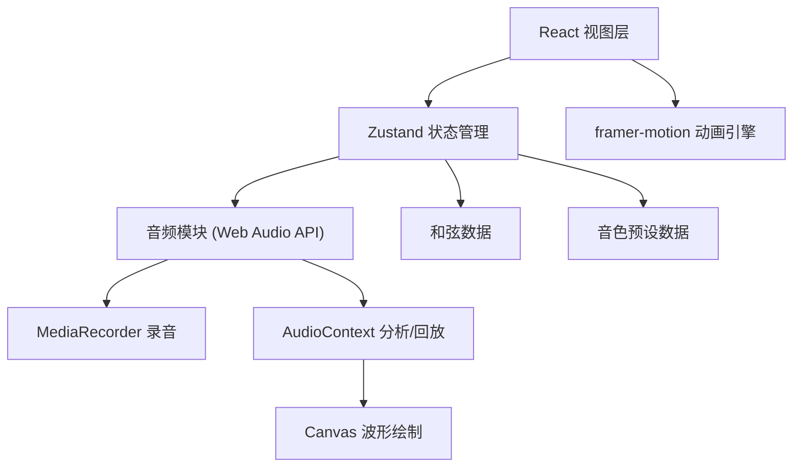
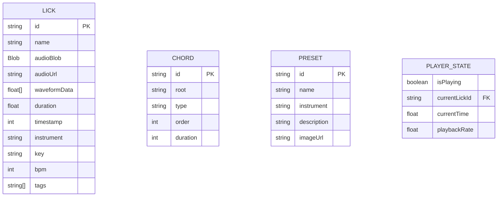

## 1. 架构设计



纯前端单页应用，无后端依赖；所有数据存储在 Zustand store 中（可扩展为 localStorage 持久化）。

## 2. 技术选型

- **前端框架**：React 18 + TypeScript
- **构建工具**：Vite 5 + @vitejs/plugin-react
- **状态管理**：Zustand 4
- **动画库**：framer-motion 11
- **唯一 ID**：uuid 9
- **音频处理**：原生 Web Audio API + MediaRecorder API
- **波形绘制**：原生 Canvas 2D API
- **类型系统**：TypeScript strict 模式，target ES2020
- **样式方案**：CSS Modules + CSS Variables（无需 Tailwind，保持音频工作站风格的精细控制）

## 3. 路由定义

| 路由 | 用途 |
|------|------|
| / | 主工作区（单页应用，无多路由） |

## 4. API 定义

本应用为纯前端应用，无后端 API。核心数据结构如下：

```typescript
export type InstrumentType = 'vocal' | 'guitar' | 'keyboard' | 'drums' | 'bass';

export interface Lick {
  id: string;
  name: string;
  audioBlob: Blob;
  audioUrl: string;
  waveformData: number[];
  duration: number;
  timestamp: number;
  instrument: InstrumentType;
  key: string;        // e.g. 'C', 'Am', 'F#m'
  bpm: number;        // 60 - 200
  tags: string[];
}

export type ChordRoot = 'C' | 'C#' | 'D' | 'D#' | 'E' | 'F' | 'F#' | 'G' | 'G#' | 'A' | 'A#' | 'B';
export type ChordType = 'Major' | 'Minor' | 'Dim' | 'Aug' | 'Sus4' | 'Sus2' | '7th';

export interface Chord {
  id: string;
  root: ChordRoot;
  type: ChordType;
  order: number;
  duration: number;   // beats
}

export interface Preset {
  id: string;
  name: string;
  instrument: InstrumentType;
  description: string;
  imageUrl: string;
}

export interface PlayerState {
  isPlaying: boolean;
  currentLickId: string | null;
  currentTime: number;
  playbackRate: number;
}
```

## 5. 数据模型



## 6. 项目文件结构

```
d:\Pro\tasks\auto328\
├── index.html
├── package.json
├── vite.config.ts
├── tsconfig.json
└── src/
    ├── App.tsx              # 根组件，三面板布局 + 拖拽分割条 + 响应式
    ├── store.ts             # Zustand store：licks, chords, presets, player
    ├── types.ts             # TypeScript 类型定义
    ├── utils/
    │   ├── audio.ts         # Web Audio API 封装：录音、波形分析、回放
    │   └── colors.ts        # 乐器颜色映射、和弦颜色生成
    └── components/
        ├── LickPanel.tsx    # 左侧：录音按钮 + 乐句卡片列表
        ├── LickCard.tsx     # 单张乐句卡片（乐器底色 + 波形缩略图 + 悬停预览）
        ├── ChordEditor.tsx  # 中央顶部：和弦编辑器
        ├── ChordBlock.tsx   # 单个和弦块（拖拽、双击编辑、入场动画）
        ├── WaveformPlayer.tsx # 中央底部：波形回放 + 标签编辑
        ├── PresetPanel.tsx  # 右侧：音色预设网格 + 创建表单
        ├── PresetCard.tsx   # 单个预设卡片（emoji 图标 + 悬停浮层）
        └── ResizablePanel.tsx # 可拖拽分割条通用组件
```

## 7. 关键实现要点

### 7.1 音频录制与波形分析
- 使用 `navigator.mediaDevices.getUserMedia` 获取麦克风流
- `MediaRecorder` 录制最长 60 秒，停止后生成 Blob
- 使用 `OfflineAudioContext.decodeAudioData` 解码后，对 PCM 数据做峰值采样（每 256 样本取一个峰值）生成波形数组
- 波形绘制使用 Canvas `requestAnimationFrame`，保证 30fps

### 7.2 和弦拖拽重排
- 使用 HTML5 Drag and Drop API，和弦块为 `draggable=true`
- `dragstart` 记录源 index，`dragover` 计算目标位置，`drop` 触发 Zustand 的 `reorderChords` action
- framer-motion `AnimatePresence` 包裹，实现入场淡入动画

### 7.3 面板宽度拖拽
- `ResizablePanel` 组件监听 `mousedown` → `mousemove` → `mouseup`
- 面板宽度使用 CSS 变量 + `flex-basis`，收起动作用 framer-motion `AnimatePresence` 控制

### 7.4 响应式断点
- CSS Media Query：`@media (max-width: 768px)` 切换 `flex-direction: column`
- Zustand 中存储 `isMobile` flag，由 `useMediaQuery` hook 初始化

### 7.5 性能保障
- 波形数据做降采样，单条乐句最多存储 200 个峰值点
- Canvas 波形只在 `currentTime` 变化时重绘（非全量 RAF）
- 和弦块使用 `React.memo`，只有自身 props 变化时重渲染
- framer-motion 使用 `will-change: transform, opacity` 提示 GPU 加速
