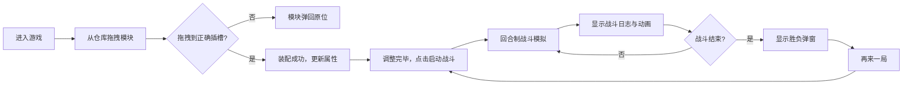

## 1. 产品概述
一款面向独立游戏玩家的科幻题材飞船改造与回合制战斗模拟Web应用，玩家可通过拖拽方式可视化装配飞船模块，实时计算属性，并在自动战斗中验证改装效果。

- 核心目标：提供直观有趣的飞船改装体验，让玩家感受模块搭配策略与战斗结果的关联
- 目标用户：科幻游戏爱好者、回合制策略游戏玩家、独立游戏制作者
- 产品价值：作为游戏原型验证核心玩法，可扩展为完整的太空策略游戏

## 2. 核心功能

### 2.1 用户角色
| 角色 | 注册方式 | 核心权限 |
|------|----------|----------|
| 玩家 | 无需注册 | 装配飞船模块、启动战斗模拟、查看战斗结果 |

### 2.2 功能模块
1. **船坞装配区**：飞船轮廓展示、6个插槽位、模块拖拽装配、拆卸功能
2. **模块仓库**：10种预设模块展示、稀有度标识、数值显示
3. **属性计算**：总推力/护盾/武器伤害实时计算、进度条可视化
4. **战斗模拟**：10回合自动战斗、回合制逻辑、战斗日志、胜负判定

### 2.3 页面详情
| 页面名称 | 模块名称 | 功能描述 |
|---------|----------|----------|
| 主界面 | 飞船装配区 | 俯视飞船轮廓，6个插槽点，支持模块拖拽装配与拆卸，实时显示模块数值 |
| 主界面 | 模块仓库 | 10种预设模块卡片，显示名称/类型/数值/稀有度，支持拖拽 |
| 主界面 | 属性面板 | 三个进度条展示总推力、总护盾、总武器伤害，带动画过渡 |
| 主界面 | 战斗控制 | 启动战斗按钮，重置战斗功能 |
| 主界面 | 战斗日志 | 逐条显示战斗过程，自动滚动，颜色区分攻击类型 |
| 主界面 | 结果弹窗 | 战斗结束后显示胜利/失败，含图标和再来一局按钮 |

## 3. 核心流程

玩家从模块仓库拖拽模块到飞船对应插槽 → 系统实时计算飞船属性 → 点击启动战斗 → 系统按回合制自动执行战斗 → 显示战斗日志和动画 → 战斗结束显示胜负弹窗 → 可选择再来一局重置战斗。

## 4. 用户界面设计

### 4.1 设计风格
- **主色调**：深空蓝黑主题，背景 #1a1a2e，主面板 #2a2a3e
- **强调色**：引擎推力 #FF5252，护盾 #448AFF，武器 #69F0AE，插槽可放置 #4CAF50
- **稀有度**：普通 #B0BEC5，稀有 #FFD54F，传说 #FF8A65
- **文字颜色**：#E0E0E0
- **字体**：使用 Orbitron 作为标题字体（科幻感），Roboto 作为正文字体
- **按钮样式**：圆角 8px，带 0.2s 过渡效果，hover 时轻微上浮
- **布局风格**：左右分栏桌面布局，上下布局移动端
- **图标风格**：使用 lucide-react 线性图标，配合 emoji 增强主题感

### 4.2 页面设计概述
| 页面名称 | 模块名称 | UI元素 |
|---------|----------|--------|
| 主界面 | 飞船装配区 | 灰色半透明背景 #2a2a3e，轮廓线 #4FC3F7，6个插槽点，拖拽悬浮时绿色虚线边框 |
| 主界面 | 模块仓库 | 卡片式布局，稀有度底色，hover时放大1.05倍，拖拽时放大1.1倍带阴影 |
| 主界面 | 属性面板 | 三个带标签的进度条，宽度过渡动画 0.3s |
| 主界面 | 战斗日志 | 固定高度滚动容器，条目按类型着色，自动滚动到底部 |
| 主界面 | 结果弹窗 | 半透明遮罩，居中卡片，胜利绿色主题 #4CAF50，失败红色主题 #F44336 |

### 4.3 响应式
- **桌面端（>768px）**：左右布局，装配区占60%，仓库+战斗区占40%
- **移动端（≤768px）**：上下布局，装配区在上，战斗区在下，卡片和飞船轮廓缩小适配
- **触摸优化**：增大点击区域，支持触摸拖拽

### 4.4 动画与交互
- 模块拖拽：使用 framer-motion 实现流畅的拖拽动画，失败时弹回原位
- 受击动画：被攻击方红色边框闪烁 0.2s
- 进度条：宽度变化 0.3s 过渡
- 战斗日志：新条目滑入动画
- 弹窗：淡入缩放动画
