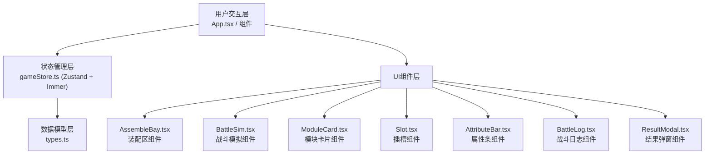

## 1. 架构设计

本项目为纯前端React应用，采用分层架构设计。



**数据流向：**
1. 用户拖拽模块 → AssembleBay/Slot 接收 drop 事件 → 调用 store.assembleModule
2. store 更新状态 → 触发所有订阅组件重渲染
3. 属性计算由 store 中的 selectors 实时派生
4. 战斗逻辑在 BattleSim 组件中通过 useEffect 按回合推进，调用 store 的战斗相关 actions

**文件调用关系：**
- `types.ts` → 被所有其他文件引用
- `gameStore.ts` → 引用 `types.ts`，被 `App.tsx`、`AssembleBay.tsx`、`BattleSim.tsx` 引用
- `App.tsx` → 引用 `types.ts`、`gameStore.ts`、`AssembleBay.tsx`、`BattleSim.tsx`
- `AssembleBay.tsx` → 引用 `types.ts`、`gameStore.ts`、`Slot.tsx`、`ModuleCard.tsx`、`AttributeBar.tsx`
- `BattleSim.tsx` → 引用 `types.ts`、`gameStore.ts`、`BattleLog.tsx`、`ResultModal.tsx`

## 2. 技术描述

- **前端框架**：React 18 + TypeScript 5
- **构建工具**：Vite 5
- **状态管理**：Zustand 4 + Immer 10
- **动画库**：framer-motion 11
- **图标库**：lucide-react 0.400
- **样式方案**：CSS Modules + CSS Variables
- **初始化工具**：vite-init (react-ts 模板)

## 3. 项目结构

```
src/
├── types.ts              # TypeScript 类型定义
├── gameStore.ts          # Zustand 状态管理
├── App.tsx               # 根组件
├── App.css               # 全局样式
├── main.tsx              # 入口文件
├── index.css             # 基础样式与CSS变量
├── components/
│   ├── AssembleBay.tsx   # 装配区组件
│   ├── BattleSim.tsx     # 战斗模拟组件
│   ├── ModuleCard.tsx    # 模块卡片组件（可拖拽）
│   ├── Slot.tsx          # 插槽组件（可放置）
│   ├── AttributeBar.tsx  # 属性进度条组件
│   ├── BattleLog.tsx     # 战斗日志组件
│   └── ResultModal.tsx   # 战斗结果弹窗组件
└── utils/
    └── battleEngine.ts   # 战斗逻辑工具函数
```

## 4. 核心数据模型

### 4.1 类型定义 (types.ts)

```typescript
// 模块类型
type ModuleType = 'engine' | 'shield' | 'weapon';

// 稀有度
type Rarity = 'common' | 'rare' | 'legendary';

// 战斗日志类型
type LogType = 'playerAttack' | 'enemyAttack' | 'turnEnd' | 'battleEnd';

// 模块接口
interface ShipModule {
  id: string;
  name: string;
  type: ModuleType;
  value: number;
  rarity: Rarity;
  description: string;
}

// 插槽接口
interface Slot {
  id: string;
  type: ModuleType;
  position: { x: number; y: number };
  equippedModule: ShipModule | null;
}

// 飞船状态
interface Ship {
  name: string;
  maxHp: number;
  currentHp: number;
  baseShield: number;
  baseWeapon: number;
  slots: Slot[];
}

// 战斗状态
interface BattleState {
  isActive: boolean;
  currentTurn: number;
  maxTurns: number;
  playerShip: Ship;
  enemyShip: Ship;
  logs: BattleLogEntry[];
  winner: 'player' | 'enemy' | null;
}

// 战斗日志条目
interface BattleLogEntry {
  id: string;
  turn: number;
  type: LogType;
  message: string;
  timestamp: number;
}

// 游戏状态
interface GameState {
  warehouse: ShipModule[];
  playerShip: Ship;
  battleState: BattleState | null;
}
```

### 4.2 Store Actions (gameStore.ts)

```typescript
interface GameActions {
  // 装配模块到插槽
  assembleModule: (slotId: string, moduleId: string) => boolean;
  
  // 从插槽拆卸模块
  disassembleModule: (slotId: string) => void;
  
  // 启动战斗
  startBattle: () => void;
  
  // 执行一个战斗回合
  executeTurn: () => void;
  
  // 重置战斗
  resetBattle: () => void;
  
  // 计算总属性
  getTotalThrust: () => number;
  getTotalShield: () => number;
  getTotalWeapon: () => number;
}
```

## 5. 战斗引擎逻辑

### 5.1 回合流程
1. 比较双方总推力，决定先手
2. 先手方攻击：伤害 = 武器伤害 - 对方当前护盾
3. 若护盾 > 0，先扣除护盾，剩余伤害扣除生命值
4. 后手方攻击（若仍存活）
5. 双方护盾自动回复 5 点（不超过最大值）
6. 回合结束，记录日志
7. 检查胜负条件

### 5.2 胜负判定
- 任意一方生命值 ≤ 0 → 对方获胜
- 达到最大回合数（10回合）→ 比较剩余生命值，高者获胜
- 生命值相同 → 平局（视为玩家失败）

## 6. 性能优化

### 6.1 拖拽性能
- 使用 framer-motion 的 drag 功能，基于 transform 实现
- 避免在拖拽过程中触发重排
- 保持 55+ FPS 的拖拽帧率

### 6.2 渲染优化
- 战斗日志超过 20 条时自动移除最早条目
- 使用 React.memo 包装频繁渲染的组件
- 战斗动画使用 CSS transition 而非 JS 动画

### 6.3 状态更新
- 使用 Immer 保证不可变更新的性能
- 战斗状态批量更新，减少渲染次数
