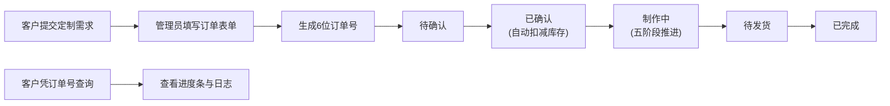
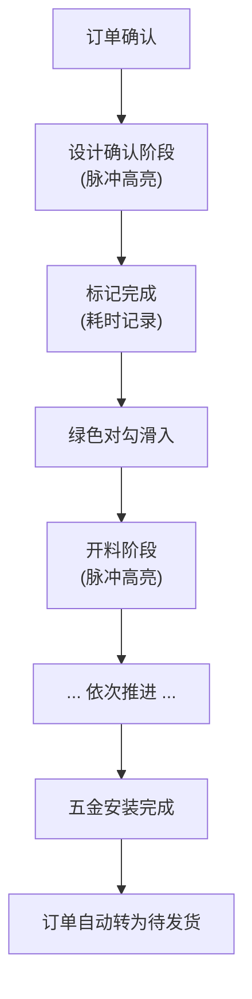
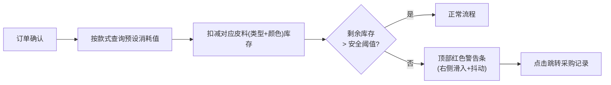

## 1. 产品概述

本产品为小型手工皮具工作室提供一站式订单管理、客户沟通与材料库存解决方案，解决手工记录遗漏、客户进度查询不便、材料采购凭感觉导致断货或浪费的核心痛点。

- 目标用户：手工皮具工作室经营者、手工艺人、工作室助理
- 产品价值：数字化订单全流程、透明化客户沟通、精准化库存管理，提升工作室运营效率与客户满意度

---

## 2. 核心功能

### 2.1 用户角色

| 角色 | 使用场景 | 核心权限 |
|------|----------|----------|
| 工作室管理员 | 日常订单处理、库存管理、查看报表 | 全部功能权限 |
| 手工艺人 | 查看分配订单、更新制作进度 | 订单进度更新、阶段完成标记 |
| 客户（无登录） | 查询自己的定制订单进度 | 仅订单进度查询（凭订单号） |

### 2.2 功能模块

1. **订单看板首页**：订单列表、滑动状态切换、快速筛选、新建订单表单
2. **订单详情面板**：五阶段进度看板、阶段耗时记录、客户信息、定制规格
3. **材料库存管理**：皮料库存卡片、低库存警告条、采购记录跳转、扣减明细
4. **客户进度查询**：订单号查询入口、分段进度条、阶段时间日志、预计完成日期
5. **公共导航框架**：左侧导航侧栏、面包屑、移动端汉堡菜单、Toast提示系统

### 2.3 页面详情

| 页面名称 | 模块名称 | 功能描述 |
|----------|----------|----------|
| 订单看板 | 订单卡片列表 | 按提交时间倒序展示，支持左右滑动切换状态（待确认→已确认→制作中→待发货→已完成），卡片背景渐变过渡0.3s |
| 订单看板 | 新建订单表单 | 款式选择（钱包/手提包/皮带/钥匙扣）、皮料类型（植鞣革/铬鞣革/马臀皮/鳄鱼皮）、色板点击选择（6色预设+涟漪动画）、尺寸预设选项、200字备注 |
| 订单看板 | 状态快速筛选 | 顶部状态标签筛选，支持查看全部/待确认/已确认/制作中/待发货/已完成 |
| 订单详情 | 进度看板 | 五阶段气泡（设计确认→开料→缝制→边油→五金安装），已完成显示绿色对勾滑入动画，当前阶段橙色脉冲光晕（1.5Hz），点击展开操作面板（高度动画0.3s ease-out） |
| 订单详情 | 阶段操作面板 | 标记完成按钮、耗时输入（分钟）、备注记录、阶段时间戳自动生成 |
| 库存管理 | 库存卡片 | 按皮料类型+颜色组合展示库存面积（sqft）、采购日期、安全阈值标识、近期消耗趋势 |
| 库存管理 | 低库存警告条 | 顶部红色警告条（右侧滑入+抖动动画），点击跳转采购记录，库存低于安全阈值（款式2倍消耗量）触发 |
| 客户查询 | 查询入口 | 6位订单号输入框，输入校验，查询结果展示 |
| 客户查询 | 进度展示 | 分段圆角进度条（每完成一段渐变填充），预计完成日期，阶段时间日志（交替背景+悬停加深） |
| 公共框架 | 导航侧栏 | 固定280px左侧栏，工作室logo、菜单列表（订单/库存/采购/设置）、在线工单数徽标 |
| 公共框架 | Toast提示 | 所有状态变更弹出绿色Toast（顶部滑入+2s淡出） |
| 公共框架 | 响应式布局 | <768px时侧栏折叠为顶部汉堡菜单，展开时从左侧滑入0.3s |

---

## 3. 核心流程

### 3.1 订单创建与状态流转流程

工作室管理员接收客户定制需求 → 填写定制规格表单（款式/皮料/颜色/尺寸/备注） → 系统生成6位订单号 → 订单进入待确认队列 → 确认订单（自动扣减库存） → 手工艺人逐阶段标记完成 → 待发货 → 完成交付。

### 3.2 五阶段进度推进流程

### 3.3 库存扣减与警告流程

---

## 4. 用户界面设计

### 4.1 设计风格

**主题方向：温暖匠心/皮革质感（Organic Luxury）**

- **主色调**：
  - 棕色 `#8B6914`（品牌主色/按钮/强调文字）
  - 米白 `#F5F0E8`（背景色/卡片底色）
  - 深褐 `#4A3525`（标题文字/边框/导航侧栏）
- **辅助色**：
  - 成功绿 `#5D8A4A`（完成标记/进度填充/Toast）
  - 警告橙 `#E8873C`（当前阶段脉冲光晕）
  - 危险红 `#C44536`（低库存警告条）
  - 进度灰 `#D4C8B8`（未完成进度段）

- **色彩逻辑**：深褐导航+米白内容区+棕色强调，营造手工皮具工作室的温暖匠心氛围。

- **按钮风格**：圆角12px，棕色渐变背景，悬停上移4px（0.2s过渡），点击缩放至0.95（0.1s），柔和阴影。

- **字体方案**：
  - 标题/Logo：Playfair Display（衬线体，体现手工质感与优雅）
  - 正文：Noto Serif SC（中文衬线，与皮革主题呼应）
  - 数字/订单号：JetBrains Mono（等宽体，清晰易读）

- **布局风格**：左右分栏（侧栏280px固定+主区自适应），卡片式模块化布局，圆角12px，柔和阴影（0 4px 12px rgba(0,0,0,0.08)）。

- **皮革纹理背景**：CSS径向渐变模拟皮革毛孔质感，叠加噪声纹理，整体呈现细腻的手工皮质触感。

- **图标风格**：Lucide React线性图标，颜色与主色系统一，线条粗细2px。

### 4.2 页面设计概览

| 页面名称 | 模块名称 | UI元素与动效 |
|----------|----------|--------------|
| 订单看板 | 订单卡片 | 皮革纹理背景、12px圆角、柔和阴影；滑动时背景渐变色过渡0.3s；状态标签动态变化；悬停上移4px |
| 订单看板 | 色板选择器 | 6色色块圆形排列；点击放大+0.2s涟漪扩散动画；选中态描边加粗 |
| 订单详情 | 阶段气泡 | 横向排列圆形气泡；已完成态绿色对勾从左滑入（0.4s）；当前态橙色box-shadow脉冲光晕（1.5Hz）；点击展开面板高度动画0.3s ease-out |
| 库存管理 | 警告条 | 顶部固定定位；从右侧translateX滑入（0.4s）；x轴轻微抖动动画（0.3s infinite alternate）；点击跳转采购页 |
| 客户查询 | 分段进度条 | 圆角分段容器；每段独立灰→绿渐变填充；段间间隙4px；百分比数字居中显示 |
| 客户查询 | 阶段日志 | 时间线布局；条目交替浅白/浅灰背景；悬停背景加深0.2s过渡 |
| 公共框架 | 导航侧栏 | 深褐渐变背景；皮革纹理叠加；菜单项悬停背景棕色半透明；在线工单红色圆形徽标 |
| 公共框架 | Toast提示 | 顶部居中；绿色背景白色文字；从顶部translateY滑入（0.3s ease-out）；2s后淡出（0.4s opacity） |
| 公共框架 | 汉堡菜单 | 移动端顶部深褐条；三条横线图标；点击后侧栏从左侧translateX滑入（0.3s ease-out）；遮罩层淡入 |

### 4.3 响应式设计

- **设计策略**：Desktop First（桌面端优先），移动端适配
- **断点定义**：
  - 桌面端 ≥ 1024px：完整左右分栏
  - 平板端 768px - 1023px：侧栏240px，内容区自适应
  - 移动端 < 768px：侧栏折叠为汉堡菜单，内容区全宽，卡片单列
- **移动端优化**：
  - 订单卡片滑动操作（touch事件处理）
  - 按钮最小点击区域48×48px
  - 输入框字号≥16px防止iOS缩放
  - 阶段气泡横向滚动容器

### 4.4 性能设计

- 订单列表100条卡片首屏≤3s（虚拟滚动/懒渲染策略）
- 状态切换响应≤100ms（本地状态优先更新，异步持久化）
- Web Worker后台预加载500条订单+200条库存模拟数据
- CSS动画优先使用transform/opacity，触发GPU合成层
