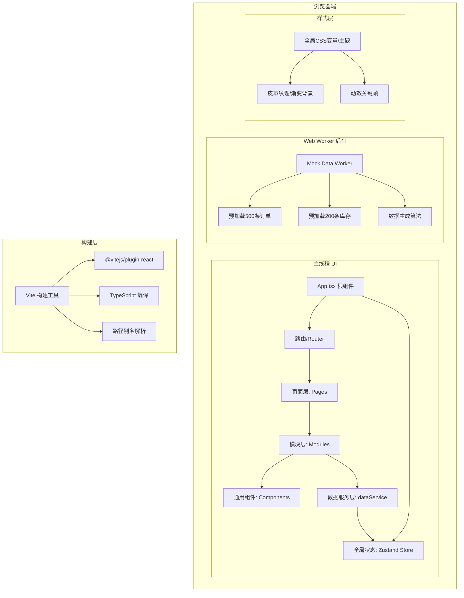
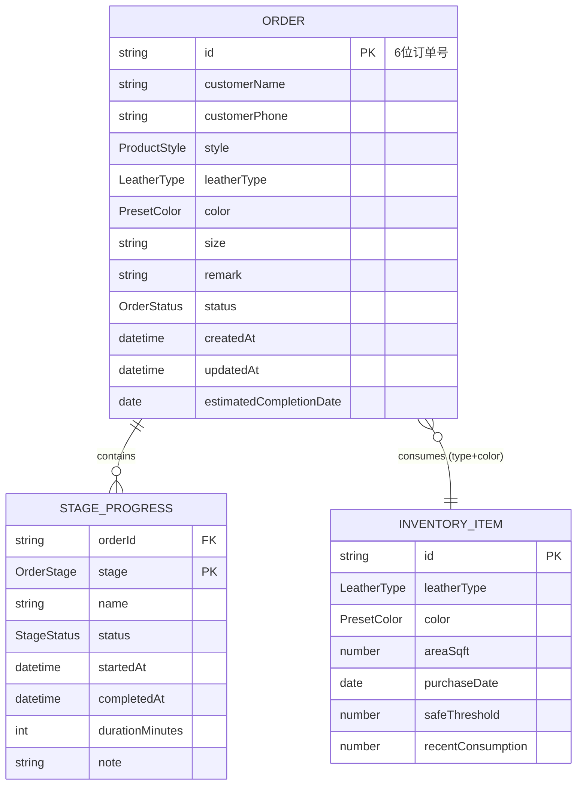

## 1. 架构设计



---

## 2. 技术选型说明

| 类别 | 技术栈 | 版本 | 选型理由 |
|------|--------|------|----------|
| 前端框架 | React | ^18.2.0 | 用户指定，生态成熟，组件化开发 |
| 语言 | TypeScript | ^5.3.0 | 严格类型安全，target ES2020 |
| 构建工具 | Vite | ^5.0.0 | 快速开发启动，HMR，路径别名支持 |
| 状态管理 | Zustand | ^4.4.0 | 轻量、简单、无boilerplate，适合中小规模应用 |
| 图标库 | lucide-react | ^0.294.0 | 线性风格图标，符合温暖匠心主题 |
| 后台线程 | Web Worker API | - | 预加载大量模拟数据避免阻塞主线程 |
| 数据层 | 内存模拟 + Promise | - | setTimeout模拟50ms异步延迟，模拟真实API体验 |
| 唯一ID | uuid | ^9.0.0 | 生成订单号等唯一标识 |
| HTTP客户端 | axios | ^1.6.0 | 用户指定依赖，预留未来真实API对接 |

### 核心架构原则
- **模块职责分离**：订单/库存/通用组件分目录组织，单一职责
- **数据服务层封装**：所有数据操作通过dataService，便于未来替换为真实API
- **性能优化**：Web Worker预加载大数据，CSS transform/opacity动画，虚拟滚动
- **类型安全**：全局TypeScript严格模式，定义完整数据模型接口

---

## 3. 路由与页面定义

| 路由路径 | 页面组件 | 主要功能 |
|----------|----------|----------|
| `/` | DashboardPage | 订单看板首页，订单卡片列表、状态筛选、新建订单表单 |
| `/orders/:id` | OrderDetailPage | 订单详情，五阶段进度看板、客户信息、操作面板 |
| `/inventory` | InventoryPage | 库存管理，库存卡片网格、低库存警告、采购记录跳转 |
| `/track` | TrackOrderPage | 客户进度查询，订单号输入、进度条展示、阶段日志 |
| `/purchases` | PurchasePage | 采购记录（从警告条跳转） |

---

## 4. 数据模型定义

### 4.1 核心数据接口 (TypeScript Type Definitions)

```typescript
// 订单状态枚举
type OrderStatus = 'pending' | 'confirmed' | 'in_progress' | 'shipping' | 'completed';

// 产品款式枚举
type ProductStyle = 'wallet' | 'handbag' | 'belt' | 'keychain';

// 皮料类型枚举
type LeatherType = 'vegetable_tanned' | 'chrome_tanned' | 'cordovan' | 'crocodile';

// 预设颜色枚举
type PresetColor = 'tan' | 'dark_brown' | 'black' | 'burgundy' | 'navy' | 'olive';

// 尺寸选项（按款式预设）
interface SizeOptionsMap {
  wallet: 'long' | 'short' | 'bifold';
  handbag: 'small' | 'medium' | 'large';
  belt: 'S' | 'M' | 'L' | 'XL';
  keychain: 'round' | 'rectangle' | 'custom';
}

// 订单阶段枚举
type OrderStage = 'design' | 'cutting' | 'stitching' | 'edge_painting' | 'hardware';

// 单个阶段数据
interface StageProgress {
  stage: OrderStage;
  name: string;
  status: 'pending' | 'current' | 'completed';
  startedAt?: Date;
  completedAt?: Date;
  durationMinutes?: number;
  note?: string;
}

// 订单主模型
interface Order {
  id: string;                 // 6位订单号
  customerName: string;
  customerPhone: string;
  style: ProductStyle;
  leatherType: LeatherType;
  color: PresetColor;
  size: string;               // 对应SizeOptionsMap中的值
  remark: string;             // 最多200字
  status: OrderStatus;
  stages: StageProgress[];    // 5个阶段数据
  createdAt: Date;
  updatedAt: Date;
  estimatedCompletionDate: Date;
}

// 库存项目模型
interface InventoryItem {
  id: string;
  leatherType: LeatherType;
  color: PresetColor;
  areaSqft: number;           // 库存面积（平方英尺）
  purchaseDate: Date;
  safeThreshold: number;      // 安全阈值（基于款式2倍消耗量计算）
  recentConsumption: number;  // 近期消耗量（用于趋势显示）
}

// 款式消耗预设（平方英尺）
const STYLE_CONSUMPTION: Record<ProductStyle, number> = {
  wallet: 1.5,
  handbag: 4.0,
  belt: 0.8,
  keychain: 0.3,
};

// 预设颜色值映射
const COLOR_PALETTE: Record<PresetColor, string> = {
  tan: '#C8A572',
  dark_brown: '#5C4033',
  black: '#2C2416',
  burgundy: '#722F37',
  navy: '#1E3A5F',
  olive: '#556B2F',
};

// 阶段名称映射
const STAGE_NAMES: Record<OrderStage, string> = {
  design: '设计确认',
  cutting: '开料',
  stitching: '缝制',
  edge_painting: '边油',
  hardware: '五金安装',
};
```

### 4.2 ER关系图



---

## 5. 项目文件结构

```
auto33/
├── .trae/documents/              # 项目文档
│   ├── PRD-手工皮具工作室管理系统.md
│   └── TECH-手工皮具工作室管理系统.md
├── public/                       # 静态资源
├── src/
│   ├── main.tsx                  # 应用入口，注入全局样式
│   ├── App.tsx                   # 根组件，路由配置
│   ├── index.css                 # 全局样式（主题变量、皮革纹理、动效）
│   ├── pages/                    # 页面层
│   │   ├── DashboardPage.tsx     # 订单看板首页
│   │   ├── OrderDetailPage.tsx   # 订单详情页
│   │   ├── InventoryPage.tsx     # 库存管理页
│   │   ├── TrackOrderPage.tsx    # 客户查询页
│   │   └── PurchasePage.tsx      # 采购记录页
│   ├── modules/                  # 业务模块层
│   │   ├── orders/
│   │   │   ├── OrderCard.tsx         # 订单卡片（滑动交互+状态标签）
│   │   │   ├── OrderDetailPanel.tsx  # 订单详情（进度看板+阶段操作）
│   │   │   ├── NewOrderForm.tsx      # 新建订单表单
│   │   │   └── StatusFilter.tsx      # 状态筛选器
│   │   ├── inventory/
│   │   │   ├── InventoryTracker.tsx  # 库存组件（卡片+警告条）
│   │   │   └── InventoryCard.tsx     # 单张库存卡片
│   │   ├── track/
│   │   │   └── TrackOrderForm.tsx    # 查询表单+结果展示
│   │   └── common/
│   │       ├── ProgressBar.tsx       # 分段进度条
│   │       ├── ColorSwatch.tsx       # 色板选择器（涟漪动画）
│   │       ├── StageBubble.tsx       # 阶段气泡（对勾+脉冲）
│   │       ├── Toast.tsx             # Toast提示系统
│   │       ├── Sidebar.tsx           # 导航侧栏
│   │       ├── Navbar.tsx            # 顶部导航（汉堡菜单+面包屑）
│   │       └── LowStockAlert.tsx     # 低库存警告条
│   ├── services/
│   │   └── dataService.ts            # 数据服务层（增删改查接口）
│   ├── workers/
│   │   └── mockData.worker.ts        # Web Worker预加载数据
│   ├── utils/
│   │   ├── mockData.ts               # 模拟数据生成器
│   │   ├── constants.ts              # 常量定义（颜色、款式、消耗值等）
│   │   └── types.ts                  # 全局类型定义
│   ├── store/
│   │   └── useAppStore.ts            # Zustand全局状态
│   └── hooks/
│       ├── useSwipe.ts               # 滑动手势hook
│       └── useToast.ts               # Toast hook
├── package.json
├── vite.config.ts                    # Vite配置+路径别名
├── tsconfig.json                     # TS配置（严格模式+ES2020）
└── index.html                        # 入口HTML（viewport+字体预加载）
```

---

## 6. 关键实现方案

### 6.1 性能优化方案

| 需求 | 实现策略 |
|------|----------|
| 100条订单首屏≤3s | 1. Web Worker后台生成500条数据，主线程仅渲染首屏<br>2. 列表虚拟滚动（仅渲染可视区域DOM）<br>3. 卡片组件memo化避免重复渲染 |
| 状态切换≤100ms | 1. Zustand本地状态乐观更新<br>2. CSS transition/transform硬件加速动画<br>3. 状态变更先UI响应，后台异步持久化 |
| 大数据不阻塞主线程 | Web Worker独立线程生成mock数据，postMessage传输到主线程 |

### 6.2 动效实现方案

| 动效 | 实现方式 | 性能考量 |
|------|----------|----------|
| 卡片滑动状态切换 | pointer事件监听+transform translateX+背景色transition | 只动画transform/opacity |
| 色板涟漪动画 | 伪元素::after radial-gradient + keyframes expand-ripple | GPU合成层 |
| 阶段对勾滑入 | clip-path + transform translateX 滑入动画 | 独立合成层 |
| 脉冲光晕 | @keyframes pulse box-shadow 1.5Hz | 注意避免频繁layout |
| 警告条抖动 | @keyframes shake translateX(-3px/3px) alternate | 短时间动画 |
| Toast滑入淡出 | transform translateY + opacity transition | will-change提示浏览器 |

### 6.3 响应式断点实现

使用CSS媒体查询 + 动态组件：

```css
/* 桌面端默认样式 */
.sidebar { width: 280px; position: fixed; }

/* 平板端 */
@media (max-width: 1023px) {
  .sidebar { width: 240px; }
}

/* 移动端 */
@media (max-width: 767px) {
  .sidebar { 
    position: fixed; 
    transform: translateX(-100%); 
    transition: transform 0.3s ease-out; 
    z-index: 50;
  }
  .sidebar.open { transform: translateX(0); }
}
```

---

## 7. 构建与配置

### 7.1 package.json 核心配置

- 依赖：react、react-dom、vite、@vitejs/plugin-react、typescript、@types/react、@types/react-dom、axios、uuid、zustand、lucide-react
- devDependencies：@types/uuid
- 启动脚本：`npm run dev`（vite启动开发服务器）
- 构建脚本：`npm run build`

### 7.2 vite.config.ts 关键配置

```typescript
import { defineConfig } from 'vite';
import react from '@vitejs/plugin-react';
import path from 'path';

export default defineConfig({
  plugins: [react()],
  resolve: {
    alias: {
      '@': path.resolve(__dirname, './src'),
    },
  },
  server: {
    port: 5173,
    open: true,
  },
});
```

### 7.3 tsconfig.json 关键配置

- compilerOptions.strict: true
- compilerOptions.target: "ES2020"
- compilerOptions.baseUrl + paths 配置路径别名 `@/*`
- compilerOptions.module: "ESNext"
- compilerOptions.jsx: "react-jsx"

### 7.4 index.html 字体预加载

```html
<link rel="preconnect" href="https://fonts.googleapis.com">
<link rel="preconnect" href="https://fonts.gstatic.com" crossorigin>
<link 
  href="https://fonts.googleapis.com/css2?family=Playfair+Display:wght@600;700&family=Noto+Serif+SC:wght@400;500;600&family=JetBrains+Mono:wght@500&display=swap" 
  rel="stylesheet"
>
```
