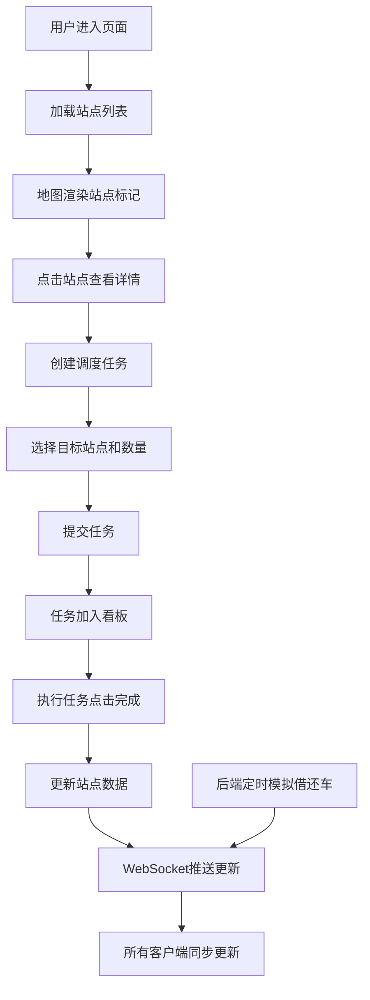

## 1. 产品概述

城市共享单车实时调度监控看板，为运维人员提供全城站点单车动态分布可视化、调度任务派发与执行状态追踪的一体化管理平台。

- 面向运维管理人员，解决共享单车供需不平衡、调度效率低下的问题
- 通过实时数据可视化和智能任务管理，提升城市共享单车运营效率

## 2. 核心功能

### 2.1 用户角色
| 角色 | 注册方式 | 核心权限 |
|------|----------|----------|
| 运维人员 | 系统内置 | 查看站点分布、创建调度任务、执行任务、查看统计数据 |

### 2.2 功能模块
1. **地图可视化模块**：Leaflet地图展示30个站点，按容量饱和度显示不同颜色标记
2. **实时数据推送模块**：WebSocket实时推送单车数量变化，前端动画提示
3. **调度任务管理模块**：创建、派发、执行、完成调度任务全流程管理
4. **统计看板模块**：全局统计数据展示（总站点数、平均空闲率、进行中任务数）

### 2.3 页面详情
| 页面名称 | 模块名称 | 功能描述 |
|----------|----------|----------|
| 主看板页面 | 地图视图 | 展示30个站点标记，支持点击查看详情、悬停放大效果 |
| 主看板页面 | 站点详情 | 显示选中站点名称、容量、状态，提供创建调度任务入口 |
| 主看板页面 | 统计卡片 | 展示总站点数、平均空闲率、进行中任务数三个核心指标 |
| 主看板页面 | 任务列表 | 展示所有调度任务，支持状态筛选和完成操作 |
| 主看板页面 | 创建任务模态框 | 选择目标站点、调度方向、数量，提交创建任务 |

## 3. 核心流程

### 3.1 站点查看流程
用户进入页面 → 自动加载站点列表 → 地图渲染30个站点标记 → 点击标记查看详情 → 显示站点信息和操作按钮

### 3.2 调度任务创建流程
点击"创建调度任务" → 弹出模态框 → 选择目标站点和调度方向 → 输入调度数量 → 提交创建 → 任务出现在任务列表 → 后端更新站点数据 → WebSocket推送更新所有客户端

### 3.3 任务执行流程
查看任务列表 → 点击"完成"按钮 → 后端更新任务状态 → 更新站点单车数量 → WebSocket推送更新 → 任务卡片变为已完成状态

### 3.4 实时数据更新流程
后端每3秒随机更新2-3个站点 → WebSocket推送新数据 → 前端更新标记颜色和数值 → 数值变化处显示脉冲动画

## 4. 用户界面设计

### 4.1 设计风格
- **主色调**：深蓝灰 #2c3e50（背景）、#3498db（主按钮）
- **状态色**：绿色 #27ae60（>50%容量）、黄色 #f1c40f（20-50%容量）、红色 #e74c3c（<20%容量）
- **按钮风格**：圆角6px，悬停变亮 #5dade2，平滑过渡
- **字体**：现代无衬线字体，清晰易读
- **布局风格**：左宽右窄两栏布局（65%/35%），卡片式设计
- **动画效果**：标记悬停缩放、数值脉冲、模态框淡入、任务卡片悬停上浮

### 4.2 页面设计概述
| 页面名称 | 模块名称 | UI元素 |
|----------|----------|--------|
| 主看板页面 | 地图区域 | Leaflet地图，圆形标记（半径20px），颜色区分容量，悬停放大1.3倍（0.2s过渡），点击弹出信息窗 |
| 主看板页面 | 右侧面板 | 背景 #34495e，上下分割为统计区和任务列表区 |
| 主看板页面 | 统计卡片 | 圆角12px，白色背景 #ecf0f1，内间距16px，深色文字 #2c3e50 |
| 主看板页面 | 任务列表项 | 背景 #3b4d61，圆角8px，间距8px，悬停上移3px带阴影 |
| 主看板页面 | 模态框 | 居中弹出，半透明黑色遮罩，fade in 0.3s动画 |

### 4.3 响应式
- 桌面端：左65%地图，右35%面板
- 移动端（<768px）：上下布局，地图在上，面板在下

### 4.4 性能指标
- 30个地图标记交互无卡顿
- WebSocket消息延迟 < 200ms
- 数值变化动画 60fps流畅
