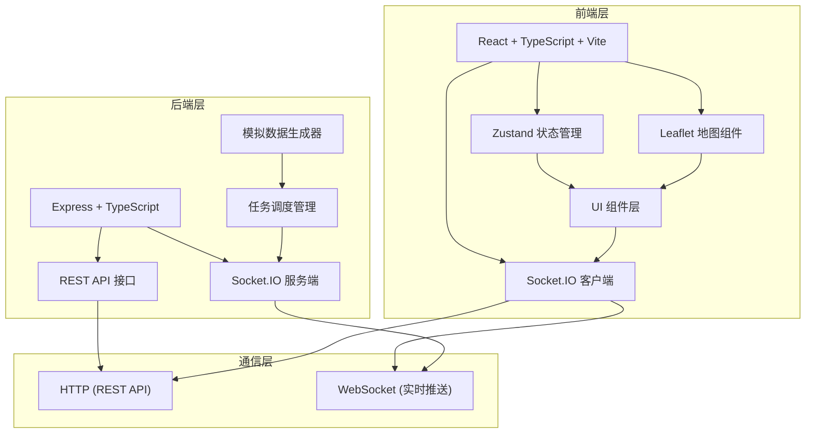
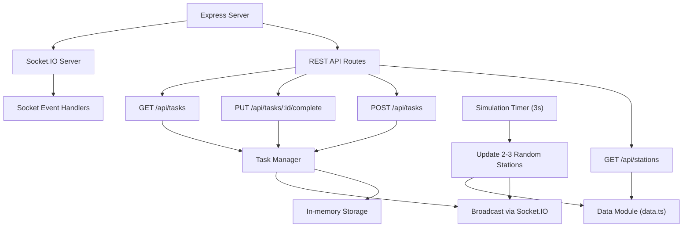
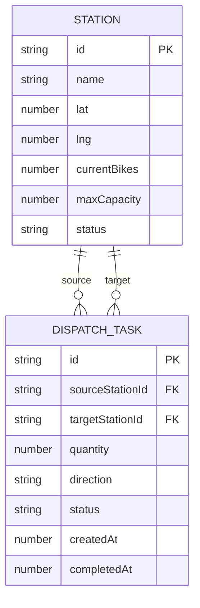

## 1. 架构设计



## 2. 技术描述

- **前端**：React 18 + TypeScript + Vite 5 + Zustand 4 + Leaflet 1.9 + react-leaflet 4 + socket.io-client 4
- **后端**：Express 4 + TypeScript + Socket.IO 4 + CORS 2 + UUID 9
- **构建工具**：Vite 5，支持路径别名配置
- **类型系统**：TypeScript 5，严格模式，target ES2020

## 3. 目录结构定义

```
auto333/
├── .trae/documents/          # 项目文档
├── server/                   # 后端代码
│   ├── index.ts             # Express服务入口
│   ├── data.ts              # 模拟数据生成
│   └── socket.ts            # WebSocket事件处理
├── src/
│   ├── components/          # React组件
│   │   └── MapView.tsx      # 地图组件
│   ├── pages/               # 页面组件
│   │   └── Dashboard.tsx    # 主看板页面
│   └── store/               # 状态管理
│       └── stationStore.ts  # Zustand store
├── index.html               # 入口HTML
├── vite.config.ts           # Vite配置
├── tsconfig.json            # TypeScript配置
└── package.json             # 项目依赖
```

## 4. API 定义

### 4.1 类型定义

```typescript
// 站点类型
interface Station {
  id: string;
  name: string;
  lat: number;
  lng: number;
  currentBikes: number;
  maxCapacity: number;
  status: 'normal' | 'maintenance' | 'full';
}

// 调度任务类型
interface DispatchTask {
  id: string;
  sourceStationId: string;
  targetStationId: string;
  quantity: number;
  direction: 'out' | 'in';
  status: 'pending' | 'in_progress' | 'completed';
  createdAt: number;
  completedAt?: number;
}

// 站点状态更新事件
interface StationUpdateEvent {
  stationId: string;
  currentBikes: number;
}
```

### 4.2 REST API 接口

| 方法 | 路径 | 描述 | 请求参数 | 响应 |
|------|------|------|----------|------|
| GET | `/api/stations` | 获取所有站点列表 | 无 | `Station[]` |
| POST | `/api/tasks` | 创建调度任务 | `{ sourceStationId, targetStationId, quantity, direction }` | `DispatchTask` |
| PUT | `/api/tasks/:id/complete` | 完成任务 | 无 | `DispatchTask` |
| GET | `/api/tasks` | 获取所有任务列表 | 无 | `DispatchTask[]` |

### 4.3 WebSocket 事件

| 事件名 | 方向 | 描述 | 数据 |
|--------|------|------|------|
| `station:update` | 服务端→客户端 | 站点单车数量更新 | `{ stationId, currentBikes }` |
| `task:created` | 服务端→客户端 | 新任务创建 | `DispatchTask` |
| `task:updated` | 服务端→客户端 | 任务状态更新 | `DispatchTask` |
| `stations:initial` | 服务端→客户端 | 初始站点数据 | `Station[]` |

## 5. 服务端架构



## 6. 数据模型

### 6.1 实体关系图



### 6.2 业务规则

1. **站点状态计算**：
   - `currentBikes / maxCapacity > 0.5` → 绿色标记
   - `0.2 <= currentBikes / maxCapacity <= 0.5` → 黄色标记
   - `currentBikes / maxCapacity < 0.2` → 红色标记

2. **空闲率计算**：
   - 空闲率 = (容量<20%的站点数 / 总站点数) × 100%
   - 颜色规则：>30%红色，10-30%黄色，<10%绿色

3. **调度任务规则**：
   - 调度数量范围：1-10辆
   - 任务状态流转：待接收 → 进行中 → 已完成
   - 完成任务时自动更新源站点和目标站点的单车数量

4. **模拟数据规则**：
   - 每3秒随机选择2-3个站点
   - 每个站点随机增减1-3辆单车
   - 确保数值在0到最大容量范围内
