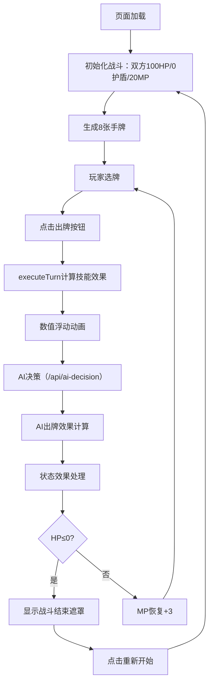

## 1. 产品概述

回合制卡牌战斗模拟器与数值看板——一款面向游戏策划的交互式测试工具，用于模拟玩家与AI对手的轮流出牌战斗，实时展示伤害/治疗数值浮动，并通过右侧看板可视化双方属性变化曲线和技能使用统计，帮助快速定位技能平衡性问题。

## 2. 核心功能

### 2.1 用户角色
| 角色 | 使用方式 | 核心权限 |
|------|----------|----------|
| 游戏策划 | 直接访问页面 | 操作战斗、查看看板数据 |

### 2.2 功能模块
1. **战斗页面**：卡牌手牌选择、出牌操作、技能特效动画、伤害/治疗数值浮动、血条/护盾/状态效果实时显示
2. **数值看板**：双方HP/MP/攻击力变化曲线图（Canvas绘制）、技能使用统计列表

### 2.3 页面详情
| 页面名称 | 模块名称 | 功能描述 |
|----------|----------|----------|
| 战斗主页面 | 战斗场景区 | 显示双方角色立绘(emoji)、血条(Hp/Mp/护盾)、状态图标(中毒/冰冻/灼烧/狂暴)，数值浮动动画 |
| 战斗主页面 | 手牌区 | 8张初始卡牌显示（攻击/防御/治疗/增益/减益），牌面按稀有度渐变，选中上移动画，出牌按钮 |
| 战斗主页面 | 属性曲线图 | Canvas绘制双方HP/MP/攻击力时间序列曲线，鼠标悬停显示具体数值 |
| 战斗主页面 | 技能统计列表 | 按使用次数降序排列，进度条按技能类型着色，背景深灰 |
| 战斗主页面 | 战斗结束遮罩 | 半透明遮罩显示胜负结果和总回合数，重新开始按钮 |

## 3. 核心流程

用户进入页面后自动初始化战斗，双方各拥有100HP、0护盾、20MP。用户从手牌中选择一张卡牌，点击出牌按钮触发回合执行。战斗引擎计算技能效果（伤害/治疗/护盾/状态附加），同时前端通过API获取AI出牌决策。每回合结束时处理状态效果（中毒扣血、灼烧扣血、冰冻跳过、狂暴增攻），更新属性曲线数据。任意一方HP降至0以下触发战斗结束遮罩。

## 4. 用户界面设计

### 4.1 设计风格
- 主题：深色赛博朋克风（背景#1a1a2e，战斗区#16213e，看板区#1e1e2f）
- 主色：深蓝黑底，搭配蓝色(#42A5F5)与红色(#EF5350)对比色代表双方
- 按钮：圆形出牌按钮，渐变色(#E53935→#FF7043)，悬停缩放1.1倍
- 字体：系统默认无衬线字体，数值浮动24px加粗，坐标轴12px白色
- 布局：左侧战斗区60% + 右侧看板区40%
- 动画：framer-motion驱动血条平滑变化、卡牌翻转Y轴0.3秒、数值浮动向上50px/1秒、选中上移20px弹簧动画

### 4.2 页面设计概览
| 页面名称 | 模块名称 | UI元素 |
|----------|----------|--------|
| 战斗主页面 | 战斗场景 | 深蓝背景，emoji立绘(👨‍🔧/👾)，圆角血条(12px高)，HP绿/MP蓝/护盾黄，状态图标+剩余回合数 |
| 战斗主页面 | 手牌区 | 底部排列，80x120px卡牌，10px间距，稀有度渐变(普通#A5D6A7/稀有#FFD54F/史诗#CE93D8)，选中上移20px |
| 战斗主页面 | 出牌按钮 | 圆形50px直径，红→橙渐变，悬停1.1倍缩放 |
| 战斗主页面 | 属性曲线图 | Canvas深灰#2c2c2c背景，#555网格线，蓝色/红色曲线，小圆点标记 |
| 战斗主页面 | 技能统计 | 每行40px，圆角4px进度条，背景#444，攻击红/治疗绿/防御蓝/增益黄/减益紫 |
| 战斗主页面 | 结束遮罩 | rgba(0,0,0,0.7)背景，胜负文字+回合数，重新开始按钮 |

### 4.3 响应式
- 桌面优先设计，最小宽度1024px
- 战斗区与看板区使用flex布局，窄屏时看板区折叠至下方

### 4.4 3D场景指引
- 不适用
