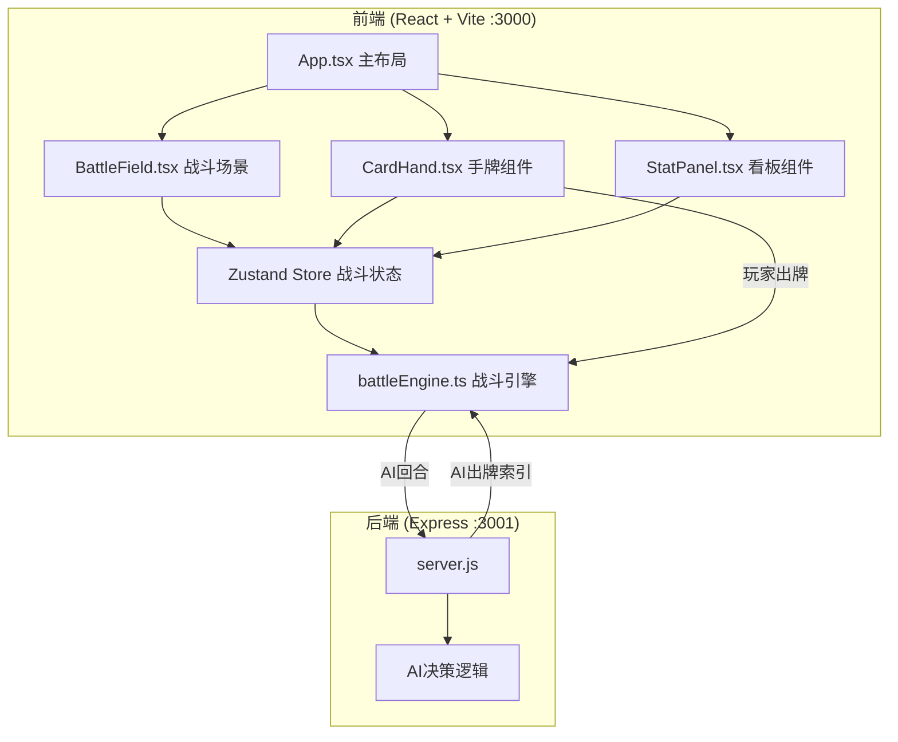
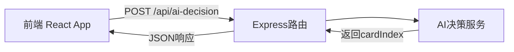

## 1. 架构设计



## 2. 技术说明
- 前端：React@18 + TypeScript + Vite + Zustand + Framer Motion
- 初始化工具：vite-init (react-express-ts模板)
- 后端：Express@4 (server.js，CommonJS)
- 数据库：无，所有数据在前端内存中管理
- API通信：前端通过fetch调用后端/api/ai-decision获取AI决策

## 3. 路由定义
| 路由 | 用途 |
|------|------|
| / | 战斗主页面（唯一页面） |

## 4. API定义

### POST /api/ai-decision
请求体：
```typescript
interface AIDecisionRequest {
  aiHP: number;
  aiMP: number;
  aiShield: number;
  aiStatusEffects: StatusEffect[];
  playerHP: number;
  hand: Card[];
}
```

响应体：
```typescript
interface AIDecisionResponse {
  cardIndex: number;
}
```

AI策略：HP<30时优先使用治疗牌，否则优先使用伤害牌，MP不足时随机选择可用的牌。

### 核心类型定义

```typescript
interface Card {
  id: string;
  name: string;
  type: 'attack' | 'defense' | 'heal' | 'buff' | 'debuff';
  rarity: 'common' | 'rare' | 'epic';
  mpCost: number;
  description: string;
  effect: SkillEffect;
}

interface SkillEffect {
  damage?: number;
  heal?: number;
  shield?: number;
  statusEffect?: StatusEffectType;
  statusDuration?: number;
}

type StatusEffectType = 'poison' | 'freeze' | 'burn' | 'rage';

interface StatusEffect {
  type: StatusEffectType;
  duration: number;
  stacks: number;
}

interface Fighter {
  hp: number;
  maxHp: number;
  mp: number;
  maxMp: number;
  shield: number;
  attack: number;
  statusEffects: StatusEffect[];
  isFrozen: boolean;
}

interface BattleState {
  player: Fighter;
  enemy: Fighter;
  playerHand: Card[];
  enemyHand: Card[];
  currentTurn: 'player' | 'enemy';
  turnCount: number;
  isOver: boolean;
  winner: 'player' | 'enemy' | null;
  hpHistory: { turn: number; playerHP: number; enemyHP: number }[];
  mpHistory: { turn: number; playerMP: number; enemyMP: number }[];
  attackHistory: { turn: number; playerAttack: number; enemyAttack: number }[];
  skillUsage: Record<string, number>;
  floatingNumbers: FloatingNumber[];
}

interface FloatingNumber {
  id: string;
  value: number;
  type: 'damage' | 'heal' | 'shield';
  target: 'player' | 'enemy';
  timestamp: number;
}
```

## 5. 服务器架构图



## 6. 数据模型

不使用数据库，所有状态通过Zustand store在前端内存中管理，每次页面刷新重置。

### 数据流向说明

1. **初始化**：App.tsx调用`startBattle()`，战斗引擎生成双方角色和手牌，写入Zustand store
2. **玩家出牌**：CardHand组件选中卡牌→点击出牌→调用`executeTurn(playerCard)`→引擎计算效果→更新store→触发BattleField和StatPanel重渲染
3. **AI出牌**：引擎通过fetch调用后端/api/ai-decision→获取cardIndex→计算AI卡牌效果→更新store
4. **状态效果处理**：每回合结束时引擎处理所有状态效果（扣血/跳过回合/增益到期）→更新store
5. **看板更新**：StatPanel从store读取hpHistory/mpHistory/attackHistory绘制Canvas曲线，读取skillUsage渲染统计列表

### 文件调用关系

```
src/main.tsx → src/App.tsx
src/App.tsx → src/engine/battleEngine.ts (调用startBattle/executeTurn)
src/App.tsx → src/components/BattleField.tsx (渲染战斗区)
src/App.tsx → src/components/CardHand.tsx (渲染手牌)
src/App.tsx → src/components/StatPanel.tsx (渲染看板)
src/components/BattleField.tsx → src/store/battleStore.ts (读取状态)
src/components/CardHand.tsx → src/store/battleStore.ts (读取/更新状态)
src/components/StatPanel.tsx → src/store/battleStore.ts (读取历史数据)
src/engine/battleEngine.ts → src/store/battleStore.ts (更新战斗状态)
server.js → 独立运行，提供AI决策API
```
