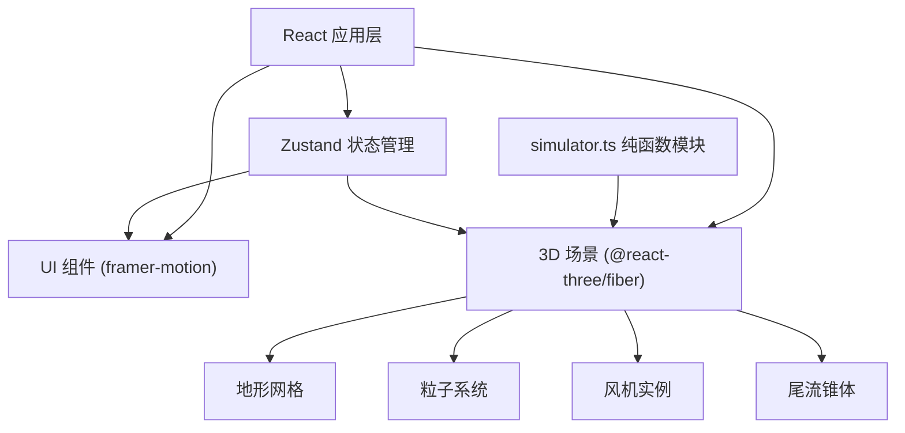

## 1. 架构设计


## 2. 技术描述
- 前端：React@18 + TypeScript + Vite
- 3D渲染：three + @react-three/fiber + @react-three/drei
- 状态管理：zustand
- UI动画：framer-motion
- 其他：uuid

## 3. 目录结构
```
├── package.json
├── vite.config.ts
├── tsconfig.json
├── index.html
└── src/
    ├── store.ts          # Zustand状态仓库
    ├── simulator.ts      # 尾流计算与布局优化纯函数
    └── components/
        ├── Scene.tsx     # 3D场景主组件
        ├── UIPanel.tsx   # 右侧控制面板
        ├── Turbine.tsx   # 单个风机组件
        └── Particles.tsx # 粒子系统组件
```

## 4. 数据模型

### 4.1 Zustand Store
```typescript
interface Turbine {
  id: string;
  position: [number, number, number];
  power: number;
  windSpeed: number;
}

interface Store {
  terrainAmplitude: number;      // 地形起伏幅度 10-50
  particleCount: number;        // 粒子数量 800-1200
  maxTurbines: number;          // 最大风机数量 8-12
  turbines: Turbine[];          // 风机列表
  suggestions: [number, number, number][]; // 推荐机位
  expectedGain: number;         // 预期增益百分比
  setTerrainAmplitude: (v: number) => void;
  setParticleCount: (v: number) => void;
  setMaxTurbines: (v: number) => void;
  addTurbine: (pos: [number, number, number]) => void;
  updateTurbine: (id: string, pos: [number, number, number]) => void;
  removeTurbine: (id: string) => void;
  setSuggestions: (s: [number, number, number][], gain: number) => void;
  updateTurbinePower: (id: string, power: number, windSpeed: number) => void;
}
```

## 5. 核心模块说明

### 5.1 simulator.ts
- `calculateWake(turbines: Turbine[], windSpeed: number): { position: [number, number, number], height: number, radius: number }[]`
  - 计算每台风机的尾流影响锥体
  - 基于Jensen尾流模型简化实现
  - 返回锥体顶点数据用于渲染

- `optimizeLayout(heightMap: number[][], turbines: Turbine[]): { positions: [number, number, number][], gain: number }`
  - 基于粒子流密度和地形风速分布的启发式算法
  - 评估候选点的风能潜力和尾流影响
  - 返回3个最佳机位和预期发电量提升

### 5.2 性能优化
- 粒子系统使用BufferGeometry和Points，GPU加速
- 尾流计算使用requestAnimationFrame分帧处理
- 风机位置更新防抖处理，避免频繁重算
