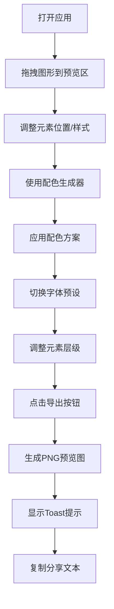

## 1. 产品概述

品牌视觉灵感板是一款面向平面设计师的在线创意工具，解决设计师在构思品牌海报时需要在多个软件间切换、灵感碎片易丢失的痛点。用户可在浏览器中自由搭配字体、颜色和图形元素，实时预览效果并一键导出高清预览图。

- 目标用户：平面设计师、品牌策划人员、创意工作者
- 核心价值：一站式品牌视觉创意搭配，灵感不中断，高效产出配色与字体方案

## 2. 核心功能

### 2.1 用户角色

| 角色 | 注册方式 | 核心权限 |
|------|----------|----------|
| 访客用户 | 无需注册 | 使用全部核心功能，导出灵感板预览图 |

### 2.2 功能模块

1. **灵感板主界面**：左侧控制面板 + 右侧预览区，支持响应式布局
2. **元素拖拽与层级管理**：图形和文本自由拖拽定位，层级调整
3. **配色方案生成器**：基于主色智能生成互补色和辅助色方案
4. **字体组合预设**：5种字体风格一键切换应用
5. **图形元素库**：5种基础图形拖拽添加，样式实时编辑
6. **高清导出功能**：导出PNG预览图，生成分享文本

### 2.3 页面详情

| 页面名称 | 模块名称 | 功能描述 |
|----------|----------|----------|
| 灵感板主页 | 控制面板-配色区 | 主色拾取、智能配色生成、色块卡片展示与应用 |
| 灵感板主页 | 控制面板-元素库 | 图形拖拽添加、样式编辑（颜色/边框/旋转/透明度） |
| 灵感板主页 | 控制面板-字体区 | 5种字体组合预设切换 |
| 灵感板主页 | 灵感板预览区 | 元素拖拽定位、层级显示、选中高亮 |
| 灵感板主页 | 导出功能 | 高清PNG导出、Toast提示、分享文本复制 |
| 灵感板主页 | 层级控制 | 上移/下移/置顶/置底操作 |
| 灵感板主页 | 历史记录 | 配色方案历史栈，撤销/重做 |

## 3. 核心流程

用户打开应用 → 在控制面板选择图形元素拖拽到预览区 → 调整元素位置和样式 → 使用配色生成器创建配色方案 → 点击色块应用新配色 → 切换字体组合预设 → 调整元素层级 → 点击导出按钮 → 生成PNG图片并显示下载Toast → 复制分享文本。

## 4. 用户界面设计

### 4.1 设计风格

- **主色调**：#1976D2（蓝色），辅助色：#9C27B0（紫色选中边框），#4CAF50（成功提示），#2196F3（字体标签）
- **背景色**：#FAFAFA（整体），#FFFFFF（控制面板），#ECECEC（预览区），#FFFFFF（内部画布）
- **按钮样式**：圆角12px，悬停背景变暗（#1565C0），0.2s过渡动画
- **字体**：采用现代无衬线字体组合，区域标题14px加粗，颜色#555555
- **布局风格**：左右分栏布局，左侧固定320px控制面板，右侧自适应预览区
- **视觉细节**：细微网格背景（20x20px，#D0D0D0），内阴影画布效果，浅灰分割线

### 4.2 页面设计概述

| 页面名称 | 模块名称 | UI元素 |
|----------|----------|--------|
| 灵感板主页 | 配色生成区 | 颜色拾取器、生成按钮、7张色块卡片（60x60px，圆角8px，悬停放大1.1倍） |
| 灵感板主页 | 元素库与编辑区 | 5种图形缩略图、颜色输入、边框粗细滑块、旋转角度滑块、透明度滑块 |
| 灵感板主页 | 字体预设区 | 5个预设按钮，实时显示当前字体组合标签 |
| 灵感板主页 | 预览画布 | 网格背景、可拖拽元素、选中虚线边框（2px #9C27B0）、层级调整按钮 |
| 灵感板主页 | 导出Toast | 绿色背景#4CAF50，圆角8px，渐入渐出0.3s，下载链接和复制按钮 |

### 4.3 响应式设计

- **桌面端（≥1024px）**：左右分栏固定布局，控制面板320px宽度
- **移动端（<1024px）**：控制面板可折叠，汉堡菜单按钮左上角，点击后从左侧滑出（0.3s动画），预览区撑满全屏

### 4.4 动画设计

- 元素拖拽：0.1s弹性跟随动画
- 配色切换：十字交叉淡入动画（0.4s）
- 字体切换：文本容器淡入动画（0.3s）
- 悬停效果：色块放大1.1倍（0.2s），按钮背景色过渡（0.2s）
- 面板滑动：左侧滑出动画（0.3s）
- Toast提示：渐入渐出动画（0.3s）
- 图形编辑：平滑过渡（0.2s）

## 5. 性能约束

- 灵感板最多支持30个元素同时存在
- 拖拽元素帧率稳定在50FPS以上
- 配色生成计算在30ms内完成
- 导出PNG图片在1500ms内完成
