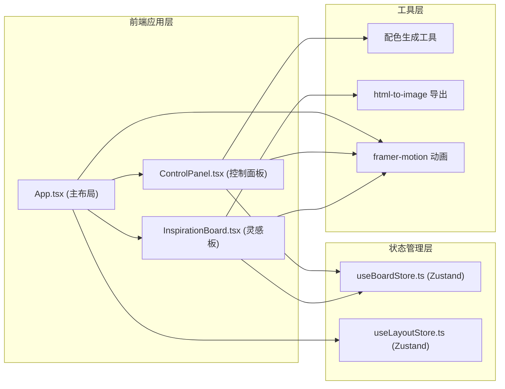

## 1. 架构设计



## 2. 技术描述

- **前端框架**：React 18 + TypeScript
- **构建工具**：Vite 5 + @vitejs/plugin-react
- **状态管理**：Zustand 4（跨组件状态共享）
- **动画库**：framer-motion 11（界面交互动画）
- **导出工具**：html-to-image（PNG图片生成）
- **唯一ID生成**：uuid v4
- **开发服务**：Vite Dev Server（npm run dev）
- **后端**：无（纯前端应用）
- **数据库**：无（浏览器内存状态）

## 3. 目录结构

```
auto338/
├── index.html                    # 入口HTML
├── package.json                  # 依赖配置
├── tsconfig.json                 # TypeScript配置
├── vite.config.ts                # Vite配置
└── src/
    ├── main.tsx                  # React入口
    ├── App.tsx                   # 主布局组件
    ├── modules/
    │   ├── ControlPanel.tsx      # 控制面板模块
    │   └── InspirationBoard.tsx  # 灵感板核心模块
    ├── stores/
    │   ├── useBoardStore.ts      # 灵感板状态管理
    │   └── useLayoutStore.ts     # 布局状态管理
    ├── types/
    │   └── index.ts              # 类型定义
    └── utils/
        ├── colorGenerator.ts     # 配色生成工具
        └── fontPresets.ts        # 字体预设配置
```

## 4. 数据流向

### 4.1 模块调用关系

1. **App.tsx** → 渲染 ControlPanel 和 InspirationBoard
2. **ControlPanel.tsx** → 调用 useBoardStore 的 actions 添加/编辑元素
3. **InspirationBoard.tsx** → 订阅 useBoardStore 状态，渲染元素
4. **useBoardStore.ts** → 管理元素数组、配色历史、导出状态
5. **useLayoutStore.ts** → 管理面板折叠/展开状态

### 4.2 数据流路径

```
用户操作 → ControlPanel → useBoardStore.dispatch → InspirationBoard 重渲染 → 动画更新 → 导出 → html-to-image → PNG下载
```

## 5. 类型定义

### 5.1 元素类型

```typescript
type ElementType = 'rectangle' | 'circle' | 'triangle' | 'hexagon' | 'star' | 'text';

interface BoardElement {
  id: string;
  type: ElementType;
  x: number;
  y: number;
  width: number;
  height: number;
  fill: string;
  stroke: string;
  strokeWidth: number;
  rotation: number;
  opacity: number;
  zIndex: number;
  text?: string;
  fontSize?: number;
  fontFamily?: string;
}

interface ColorScheme {
  id: string;
  primary: string;
  complementary: string[];  // 4种互补色
  auxiliary: string[];      // 3种辅助色
  createdAt: number;
}

interface FontPreset {
  name: string;
  displayName: string;
  titleFont: string;
  bodyFont: string;
}
```

### 5.2 Store 状态

```typescript
interface BoardState {
  elements: BoardElement[];
  selectedElementId: string | null;
  colorHistory: ColorScheme[];
  historyIndex: number;
  currentFontPreset: FontPreset;
  isExporting: boolean;
  exportToast: { visible: boolean; message: string; downloadUrl?: string };
}

interface LayoutState {
  isPanelCollapsed: boolean;
  screenWidth: number;
}
```

## 6. 核心组件Props

### 6.1 ControlPanel

```typescript
interface ControlPanelProps {
  isCollapsed: boolean;
  onToggle: () => void;
}
```

### 6.2 InspirationBoard

```typescript
interface InspirationBoardProps {
  // 通过store获取状态，无需props传递
}
```

## 7. Store Actions

### 7.1 useBoardStore

```typescript
interface BoardActions {
  addElement: (element: Omit<BoardElement, 'id' | 'zIndex'>) => void;
  removeElement: (id: string) => void;
  updateElement: (id: string, updates: Partial<BoardElement>) => void;
  selectElement: (id: string | null) => void;
  moveElement: (id: string, x: number, y: number) => void;
  bringForward: (id: string) => void;      // 上移一层
  sendBackward: (id: string) => void;      // 下移一层
  bringToFront: (id: string) => void;      // 置顶
  sendToBack: (id: string) => void;        // 置底
  applyColorScheme: (scheme: ColorScheme) => void;
  setFontPreset: (preset: FontPreset) => void;
  undoColor: () => void;
  redoColor: () => void;
  exportBoard: () => Promise<void>;
  hideToast: () => void;
}
```

### 7.2 useLayoutStore

```typescript
interface LayoutActions {
  togglePanel: () => void;
  setScreenWidth: (width: number) => void;
}
```

## 8. 工具函数

### 8.1 colorGenerator.ts

```typescript
// 生成互补色和辅助色
function generateColorScheme(primaryColor: string): ColorScheme;

// 调整颜色亮度
function adjustBrightness(color: string, percent: number): string;

// 颜色格式转换
function hexToHsl(hex: string): { h: number; s: number; l: number };
function hslToHex(h: number, s: number, l: number): string;
```

### 8.2 fontPresets.ts

```typescript
const FONT_PRESETS: FontPreset[] = [
  { name: 'modern', displayName: '现代', titleFont: 'Poppins', bodyFont: 'Inter' },
  { name: 'retro', displayName: '复古', titleFont: 'Playfair Display', bodyFont: 'Source Serif Pro' },
  { name: 'minimal', displayName: '简约', titleFont: 'Helvetica Neue', bodyFont: 'Helvetica' },
  { name: 'handwriting', displayName: '手写', titleFont: 'Dancing Script', bodyFont: 'Caveat' },
  { name: 'bold', displayName: '粗犷', titleFont: 'Bebas Neue', bodyFont: 'Oswald' },
];
```

## 9. 性能优化措施

1. **元素拖拽**：使用 transform 替代 top/left，开启 GPU 加速
2. **重渲染优化**：使用 React.memo 包装子组件，Zustand 细粒度选择器
3. **动画性能**：framer-motion 使用 will-change 提示，减少重排
4. **拖拽防抖**：mousemove 事件使用 requestAnimationFrame 节流
5. **内存管理**：及时清理事件监听器，限制历史记录栈大小（最多20条）
6. **导出优化**：html-to-image 使用 pixelRatio: 2 保证清晰度，避免过度绘制
