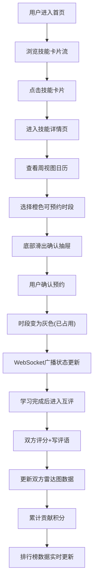

## 1. 产品概述
SkillSwap 是一个面向微型团队的内部技能交换与互助预约平台，让不同部门的同事能够发布可教授的短技能，并通过预约系统进行技能学习与互助。
- 主要目的：促进团队内部知识共享，降低跨部门协作门槛，构建学习型组织文化
- 目标用户：企业内部不同部门的员工（技能提供者与学习者）
- 产品价值：通过游戏化（积分、排行榜、技能图谱）机制激励员工积极参与技能交换

## 2. 核心功能

### 2.1 用户角色
| 角色 | 注册方式 | 核心权限 |
|------|----------|----------|
| 普通用户 | 系统预置账号 | 浏览技能、预约学习、发布技能、双方互评、查看排行榜 |
| 技能讲师 | 同普通用户（自动升级） | 在普通用户基础上，可管理自己发布的技能及可预约时段 |

### 2.2 功能模块
1. **首页主页**：顶部导航栏、技能卡片流展示、筛选与搜索
2. **技能详情页**：技能描述、讲师简介、周视图预约日历、预约确认抽屉、双方互评区、技能雷达图
3. **排行榜页**：积分Top20排名展示、用户跳转入口

### 2.3 页面详情
| 页面名称 | 模块名称 | 功能描述 |
|-----------|-------------|---------------------|
| 首页主页 | 顶部导航栏 | 左侧Logo、中间导航链接（首页/排行榜）、右侧用户头像与积分徽章 |
| 首页主页 | 技能卡片流 | 网格布局展示所有技能卡片，含emoji图标、标题、讲师头像、可预约时段标签 |
| 技能详情页 | 左侧信息区 | 技能图标标题、详细描述、讲师头像昵称简介、讲师技能雷达图 |
| 技能详情页 | 右侧日历区 | 周视图（7天×多时段），灰/橙色区分已占用/可预约，支持切换周 |
| 技能详情页 | 预约确认抽屉 | 从底部滑入，显示预约详情，确认/取消按钮 |
| 技能详情页 | 互评区 | 1-5星评分+200字评语，学完后双方均可评价 |
| 排行榜页 | 排名卡片流 | Top20用户，前三名特殊渐变背景，展示头像/昵称/积分/技能数 |

## 3. 核心流程

用户进入首页 → 浏览技能卡片 → 点击卡片进入详情页 → 查看日历选择可预约时段 → 弹出确认抽屉 → 确认预约（时段变灰）→ 学习完成后双方互评 → 系统更新雷达图与积分 → 查看排行榜排名变化

## 4. 用户界面设计

### 4.1 设计风格
- **主色调**：暖橙色 #FF7043（品牌色），背景色 #FFF3E0（米黄暖色调）
- **辅助色**：金色 #FFD700 / #FFA000（第1名）、银色 #C0C0C0 / #9E9E9E（第2名）、铜色 #CD7F32 / #8D6E63（第3名）
- **按钮风格**：圆角矩形（8px），填充主色橙色，hover有0.15s涟漪效果（CSS pseudo-element实现）
- **字体**：系统默认无衬线字体族（-apple-system, BlinkMacSystemFont, "Segoe UI", Roboto, sans-serif）
- **布局风格**：Material Design 风格，卡片式布局，8px圆角，清晰阴影层次
- **图标/emoji**：技能卡片使用 emoji 作为图标（如 📊、🎨、🐍），整体风格活泼友好

### 4.2 页面设计概述
| 页面名称 | 模块名称 | UI元素 |
|-----------|-------------|-------------|
| 首页主页 | 导航栏 | 固定顶部，橙色Logo方块(#FF7043, 圆角8px)，右侧圆形头像+积分徽章(橙色圆形背景) |
| 首页主页 | 技能卡片 | 白色背景+8px圆角，hover 上浮4px + 阴影由 rgba(0,0,0,0.1) 过渡到 rgba(0,0,0,0.2)（0.25s动画） |
| 技能详情页 | 日历网格 | 等宽方格排列，灰色(#E0E0E0)已占用，橙色(#FF7043)可预约，hover放大1.05倍，周切换按钮左右箭头 |
| 技能详情页 | 抽屉弹窗 | 从底部 translateY(100%) 到 translateY(0)，0.3s ease-out 过渡，半透明遮罩层 |
| 技能详情页 | 雷达图 | recharts RadarChart，区域填充 #FF7043 opacity 0.3，边框 2px #FF7043，五维指标文字标签 |
| 排行榜页 | 排名卡片 | 第1-3名渐变背景（金色/银色/铜色），圆形排名数字序号，左头像右信息，跳转可点击 |

### 4.3 响应式
- **桌面优先**：1024px 宽度以上，容器固定 1280px 居中，左右留白
- **中等尺寸**：小于 1024px 时，容器宽度自适应（max-width: 100%, padding: 0 24px），卡片网格列数减少
- **不支持移动端**：不做触摸优化，不针对 < 768px 做适配，保持桌面交互逻辑

### 4.4 性能要求
- 技能卡片列表渲染 < 300ms（虚拟列表按需，初始量小可直接渲染）
- 日历周切换 DOM 更新 < 50ms（使用 Zustand 局部订阅 + memo 优化）
- WebSocket 消息推送延迟 < 100ms
