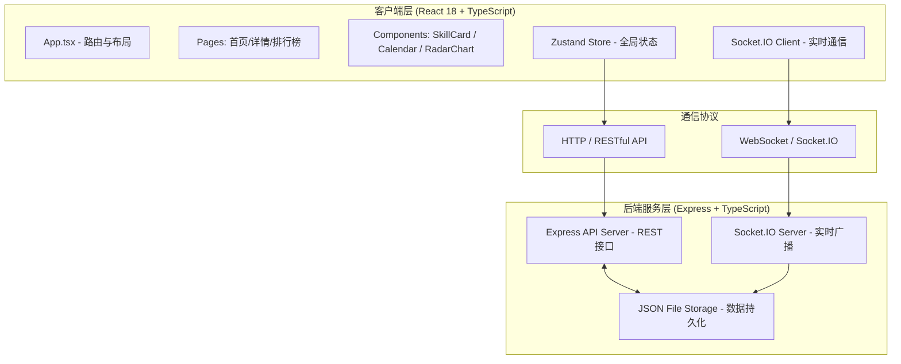
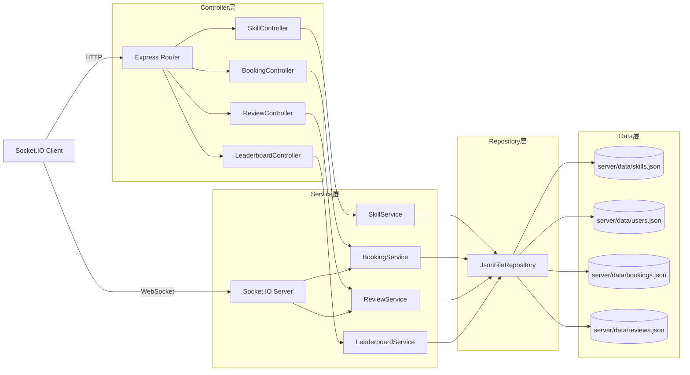
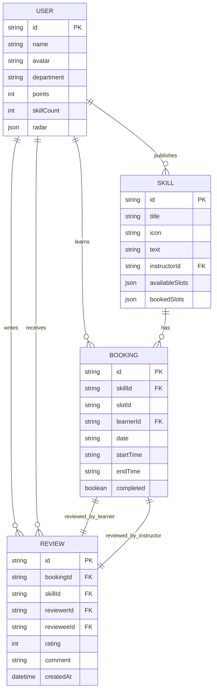

## 1. 架构设计



## 2. 技术描述
- **前端框架**：React 18 + TypeScript (strict mode)
- **构建工具**：Vite 5 + @vitejs/plugin-react
- **路由**：React Router v6
- **状态管理**：Zustand 4 (轻量 store，无 boilerplate)
- **图表库**：Recharts 2 (RadarChart 雷达图)
- **实时通信**：Socket.IO Client 4
- **后端框架**：Express 4 + TypeScript
- **实时服务**：Socket.IO Server 4
- **CORS**：cors 中间件
- **ID生成**：uuid
- **数据存储**：本地 JSON 文件（server/data/*.json）
- **启动方式**：npm run dev（concurrently 同时跑前端 Vite + 后端 Node）

## 3. 路由定义
| Route | Purpose |
|-------|---------|
| `/` | 首页主页 - 技能卡片流展示 |
| `/skill/:id` | 技能详情页 - 含日历预约/抽屉确认/互评/雷达图 |
| `/leaderboard` | 排行榜页 - Top20 积分排名 |
| `*` | 重定向到 `/` |

## 4. API 定义

### 4.1 TypeScript 类型

```typescript
interface User {
  id: string;
  name: string;
  avatar: string;
  department: string;
  points: number;
  skillCount: number;
  radar: {
    communication: number;  // 1-5
    technical: number;
    patience: number;
    punctuality: number;
    contribution: number;
  };
}

interface Skill {
  id: string;
  title: string;
  icon: string;  // emoji
  description: string;
  instructorId: string;
  instructor: User;
  availableSlots: TimeSlot[];
  bookedSlots: BookedSlot[];
}

interface TimeSlot {
  id: string;
  date: string;      // YYYY-MM-DD
  startTime: string; // HH:mm
  endTime: string;   // HH:mm
  isBooked: boolean;
}

interface BookedSlot {
  slotId: string;
  skillId: string;
  learnerId: string;
  date: string;
  startTime: string;
  endTime: string;
  completed: boolean;
}

interface Review {
  id: string;
  bookingId: string;
  skillId: string;
  reviewerId: string;
  revieweeId: string;
  rating: number;   // 1-5
  comment: string;  // max 200
  createdAt: string;
}

interface LeaderboardEntry {
  rank: number;
  user: User;
}
```

### 4.2 RESTful API
| Method | Path | Description | Request Body | Response |
|--------|------|-------------|--------------|----------|
| GET | `/api/skills` | 获取全部技能列表 | - | `Skill[]` |
| GET | `/api/skills/:id` | 获取单技能详情 | - | `Skill` |
| POST | `/api/booking` | 创建预约 | `{skillId, slotId, learnerId}` | `{success, booking}` |
| POST | `/api/review` | 提交互评 | `{bookingId, reviewerId, revieweeId, rating, comment, skillId}` | `{success, updatedUser}` |
| GET | `/api/leaderboard` | 获取排行榜Top20 | - | `LeaderboardEntry[]` |
| GET | `/api/users/:id` | 获取用户信息+技能图谱 | - | `User` |

### 4.3 WebSocket 事件
| Event | Direction | Payload | Description |
|-------|-----------|---------|-------------|
| `booking:updated` | Server → All Clients | `{skillId, slotId, isBooked}` | 预约状态变化广播 |
| `review:submitted` | Server → All Clients | `{userId, radar, points}` | 评价提交后积分/图谱更新 |

## 5. 服务器架构图



## 6. 数据模型

### 6.1 ER 图



### 6.2 初始数据（Mock）
- `server/data/users.json`：预置 8-10 个用户，含不同部门、头像、积分和雷达图数据
- `server/data/skills.json`：预置 6-8 个技能，覆盖 Excel、PPT、Python、设计、沟通等
- `server/data/bookings.json`：预置少量已预约的时间段，用于演示灰色占用状态
- `server/data/reviews.json`：预置 3-5 条评价，展示互评效果
