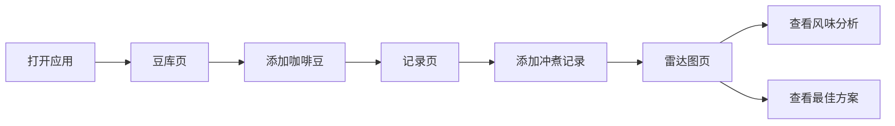

## 1. 产品概述
本应用是为咖啡爱好者设计的个人手冲咖啡配方管理与品鉴记录工具，帮助用户记录不同咖啡豆的冲煮参数，分析个人风味偏好，找到最适合的冲煮方案。

- 核心价值：系统化记录冲煮过程，通过数据可视化发现个人风味偏好
- 目标用户：家庭咖啡爱好者、手冲咖啡入门者、咖啡品鉴爱好者
- 市场定位：轻量级个人工具类应用，专注于手冲咖啡的精细化管理

## 2. 核心功能

### 2.1 用户角色
| 角色 | 注册方式 | 核心权限 |
|------|----------|----------|
| 普通用户 | 无需注册，本地存储 | 管理咖啡豆信息、记录冲煮数据、查看风味分析 |

### 2.2 功能模块
1. **豆库页**：咖啡豆卡片列表，添加/编辑咖啡豆信息
2. **记录页**：冲煮记录表格，添加/编辑冲煮参数
3. **雷达图页**：个人风味偏好雷达图，最佳冲煮方案推荐

### 2.3 页面详情
| 页面名称 | 模块名称 | 功能描述 |
|----------|----------|----------|
| 豆库页 | 咖啡豆卡片列表 | 展示所有咖啡豆，卡片背景随烘焙度渐变，悬停上浮效果，点击展开详情 |
| 豆库页 | 添加咖啡豆表单 | 录入豆子名称、产地、处理法、烘焙度 |
| 记录页 | 冲煮记录表格 | 按时间倒序展示所有记录，左侧色块标识综合评分 |
| 记录页 | 冲煮参数表单 | 录入粉量、水温、研磨度、注水方式、总时长、6维度风味评分 |
| 雷达图页 | 风味雷达图 | 六边形雷达图展示6维度平均分，点击顶点查看相关记录 |
| 雷达图页 | 最佳方案推荐 | 自动筛选评分最高的冲煮参数组合 |

## 3. 核心流程
用户打开应用后，首先在豆库页添加咖啡豆信息，然后在记录页为该豆子添加冲煮记录，多次记录后在雷达图页查看个人风味偏好分析和最佳冲煮方案推荐。

## 4. 用户界面设计

### 4.1 设计风格
- **主色调**：#6F4E37（咖啡色）
- **辅助色**：#D2B48C（浅棕色）
- **背景色**：#FFF8F0（米白色）
- **烘焙度渐变色**：浅焙#F5DEB3，中焙#D2B48C，深焙#8B4513
- **按钮样式**：圆角4px，点击0.2s缩放反馈（scale(0.95)）
- **字体**：使用温暖的无衬线字体，标题加粗，正文清晰易读
- **布局风格**：卡片式布局，顶部导航，三页标签切换
- **动画效果**：卡片展开0.4s cubic-bezier过渡，悬停translateY(-4px)上浮

### 4.2 页面设计概述
| 页面名称 | 模块名称 | UI元素 |
|----------|----------|--------|
| 豆库页 | 咖啡豆卡片 | 渐变背景、豆子名称、产地、悬停上浮、点击放大展开 |
| 记录页 | 记录表格 | 时间倒序、左侧评分色块、粉量/水温/研磨度/注水方式/时长/评分展示 |
| 记录页 | 滑块组件 | 数值实时显示、轨道红到绿渐变 |
| 雷达图页 | 雷达图 | 六色半透明填充、六维度不同颜色、可点击顶点 |
| 雷达图页 | 推荐卡片 | 最佳参数组合展示 |

### 4.3 响应式
- 桌面端（≥768px）：多列网格布局
- 移动端（<768px）：单列布局，卡片自适应宽度
- 触摸优化：增大按钮可点击区域，滑块触摸友好

### 4.4 性能要求
- 页面初始加载2秒内完成交互响应
- 雷达图拖动重绘延迟不超过100ms
- 动画帧率保持60fps
